# Higher-Order Linear Differential Equations - Complete Learning Guide

## Table of Contents
1. [Linear Homogeneous Equations with Constant Coefficients](#1-linear-homogeneous-equations)
2. [Linear Non-Homogeneous Equations](#2-linear-non-homogeneous-equations)
3. [Method of Undetermined Coefficients](#3-method-of-undetermined-coefficients)
4. [Method of Variation of Parameters](#4-method-of-variation-of-parameters)
5. [Two-Point Boundary Value Problems](#5-two-point-boundary-value-problems)
6. [Cauchy-Euler Equations](#6-cauchy-euler-equations)
7. [System of Linear Differential Equations](#7-system-of-linear-differential-equations)

---

## 1. Linear Homogeneous Equations with Constant Coefficients

### 🎯 Concept Introduction

Think of a linear homogeneous differential equation like a recipe where all ingredients must combine in a specific way with no "extra flavor" added. The equation looks like:

$$a_n \frac{d^n y}{dx^n} + a_{n-1} \frac{d^{n-1} y}{dx^{n-1}} + \cdots + a_1 \frac{dy}{dx} + a_0 y = 0$$

where $a_0, a_1, \ldots, a_n$ are constants, and the right side equals zero (homogeneous).

**Analogy**: Imagine a damped spring-mass system. The motion naturally dies down without any external force - this is described by a homogeneous equation.

### 📊 Visual Structure

```mermaid
graph TD
    A[Homogeneous Linear DE] --> B[Form Characteristic Equation]
    B --> C[Solve for Roots]
    C --> D{Type of Roots?}
    D -->|Real & Distinct| E[y = c₁e^r₁x + c₂e^r₂x]
    D -->|Real & Repeated| F[y = c₁e^rx + c₂xe^rx]
    D -->|Complex| G[y = e^αx(c₁cos βx + c₂sin βx)]
```

### 📝 Step-by-Step Solution Method

**Step 1:** Write the differential equation in standard form
**Step 2:** Form the characteristic (auxiliary) equation by replacing:
- $\frac{d^n y}{dx^n}$ with $r^n$
- $\frac{d^{n-1} y}{dx^{n-1}}$ with $r^{n-1}$
- Continue until $y$ is replaced with $r^0 = 1$

**Step 3:** Solve the characteristic equation for roots
**Step 4:** Write the general solution based on the nature of roots

### 🔑 Root Types and Solutions

| Root Type | Example | General Solution |
|-----------|---------|------------------|
| **Distinct Real** | $r_1 = 2, r_2 = -3$ | $y = c_1 e^{2x} + c_2 e^{-3x}$ |
| **Repeated Real** | $r = -1$ (multiplicity 2) | $y = c_1 e^{-x} + c_2 x e^{-x}$ |
| **Complex Conjugate** | $r = \alpha \pm i\beta$ | $y = e^{\alpha x}(c_1 \cos \beta x + c_2 \sin \beta x)$ |

### 💡 Worked Example 1: Distinct Real Roots

**Problem:** Solve $\frac{d^2y}{dx^2} - 5\frac{dy}{dx} + 6y = 0$

**Solution:**

**Step 1:** The equation is already in standard form.

**Step 2:** Form characteristic equation:
$$r^2 - 5r + 6 = 0$$

**Step 3:** Factor the equation:
$$(r - 2)(r - 3) = 0$$
$$r_1 = 2, \quad r_2 = 3$$

**Step 4:** Since roots are real and distinct:
$$\boxed{y = c_1 e^{2x} + c_2 e^{3x}}$$

### 💡 Worked Example 2: Repeated Real Roots

**Problem:** Solve $\frac{d^2y}{dx^2} - 4\frac{dy}{dx} + 4y = 0$

**Solution:**

**Step 1:** Characteristic equation:
$$r^2 - 4r + 4 = 0$$

**Step 2:** Factor:
$$(r - 2)^2 = 0$$
$$r = 2 \text{ (multiplicity 2)}$$

**Step 3:** For repeated roots with multiplicity 2:
$$\boxed{y = c_1 e^{2x} + c_2 x e^{2x} = (c_1 + c_2 x)e^{2x}}$$

### 💡 Worked Example 3: Complex Roots

**Problem:** Solve $\frac{d^2y}{dx^2} + 4y = 0$

**Solution:**

**Step 1:** Characteristic equation:
$$r^2 + 4 = 0$$

**Step 2:** Solve for r:
$$r^2 = -4$$
$$r = \pm 2i$$
$$\alpha = 0, \quad \beta = 2$$

**Step 3:** For complex roots $\alpha \pm i\beta$:
$$\boxed{y = e^{0 \cdot x}(c_1 \cos 2x + c_2 \sin 2x) = c_1 \cos 2x + c_2 \sin 2x}$$

### ✏️ Practice Problems

**Problem 1:** Solve $y'' - y' - 2y = 0$

<details>
<summary>Click for solution</summary>

Characteristic equation: $r^2 - r - 2 = 0$

Factor: $(r - 2)(r + 1) = 0$

Roots: $r_1 = 2, r_2 = -1$

**Answer:** $y = c_1 e^{2x} + c_2 e^{-x}$
</details>

**Problem 2:** Solve $y'' + 6y' + 9y = 0$

<details>
<summary>Click for solution</summary>

Characteristic equation: $r^2 + 6r + 9 = 0$

Factor: $(r + 3)^2 = 0$

Root: $r = -3$ (multiplicity 2)

**Answer:** $y = (c_1 + c_2 x)e^{-3x}$
</details>

**Problem 3:** Solve $y'' + 2y' + 5y = 0$

<details>
<summary>Click for solution</summary>

Characteristic equation: $r^2 + 2r + 5 = 0$

Using quadratic formula: $r = \frac{-2 \pm \sqrt{4-20}}{2} = \frac{-2 \pm 4i}{2} = -1 \pm 2i$

$\alpha = -1, \beta = 2$

**Answer:** $y = e^{-x}(c_1 \cos 2x + c_2 \sin 2x)$
</details>

### ⚠️ Common Mistakes

1. **Forgetting the multiplicity rule**: For repeated root $r$ with multiplicity $k$, solutions are $e^{rx}, xe^{rx}, x^2e^{rx}, \ldots, x^{k-1}e^{rx}$
2. **Sign errors in complex roots**: Remember $r = \alpha \pm i\beta$ gives $e^{\alpha x}(\cos \beta x, \sin \beta x)$
3. **Incomplete factoring**: Always check if roots can be factored further

### 🎓 Exam Strategies

- **Quick Check**: Verify your solution by substituting back into the original equation
- **Time Management**: Characteristic equation should take 2-3 minutes maximum
- **Pattern Recognition**: Memorize the three solution forms for different root types
- **Higher Order**: For $n$-th order equations, you'll have $n$ roots and $n$ arbitrary constants

---

## 2. Linear Non-Homogeneous Equations

### 🎯 Concept Introduction

A non-homogeneous linear differential equation has a "forcing function" on the right side:

$$a_n \frac{d^n y}{dx^n} + a_{n-1} \frac{d^{n-1} y}{dx^{n-1}} + \cdots + a_1 \frac{dy}{dx} + a_0 y = f(x)$$

where $f(x) \neq 0$.

**Analogy**: Think of pushing a child on a swing. The natural motion (homogeneous solution) combines with your pushing force (particular solution) to create the total motion.

### 📊 Solution Structure


### 🔑 Fundamental Theorem

**The general solution of a non-homogeneous linear DE is:**

$$\boxed{y = y_c + y_p}$$

where:
- $y_c$ = complementary solution (general solution of homogeneous equation)
- $y_p$ = particular solution (any specific solution of non-homogeneous equation)

### 📝 Step-by-Step Approach

**Step 1:** Solve the associated homogeneous equation $Ly = 0$ to find $y_c$

**Step 2:** Find a particular solution $y_p$ using:
   - Method of Undetermined Coefficients (Section 3)
   - Method of Variation of Parameters (Section 4)

**Step 3:** Combine: $y = y_c + y_p$

**Step 4:** Apply initial conditions (if given) to find constants

### 💡 Worked Example 1: Introduction to Non-Homogeneous

**Problem:** Solve $y'' - 3y' + 2y = 4e^x$

**Solution:**

**Step 1:** Find $y_c$ by solving $y'' - 3y' + 2y = 0$

Characteristic equation: $r^2 - 3r + 2 = 0$

$(r-1)(r-2) = 0 \Rightarrow r_1 = 1, r_2 = 2$

$$y_c = c_1 e^x + c_2 e^{2x}$$

**Step 2:** Find $y_p$ (we'll learn methods in next sections)

Try $y_p = Axe^x$ (modified because $e^x$ is in $y_c$)

$y_p' = Ae^x + Axe^x$

$y_p'' = 2Ae^x + Axe^x$

Substitute into original equation:
$$2Ae^x + Axe^x - 3(Ae^x + Axe^x) + 2Axe^x = 4e^x$$
$$2Ae^x - 3Ae^x = 4e^x$$
$$-Ae^x = 4e^x$$
$$A = -4$$

Therefore: $y_p = -4xe^x$

**Step 3:** General solution:
$$\boxed{y = c_1 e^x + c_2 e^{2x} - 4xe^x}$$

### 💡 Worked Example 2: With Initial Conditions

**Problem:** Solve $y'' + y = 2\sin x$ with $y(0) = 1$, $y'(0) = 0$

**Solution:**

**Step 1:** Find $y_c$:
$r^2 + 1 = 0 \Rightarrow r = \pm i$

$$y_c = c_1 \cos x + c_2 \sin x$$

**Step 2:** Find $y_p$:

Since $\sin x$ appears in $y_c$, try $y_p = x(A\cos x + B\sin x)$

$y_p = Ax\cos x + Bx\sin x$

$y_p' = A\cos x - Ax\sin x + B\sin x + Bx\cos x$

$y_p'' = -2A\sin x - Ax\cos x + 2B\cos x - Bx\sin x$

Substituting:
$$-2A\sin x - Ax\cos x + 2B\cos x - Bx\sin x + Ax\cos x + Bx\sin x = 2\sin x$$
$$-2A\sin x + 2B\cos x = 2\sin x$$

Comparing coefficients:
$-2A = 2 \Rightarrow A = -1$
$2B = 0 \Rightarrow B = 0$

$$y_p = -x\cos x$$

**Step 3:** General solution:
$$y = c_1\cos x + c_2\sin x - x\cos x$$

**Step 4:** Apply initial conditions:

$y(0) = c_1 = 1$

$y' = -c_1\sin x + c_2\cos x - \cos x + x\sin x$

$y'(0) = c_2 - 1 = 0 \Rightarrow c_2 = 1$

$$\boxed{y = \cos x + \sin x - x\cos x}$$

### 💡 Worked Example 3: Principle of Superposition

**Problem:** Solve $y'' - y = 2x + e^{2x}$

**Solution:**

We can split this as two problems:
- $y'' - y = 2x$ with particular solution $y_{p1}$
- $y'' - y = e^{2x}$ with particular solution $y_{p2}$

Then $y_p = y_{p1} + y_{p2}$ (superposition principle)

**For $y_{p1}$:** Try $y_{p1} = Ax + B$

$y_{p1}' = A$, $y_{p1}'' = 0$

$0 - (Ax + B) = 2x$

$A = -2, B = 0 \Rightarrow y_{p1} = -2x$

**For $y_{p2}$:** Try $y_{p2} = Ce^{2x}$

$y_{p2}' = 2Ce^{2x}$, $y_{p2}'' = 4Ce^{2x}$

$4Ce^{2x} - Ce^{2x} = e^{2x}$

$3C = 1 \Rightarrow C = \frac{1}{3}$

$$y_p = -2x + \frac{1}{3}e^{2x}$$

**Homogeneous solution:** $r^2 - 1 = 0 \Rightarrow r = \pm 1$

$$y_c = c_1e^x + c_2e^{-x}$$

**Final answer:**
$$\boxed{y = c_1e^x + c_2e^{-x} - 2x + \frac{1}{3}e^{2x}}$$

### ✏️ Practice Problems

**Problem 1:** Solve $y'' + 4y' + 4y = e^{-2x}$

<details>
<summary>Click for solution</summary>

**Homogeneous:** $r^2 + 4r + 4 = 0 \Rightarrow (r+2)^2 = 0 \Rightarrow r = -2$ (mult. 2)

$y_c = (c_1 + c_2x)e^{-2x}$

**Particular:** Try $y_p = Ax^2e^{-2x}$ (multiply by $x^2$ due to repeated root)

After substitution: $A = \frac{1}{2}$

**Answer:** $y = (c_1 + c_2x)e^{-2x} + \frac{1}{2}x^2e^{-2x}$
</details>

**Problem 2:** Solve $y'' - 2y' + y = x^2$

<details>
<summary>Click for solution</summary>

**Homogeneous:** $r^2 - 2r + 1 = 0 \Rightarrow (r-1)^2 = 0 \Rightarrow r = 1$ (mult. 2)

$y_c = (c_1 + c_2x)e^x$

**Particular:** Try $y_p = Ax^2 + Bx + C$

After substitution: $A = 1, B = 4, C = 6$

**Answer:** $y = (c_1 + c_2x)e^x + x^2 + 4x + 6$
</details>

**Problem 3:** Solve $y'' + y = \cos x + x$

<details>
<summary>Click for solution</summary>

**Homogeneous:** $r^2 + 1 = 0 \Rightarrow r = \pm i$

$y_c = c_1\cos x + c_2\sin x$

**Particular:** 
- For $\cos x$: Try $y_{p1} = x(A\cos x + B\sin x)$ → $y_{p1} = \frac{1}{2}x\sin x$
- For $x$: Try $y_{p2} = Cx + D$ → $y_{p2} = x$

**Answer:** $y = c_1\cos x + c_2\sin x + \frac{1}{2}x\sin x + x$
</details>

### ⚠️ Common Mistakes

1. **Forgetting $y_c$**: Always include both complementary and particular solutions
2. **Wrong particular solution form**: Must modify guess if it overlaps with $y_c$
3. **Not using superposition**: Can solve for each forcing function term separately
4. **Initial condition errors**: Apply conditions to complete solution $y = y_c + y_p$

### 🎓 Exam Strategies

- **Always start with homogeneous**: Find $y_c$ first
- **Check for duplication**: If your guess for $y_p$ appears in $y_c$, multiply by $x$
- **Superposition is your friend**: Split complex forcing functions into simpler parts
- **Verify your answer**: Substitute back to check

---

## 3. Method of Undetermined Coefficients

### 🎯 Concept Introduction

The Method of Undetermined Coefficients is a systematic way to find particular solutions when $f(x)$ has a special form (polynomials, exponentials, sines, cosines, or their combinations).

**Analogy**: It's like filling in a Mad Libs story - you know the form of the answer, you just need to determine the specific coefficients.

### 📊 Decision Flowchart

```mermaid
graph TD
    A[Identify f(x) type] --> B{Form of f(x)?}
    B -->|Polynomial| C[Try: Ax^n + ... + Bx + C]
    B -->|Exponential| D[Try: Ae^αx]
    B -->|Trig| E[Try: A cos βx + B sin βx]
    B -->|Mixed| F[Try: Product form]
    C --> G{In y_c?}
    D --> G
    E --> G
    F --> G
    G -->|Yes| H[Multiply by x^s]
    G -->|No| I[Use as is]
    H --> J[Substitute & solve]
    I --> J
```

### 🔑 Standard Forms for $y_p$

| $f(x)$ Form | Initial Guess for $y_p$ |
|-------------|-------------------------|
| $P_n(x)$ (polynomial degree $n$) | $A_nx^n + A_{n-1}x^{n-1} + \cdots + A_1x + A_0$ |
| $ae^{\alpha x}$ | $Ae^{\alpha x}$ |
| $a\cos\beta x$ or $a\sin\beta x$ | $A\cos\beta x + B\sin\beta x$ |
| $e^{\alpha x}P_n(x)$ | $e^{\alpha x}(A_nx^n + \cdots + A_0)$ |
| $e^{\alpha x}[P(x)\cos\beta x + Q(x)\sin\beta x]$ | $e^{\alpha x}[(A_nx^n + \cdots)\cos\beta x + (B_nx^n + \cdots)\sin\beta x]$ |

### ⚡ The Modification Rule

**If any term in your guess for $y_p$ appears in $y_c$, multiply the entire guess by $x^s$** where $s$ is the smallest integer that eliminates the duplication.

### 📝 Step-by-Step Method

**Step 1:** Find $y_c$ (solve homogeneous equation)

**Step 2:** Identify the form of $f(x)$

**Step 3:** Write initial guess for $y_p$ based on the table

**Step 4:** Check if any term in $y_p$ appears in $y_c$
   - If YES: multiply by $x$ (or $x^2$ if needed)
   - If NO: proceed

**Step 5:** Find derivatives of $y_p$

**Step 6:** Substitute into original DE

**Step 7:** Equate coefficients and solve for unknowns

**Step 8:** Write general solution: $y = y_c + y_p$

### 💡 Worked Example 1: Polynomial Forcing Function

**Problem:** Solve $y'' - 4y' + 4y = 8x^2$

**Solution:**

**Step 1:** Homogeneous solution:
$r^2 - 4r + 4 = 0 \Rightarrow (r-2)^2 = 0 \Rightarrow r = 2$ (mult. 2)

$$y_c = (c_1 + c_2x)e^{2x}$$

**Step 2:** $f(x) = 8x^2$ is a polynomial of degree 2

**Step 3:** Initial guess: $y_p = Ax^2 + Bx + C$

**Step 4:** No polynomial terms in $y_c$, so no modification needed

**Step 5:** Calculate derivatives:
$$y_p' = 2Ax + B$$
$$y_p'' = 2A$$

**Step 6:** Substitute into $y'' - 4y' + 4y = 8x^2$:
$$2A - 4(2Ax + B) + 4(Ax^2 + Bx + C) = 8x^2$$
$$2A - 8Ax - 4B + 4Ax^2 + 4Bx + 4C = 8x^2$$

**Step 7:** Equate coefficients:
- $x^2$: $4A = 8 \Rightarrow A = 2$
- $x^1$: $-8A + 4B = 0 \Rightarrow -16 + 4B = 0 \Rightarrow B = 4$
- $x^0$: $2A - 4B + 4C = 0 \Rightarrow 4 - 16 + 4C = 0 \Rightarrow C = 3$

$$y_p = 2x^2 + 4x + 3$$

**Step 8:** General solution:
$$\boxed{y = (c_1 + c_2x)e^{2x} + 2x^2 + 4x + 3}$$

### 💡 Worked Example 2: Exponential with Duplication

**Problem:** Solve $y'' - 3y' + 2y = 4e^{2x}$

**Solution:**

**Step 1:** Homogeneous:
$r^2 - 3r + 2 = 0 \Rightarrow (r-1)(r-2) = 0 \Rightarrow r = 1, 2$

$$y_c = c_1e^x + c_2e^{2x}$$

**Step 2:** $f(x) = 4e^{2x}$ is exponential

**Step 3:** Initial guess: $y_p = Ae^{2x}$

**Step 4:** **DUPLICATION!** $e^{2x}$ appears in $y_c$

Modify: $y_p = Axe^{2x}$

**Step 5:** Calculate derivatives:
$$y_p' = Ae^{2x} + 2Axe^{2x} = Ae^{2x}(1 + 2x)$$
$$y_p'' = 2Ae^{2x}(1 + 2x) + 2Ae^{2x} = Ae^{2x}(4 + 4x)$$

**Step 6:** Substitute:
$$Ae^{2x}(4 + 4x) - 3Ae^{2x}(1 + 2x) + 2Axe^{2x} = 4e^{2x}$$
$$Ae^{2x}[4 + 4x - 3 - 6x + 2x] = 4e^{2x}$$
$$Ae^{2x}[1] = 4e^{2x}$$

**Step 7:** $A = 4$

$$y_p = 4xe^{2x}$$

**Step 8:**
$$\boxed{y = c_1e^x + c_2e^{2x} + 4xe^{2x}}$$

### 💡 Worked Example 3: Trigonometric Functions

**Problem:** Solve $y'' + 9y = 6\sin 3x$

**Solution:**

**Step 1:** Homogeneous:
$r^2 + 9 = 0 \Rightarrow r = \pm 3i$

$$y_c = c_1\cos 3x + c_2\sin 3x$$

**Step 2:** $f(x) = 6\sin 3x$ is trigonometric

**Step 3:** Initial guess: $y_p = A\cos 3x + B\sin 3x$

**Step 4:** **DUPLICATION!** Both terms appear in $y_c$

Modify: $y_p = x(A\cos 3x + B\sin 3x)$

**Step 5:** Using product rule:
$$y_p' = A\cos 3x + B\sin 3x + x(-3A\sin 3x + 3B\cos 3x)$$
$$y_p' = (A + 3Bx)\cos 3x + (B - 3Ax)\sin 3x$$

$$y_p'' = -3A\sin 3x + 3B\cos 3x + 3B\cos 3x - 9Bx\sin 3x - 3A\sin 3x - 9Ax\cos 3x$$
$$y_p'' = (6B - 9Ax)\cos 3x + (-6A - 9Bx)\sin 3x$$

**Step 6:** Substitute into $y'' + 9y = 6\sin 3x$:
$$(6B - 9Ax)\cos 3x + (-6A - 9Bx)\sin 3x + 9x(A\cos 3x + B\sin 3x) = 6\sin 3x$$
$$6B\cos 3x - 6A\sin 3x = 6\sin 3x$$

**Step 7:** Equate coefficients:
- $\cos 3x$: $6B = 0 \Rightarrow B = 0$
- $\sin 3x$: $-6A = 6 \Rightarrow A = -1$

$$y_p = -x\cos 3x$$

**Step 8:**
$$\boxed{y = c_1\cos 3x + c_2\sin 3x - x\cos 3x}$$

### ✏️ Practice Problems

**Problem 1:** Solve $y'' + y' - 2y = 4x^2 - 6$

<details>
<summary>Click for solution</summary>

**Homogeneous:** $r^2 + r - 2 = 0 \Rightarrow (r+2)(r-1) = 0$

$y_c = c_1e^{-2x} + c_2e^x$

**Particular:** Try $y_p = Ax^2 + Bx + C$

After substitution and comparing:
- $A = -2$
- $B = -2$  
- $C = -1$

**Answer:** $y = c_1e^{-2x} + c_2e^x - 2x^2 - 2x - 1$
</details>

**Problem 2:** Solve $y'' + 4y = 3e^{-2x}$

<details>
<summary>Click for solution</summary>

**Homogeneous:** $r^2 + 4 = 0 \Rightarrow r = \pm 2i$

$y_c = c_1\cos 2x + c_2\sin 2x$

**Particular:** Try $y_p = Ae^{-2x}$ (no duplication)

After substitution: $A = \frac{3}{8}$

**Answer:** $y = c_1\cos 2x + c_2\sin 2x + \frac{3}{8}e^{-2x}$
</details>

**Problem 3:** Solve $y'' - 2y' + y = xe^x$

<details>
<summary>Click for solution</summary>

**Homogeneous:** $r^2 - 2r + 1 = 0 \Rightarrow (r-1)^2 = 0$

$y_c = (c_1 + c_2x)e^x$

**Particular:** Try $y_p = e^x(Ax + B)$, but both $e^x$ and $xe^x$ are in $y_c$

Modify: $y_p = x^2e^x(Ax + B) = (Ax^3 + Bx^2)e^x$

After substitution: $A = \frac{1}{6}, B = 0$

**Answer:** $y = (c_1 + c_2x)e^x + \frac{1}{6}x^3e^x$
</details>

### ⚠️ Common Mistakes

1. **Forgetting to modify when there's duplication**: Always check $y_c$ carefully
2. **Incomplete trigonometric guess**: Always include BOTH sine and cosine even if only one appears in $f(x)$
3. **Wrong degree of polynomial**: Match the degree of $f(x)$ in your guess
4. **Arithmetic errors**: Double-check coefficient matching

### 🎓 Exam Strategies

**When to Use This Method:**
✅ Polynomial $f(x)$
✅ Exponential $f(x)$
✅ Trigonometric $f(x)$
✅ Products/sums of the above

**When NOT to Use:**
❌ $f(x) = \ln x$
❌ $f(x) = \tan x$
❌ $f(x) = \sec x$
❌ $f(x) = \frac{1}{x}$

For these, use **Variation of Parameters**
## 4. Method of Variation of Parameters

### 🎯 Concept Introduction

The Method of Variation of Parameters is a powerful, universal technique that works for ANY continuous forcing function $f(x)$, not just the special forms in undetermined coefficients.

**Analogy**: While undetermined coefficients is like using a pre-made template, variation of parameters is like custom-building a solution from scratch. It always works, but requires more calculation.

**Key Idea**: We "vary" the constants in $y_c$ by replacing them with functions $u_1(x), u_2(x), \ldots$

### 📊 Method Overview

```mermaid
graph TD
    A[Find y_c = c₁y₁ + c₂y₂] --> B[Replace constants with functions]
    B --> C[y_p = u₁x·y₁ + u₂x·y₂]
    C --> D[Set up system for u₁' and u₂']
    D --> E[Solve using Wronskian]
    E --> F[Integrate to find u₁ and u₂]
    F --> G[Construct y_p]
    G --> H[Write y = y_c + y_p]
```



### 🔑 Formula for Second-Order Equations

For the equation $y'' + P(x)y' + Q(x)y = f(x)$ with complementary solution $y_c = c_1y_1 + c_2y_2$:

$$y_p = u_1(x)y_1 + u_2(x)y_2$$

where:

$$u_1 = -\int \frac{y_2 f(x)}{W} dx, \quad u_2 = \int \frac{y_1 f(x)}{W} dx$$

The **Wronskian** is:
$$W = \begin{vmatrix} y_1 & y_2 \\ y_1' & y_2' \end{vmatrix} = y_1y_2' - y_1'y_2$$

### 📝 Step-by-Step Method

**Step 1:** Solve the homogeneous equation to find $y_1$ and $y_2$

**Step 2:** Write $y_c = c_1y_1 + c_2y_2$

**Step 3:** Ensure the DE is in standard form (coefficient of $y''$ is 1)
   - If not, divide through: $y'' + P(x)y' + Q(x)y = f(x)$

**Step 4:** Calculate the Wronskian $W = y_1y_2' - y_1'y_2$

**Step 5:** Calculate $u_1'$ and $u_2'$:
$$u_1' = -\frac{y_2 f(x)}{W}, \quad u_2' = \frac{y_1 f(x)}{W}$$

**Step 6:** Integrate to find $u_1$ and $u_2$ (omit constants of integration)

**Step 7:** Form particular solution: $y_p = u_1y_1 + u_2y_2$

**Step 8:** Write general solution: $y = y_c + y_p$

### 💡 Worked Example 1: Basic Application

**Problem:** Solve $y'' + y = \sec x$

**Solution:**

**Step 1-2:** Homogeneous equation $y'' + y = 0$

$r^2 + 1 = 0 \Rightarrow r = \pm i$

$$y_1 = \cos x, \quad y_2 = \sin x$$
$$y_c = c_1\cos x + c_2\sin x$$

**Step 3:** Already in standard form with $f(x) = \sec x$

**Step 4:** Calculate Wronskian:
$$W = \begin{vmatrix} \cos x & \sin x \\ -\sin x & \cos x \end{vmatrix}$$
$$W = \cos x \cdot \cos x - \sin x \cdot (-\sin x)$$
$$W = \cos^2 x + \sin^2 x = 1$$

**Step 5:** Calculate $u_1'$ and $u_2'$:
$$u_1' = -\frac{y_2 f(x)}{W} = -\frac{\sin x \cdot \sec x}{1} = -\frac{\sin x}{\cos x} = -\tan x$$

$$u_2' = \frac{y_1 f(x)}{W} = \frac{\cos x \cdot \sec x}{1} = \frac{\cos x}{\cos x} = 1$$

**Step 6:** Integrate:
$$u_1 = -\int \tan x\, dx = -\int \frac{\sin x}{\cos x}\, dx = \ln|\cos x|$$

$$u_2 = \int 1\, dx = x$$

**Step 7:** Form $y_p$:
$$y_p = u_1y_1 + u_2y_2 = \ln|\cos x| \cdot \cos x + x \cdot \sin x$$
$$y_p = \cos x \ln|\cos x| + x\sin x$$

**Step 8:** General solution:
$$\boxed{y = c_1\cos x + c_2\sin x + \cos x \ln|\cos x| + x\sin x}$$

### 💡 Worked Example 2: Equation Not in Standard Form

**Problem:** Solve $4y'' + y = 2\sec\left(\frac{x}{2}\right)$

**Solution:**

**Step 1:** First, convert to standard form by dividing by 4:
$$y'' + \frac{1}{4}y = \frac{1}{2}\sec\left(\frac{x}{2}\right)$$

So $f(x) = \frac{1}{2}\sec\left(\frac{x}{2}\right)$

**Step 2:** Homogeneous: $r^2 + \frac{1}{4} = 0 \Rightarrow r = \pm \frac{i}{2}$

$$y_1 = \cos\frac{x}{2}, \quad y_2 = \sin\frac{x}{2}$$

**Step 3:** Calculate derivatives:
$$y_1' = -\frac{1}{2}\sin\frac{x}{2}, \quad y_2' = \frac{1}{2}\cos\frac{x}{2}$$

**Step 4:** Wronskian:
$$W = \cos\frac{x}{2} \cdot \frac{1}{2}\cos\frac{x}{2} - \sin\frac{x}{2} \cdot \left(-\frac{1}{2}\sin\frac{x}{2}\right)$$
$$W = \frac{1}{2}\cos^2\frac{x}{2} + \frac{1}{2}\sin^2\frac{x}{2} = \frac{1}{2}$$

**Step 5:**
$$u_1' = -\frac{\sin\frac{x}{2} \cdot \frac{1}{2}\sec\frac{x}{2}}{\frac{1}{2}} = -\sin\frac{x}{2} \cdot \sec\frac{x}{2} = -\tan\frac{x}{2}$$

$$u_2' = \frac{\cos\frac{x}{2} \cdot \frac{1}{2}\sec\frac{x}{2}}{\frac{1}{2}} = 1$$

**Step 6:** Integrate:
$$u_1 = -\int \tan\frac{x}{2}\, dx = 2\ln\left|\cos\frac{x}{2}\right|$$

$$u_2 = x$$

**Step 7:**
$$y_p = 2\ln\left|\cos\frac{x}{2}\right| \cdot \cos\frac{x}{2} + x \cdot \sin\frac{x}{2}$$

**Step 8:**
$$\boxed{y = c_1\cos\frac{x}{2} + c_2\sin\frac{x}{2} + 2\cos\frac{x}{2}\ln\left|\cos\frac{x}{2}\right| + x\sin\frac{x}{2}}$$

### 💡 Worked Example 3: Rational Function

**Problem:** Solve $y'' - 3y' + 2y = \frac{1}{1+e^x}$

**Solution:**

**Step 1-2:** Homogeneous: $r^2 - 3r + 2 = 0 \Rightarrow (r-1)(r-2) = 0$

$$y_1 = e^x, \quad y_2 = e^{2x}$$
$$y_c = c_1e^x + c_2e^{2x}$$

**Step 3:** Already in standard form, $f(x) = \frac{1}{1+e^x}$

**Step 4:** Wronskian:
$$W = \begin{vmatrix} e^x & e^{2x} \\ e^x & 2e^{2x} \end{vmatrix} = e^x \cdot 2e^{2x} - e^{2x} \cdot e^x = e^{3x}$$

**Step 5:**
$$u_1' = -\frac{e^{2x} \cdot \frac{1}{1+e^x}}{e^{3x}} = -\frac{1}{e^x(1+e^x)} = -\frac{e^{-x}}{1+e^x}$$

$$u_2' = \frac{e^x \cdot \frac{1}{1+e^x}}{e^{3x}} = \frac{1}{e^{2x}(1+e^x)} = \frac{e^{-2x}}{1+e^x}$$

**Step 6:** For $u_1$, use substitution $w = 1 + e^x$, $dw = e^x dx$:
$$u_1 = -\int \frac{e^{-x}}{1+e^x}\, dx = -\int \frac{1}{w \cdot e^x}\, e^x\, dw = -\int \frac{dw}{w} = -\ln|1+e^x|$$

For $u_2$:
$$u_2 = \int \frac{e^{-2x}}{1+e^x}\, dx$$

Let $t = e^{-x}$, then $dt = -e^{-x}dx$:
$$u_2 = -\int \frac{t}{1+\frac{1}{t}}\, dt = -\int \frac{t^2}{t+1}\, dt$$

Using polynomial division: $\frac{t^2}{t+1} = t - 1 + \frac{1}{t+1}$

$$u_2 = -\left[\frac{t^2}{2} - t + \ln|t+1|\right] = -\frac{e^{-2x}}{2} + e^{-x} - \ln|e^{-x}+1|$$

**Step 7:**
$$y_p = -\ln(1+e^x) \cdot e^x + \left(-\frac{e^{-2x}}{2} + e^{-x} - \ln(e^{-x}+1)\right) \cdot e^{2x}$$

Simplifying:
$$y_p = -e^x\ln(1+e^x) - \frac{1}{2} + e^x - e^{2x}\ln(e^{-x}+1)$$

**Step 8:**
$$\boxed{y = c_1e^x + c_2e^{2x} - e^x\ln(1+e^x) - \frac{1}{2} + e^x - e^{2x}\ln(e^{-x}+1)}$$

### ✏️ Practice Problems

**Problem 1:** Solve $y'' + y = \tan x$

<details>
<summary>Click for solution</summary>

**Homogeneous:** $y_1 = \cos x$, $y_2 = \sin x$

**Wronskian:** $W = 1$

$$u_1' = -\sin x \tan x = -\frac{\sin^2 x}{\cos x}$$
$$u_2' = \cos x \tan x = \sin x$$

$$u_1 = \int \frac{\sin^2 x}{\cos x}\, dx = -\sin x + \sec x$$
$$u_2 = -\cos x$$

$$y_p = (-\sin x + \sec x)\cos x + (-\cos x)\sin x$$
$$y_p = -\sin x \cos x + 1 - \sin x \cos x = 1 - 2\sin x \cos x$$

**Answer:** $y = c_1\cos x + c_2\sin x - \cos x \ln|\sec x + \tan x|$
</details>

**Problem 2:** Solve $y'' - 2y' + y = \frac{e^x}{x}$

<details>
<summary>Click for solution</summary>

**Homogeneous:** $y_1 = e^x$, $y_2 = xe^x$

**Wronskian:** $W = e^{2x}$

$$u_1' = -\frac{xe^x \cdot \frac{e^x}{x}}{e^{2x}} = -1$$
$$u_2' = \frac{e^x \cdot \frac{e^x}{x}}{e^{2x}} = \frac{1}{x}$$

$$u_1 = -x, \quad u_2 = \ln|x|$$

$$y_p = -xe^x + xe^x\ln|x| = xe^x(\ln|x| - 1)$$

**Answer:** $y = c_1e^x + c_2xe^x + xe^x\ln|x|$
</details>

**Problem 3:** Solve $y'' + 4y' + 4y = e^{-2x}\ln x$

<details>
<summary>Click for solution</summary>

**Homogeneous:** $y_1 = e^{-2x}$, $y_2 = xe^{-2x}$

**Wronskian:** $W = e^{-4x}$

$$u_1' = -\frac{xe^{-2x} \cdot e^{-2x}\ln x}{e^{-4x}} = -x\ln x$$
$$u_2' = \frac{e^{-2x} \cdot e^{-2x}\ln x}{e^{-4x}} = \ln x$$

Using integration by parts:
$$u_1 = -\frac{x^2}{2}\ln x + \frac{x^2}{4}$$
$$u_2 = x\ln x - x$$

**Answer:** $y = c_1e^{-2x} + c_2xe^{-2x} + e^{-2x}\left(-\frac{x^2}{2}\ln x + \frac{x^2}{4}\right) + xe^{-2x}(x\ln x - x)$
</details>

### ⚠️ Common Mistakes

1. **Forgetting to convert to standard form**: Coefficient of $y''$ must be 1 before applying formulas
2. **Sign errors in $u_1'$**: Note the negative sign: $u_1' = -\frac{y_2f}{W}$
3. **Including integration constants**: Don't add $+C$ when finding $u_1$ and $u_2$
4. **Arithmetic errors in Wronskian**: Double-check the determinant calculation
5. **Complex integrals**: Sometimes the integrals are difficult - use tables or substitution carefully

### 🎓 Exam Strategies

**Advantages:**
✅ Works for ANY continuous $f(x)$
✅ Systematic procedure
✅ No guessing required

**Disadvantages:**
❌ More computation than undetermined coefficients
❌ May require complex integration
❌ More room for calculation errors

**When to use:**
- $f(x)$ is not polynomial, exponential, or trig
- $f(x) = \tan x, \sec x, \csc x, \ln x, \frac{1}{x}$, etc.
- Undetermined coefficients won't work

**Time-saving tips:**
- Simplify $f(x)/W$ before integrating
- Check if undetermined coefficients could work first (it's faster!)
- Use integration tables for common forms
- Verify Wronskian is never zero (if it is, solutions aren't independent)

---

## 5. Two-Point Boundary Value Problems

### 🎯 Concept Introduction

Unlike initial value problems (IVP) where conditions are given at a single point, boundary value problems (BVP) specify conditions at **two different points**.

**Analogy**: An IVP is like launching a rocket - you know the starting position and velocity. A BVP is like building a bridge - you know where both ends must be, but need to find the path between them.

### 📊 Problem Types Comparison

```mermaid
graph TD
    A[Differential Equation Problem] --> B{Condition Type?}
    B -->|At ONE point| C[Initial Value Problem]
    B -->|At TWO points| D[Boundary Value Problem]
    C --> E[y0 = a, y'0 = b]
    D --> F[ya = α, yb = β]
    E --> G[Always has unique solution]
    F --> H{Solutions?}
    H --> I[Unique solution]
    H --> J[No solution]
    H --> K[Infinite solutions]
```



### 🔑 Key Differences: IVP vs BVP

| Feature | Initial Value Problem | Boundary Value Problem |
|---------|----------------------|------------------------|
| **Conditions** | At one point: $y(x_0), y'(x_0)$ | At two points: $y(a), y(b)$ |
| **Example** | $y'' + y = 0$, $y(0)=1$, $y'(0)=0$ | $y'' + y = 0$, $y(0)=0$, $y(\pi)=1$ |
| **Solution existence** | Always exists (if DE is well-posed) | May not exist |
| **Uniqueness** | Unique solution | May have 0, 1, or ∞ solutions |
| **Physical meaning** | Time evolution from initial state | Equilibrium between two boundaries |

### 📝 Types of Boundary Conditions

**1. Dirichlet (Type I):** Values specified at boundaries
$$y(a) = \alpha, \quad y(b) = \beta$$

**2. Neumann (Type II):** Derivatives specified at boundaries
$$y'(a) = \alpha, \quad y'(b) = \beta$$

**3. Robin (Type III):** Mixed conditions
$$\alpha_1 y(a) + \beta_1 y'(a) = \gamma_1$$
$$\alpha_2 y(b) + \beta_2 y'(b) = \gamma_2$$

**4. Periodic:** Function repeats
$$y(a) = y(b), \quad y'(a) = y'(b)$$

### 📝 Solution Procedure

**Step 1:** Solve the DE to get general solution $y = y_c + y_p$ (if non-homogeneous)

**Step 2:** Apply **both** boundary conditions

**Step 3:** Solve the resulting system of equations for constants

**Step 4:** Check the solution type:
- **Unique solution**: System has exactly one solution
- **No solution**: System is inconsistent
- **Infinite solutions**: System is dependent

### 💡 Worked Example 1: Unique Solution

**Problem:** Solve $y'' + 4y = 0$ with $y(0) = 0$ and $y\left(\frac{\pi}{4}\right) = 2$

**Solution:**

**Step 1:** Solve the DE:
$r^2 + 4 = 0 \Rightarrow r = \pm 2i$

$$y = c_1\cos 2x + c_2\sin 2x$$

**Step 2:** Apply boundary conditions:

At $x = 0$: $y(0) = c_1\cos 0 + c_2\sin 0 = c_1 = 0$

So $y = c_2\sin 2x$

At $x = \frac{\pi}{4}$: $y\left(\frac{\pi}{4}\right) = c_2\sin\left(2 \cdot \frac{\pi}{4}\right) = c_2\sin\frac{\pi}{2} = c_2 = 2$

**Step 3:** Therefore $c_1 = 0$, $c_2 = 2$

**Step 4:** Unique solution:
$$\boxed{y = 2\sin 2x}$$

### 💡 Worked Example 2: No Solution Case

**Problem:** Solve $y'' + y = 0$ with $y(0) = 0$ and $y(\pi) = 1$

**Solution:**

**Step 1:** Solve:
$r^2 + 1 = 0 \Rightarrow r = \pm i$

$$y = c_1\cos x + c_2\sin x$$

**Step 2:** Apply conditions:

At $x = 0$: $y(0) = c_1 = 0$

So $y = c_2\sin x$

At $x = \pi$: $y(\pi) = c_2\sin\pi = c_2 \cdot 0 = 0$

But we need $y(\pi) = 1$!

**Step 3:** We get $0 = 1$, which is **impossible**

**Step 4:** 
$$\boxed{\text{No solution exists}}$$

**Physical interpretation**: The natural frequency of the system makes it impossible to satisfy both boundary conditions.

### 💡 Worked Example 3: Infinite Solutions

**Problem:** Solve $y'' + 4y = 0$ with $y(0) = 0$ and $y\left(\frac{\pi}{2}\right) = 0$

**Solution:**

**Step 1:** 
$$y = c_1\cos 2x + c_2\sin 2x$$

**Step 2:** Apply conditions:

At $x = 0$: $y(0) = c_1 = 0$

So $y = c_2\sin 2x$

At $x = \frac{\pi}{2}$: $y\left(\frac{\pi}{2}\right) = c_2\sin\pi = 0$

This is satisfied for **any value of $c_2$**!

**Step 4:**
$$\boxed{y = c_2\sin 2x \text{ for any constant } c_2}$$

**Infinite solutions** - the boundary conditions don't uniquely determine the solution.

### 💡 Worked Example 4: Non-Homogeneous BVP

**Problem:** Solve $y'' - y = x$ with $y(0) = 1$ and $y(1) = 0$

**Solution:**

**Step 1:** Find general solution:

Homogeneous: $r^2 - 1 = 0 \Rightarrow r = \pm 1$
$$y_c = c_1e^x + c_2e^{-x}$$

Particular: Try $y_p = Ax + B$
$$y_p' = A, \quad y_p'' = 0$$
$$0 - (Ax + B) = x$$
$$A = -1, \quad B = 0$$
$$y_p = -x$$

General solution:
$$y = c_1e^x + c_2e^{-x} - x$$

**Step 2:** Apply boundary conditions:

At $x = 0$: $y(0) = c_1 + c_2 = 1$ ... (1)

At $x = 1$: $y(1) = c_1e + c_2e^{-1} - 1 = 0$ ... (2)

**Step 3:** Solve the system:

From (1): $c_2 = 1 - c_1$

Substitute into (2):
$$c_1e + (1-c_1)e^{-1} - 1 = 0$$
$$c_1e + e^{-1} - c_1e^{-1} - 1 = 0$$
$$c_1(e - e^{-1}) = 1 - e^{-1}$$
$$c_1 = \frac{1 - e^{-1}}{e - e^{-1}} = \frac{e - 1}{e^2 - 1} = \frac{e-1}{(e-1)(e+1)} = \frac{1}{e+1}$$

$$c_2 = 1 - \frac{1}{e+1} = \frac{e}{e+1}$$

**Step 4:** Unique solution:
$$\boxed{y = \frac{1}{e+1}e^x + \frac{e}{e+1}e^{-x} - x}$$

### ✏️ Practice Problems

**Problem 1:** Solve $y'' + 9y = 0$ with $y(0) = 2$ and $y\left(\frac{\pi}{6}\right) = 1$

<details>
<summary>Click for solution</summary>

$r^2 + 9 = 0 \Rightarrow r = \pm 3i$

$y = c_1\cos 3x + c_2\sin 3x$

At $x=0$: $c_1 = 2$

At $x=\frac{\pi}{6}$: $2\cos\frac{\pi}{2} + c_2\sin\frac{\pi}{2} = 1$

$0 + c_2 = 1 \Rightarrow c_2 = 1$

**Answer:** $y = 2\cos 3x + \sin 3x$
</details>

**Problem 2:** Solve $y'' - 4y = 0$ with $y(0) = 0$ and $y(1) = 5$

<details>
<summary>Click for solution</summary>

$r^2 - 4 = 0 \Rightarrow r = \pm 2$

$y = c_1e^{2x} + c_2e^{-2x}$

At $x=0$: $c_1 + c_2 = 0 \Rightarrow c_2 = -c_1$

At $x=1$: $c_1e^2 - c_1e^{-2} = 5$

$c_1(e^2 - e^{-2}) = 5 \Rightarrow c_1 = \frac{5}{e^2 - e^{-2}}$

**Answer:** $y = \frac{5}{e^2 - e^{-2}}(e^{2x} - e^{-2x})$
</details>

**Problem 3:** Determine if $y'' + \lambda y = 0$ with $y(0) = 0$, $y(L) = 0$ has non-trivial solutions. (This is an **eigenvalue problem**)

<details>
<summary>Click for solution</summary>

For $\lambda > 0$: $y = c_1\cos(\sqrt{\lambda}x) + c_2\sin(\sqrt{\lambda}x)$

$y(0) = 0 \Rightarrow c_1 = 0$

$y(L) = 0 \Rightarrow c_2\sin(\sqrt{\lambda}L) = 0$

Non-trivial solutions exist when $\sin(\sqrt{\lambda}L) = 0$

This occurs when $\sqrt{\lambda}L = n\pi$ for $n = 1, 2, 3, \ldots$

**Answer:** Eigenvalues $\lambda_n = \frac{n^2\pi^2}{L^2}$ with eigenfunctions $y_n = \sin\frac{n\pi x}{L}$
</details>

### ⚠️ Common Mistakes

1. **Treating BVP like IVP**: Don't apply both conditions sequentially - set up a system
2. **Not checking for consistency**: Always verify if the system has 0, 1, or ∞ solutions
3. **Ignoring physical meaning**: No solution or infinite solutions often indicate special cases
4. **Arithmetic errors**: BVPs often involve exponentials - be careful with calculations

### 🎓 Exam Strategies

**Solution Existence Guide:**
- **Unique**: Most common in exam problems
- **None**: Look for contradictory equations like $0 = 1$
- **Infinite**: Look for identities like $0 = 0$ after applying conditions

**Key Steps:**
1. Always solve homogeneous first
2. Set up system with both boundary conditions
3. Check determinant: if zero, solutions may not be unique
4. Verify your answer satisfies both boundaries

**Physical Applications:**
- Heat distribution in a rod (Dirichlet)
- Vibrating string fixed at both ends
- Beam deflection
- Steady-state diffusion

---

## 6. Cauchy-Euler Equations

### 🎯 Concept Introduction

A Cauchy-Euler (or Euler-Cauchy) equation is a special type of DE where coefficients are powers of the independent variable:

$$a_nx^n\frac{d^ny}{dx^n} + a_{n-1}x^{n-1}\frac{d^{n-1}y}{dx^{n-1}} + \cdots + a_1x\frac{dy}{dx} + a_0y = f(x)$$

**Key feature**: The power of $x$ matches the order of the derivative.

**Analogy**: Think of it as a "scaled" differential equation where the variable's size affects how strongly each term contributes.

### 📊 Solution Strategy

```mermaid
graph TD
    A[Cauchy-Euler Equation] --> B[Try y = x^r]
    B --> C[Form Indicial Equation]
    C --> D{Type of Roots?}
    D -->|Real & Distinct| E[y = c₁x^r₁ + c₂x^r₂]
    D -->|Real & Repeated| F[y = c₁x^r + c₂x^r ln x]
    D -->|Complex| G[y = x^α·c₁cos β ln x + c₂sin β ln x]
```



### 🔑 Standard Second-Order Form

$$ax^2\frac{d^2y}{dx^2} + bx\frac{dy}{dx} + cy = 0$$

**Solution method**: Assume $y = x^r$ and find $r$.

### 📝 Derivatives of $y = x^r$

$$y = x^r$$
$$\frac{dy}{dx} = rx^{r-1}$$
$$\frac{d^2y}{dx^2} = r(r-1)x^{r-2}$$

### 📝 Step-by-Step Solution

**Step 1:** Write equation in standard form

**Step 2:** Substitute $y = x^r$ and its derivatives

**Step 3:** Factor out $x^r$ (or lowest power of $x$)

**Step 4:** Form the **indicial equation** (characteristic equation in $r$)

**Step 5:** Solve for roots $r_1, r_2$

**Step 6:** Write solution based on root type:

| Root Type | Solution Form |
|-----------|---------------|
| **Distinct Real** $r_1 \neq r_2$ | $y = c_1x^{r_1} + c_2x^{r_2}$ |
| **Repeated Real** $r_1 = r_2 = r$ | $y = c_1x^r + c_2x^r\ln x$ |
| **Complex** $r = \alpha \pm i\beta$ | $y = x^\alpha[c_1\cos(\beta\ln x) + c_2\sin(\beta\ln x)]$ |

### 💡 Worked Example 1: Distinct Real Roots

**Problem:** Solve $x^2y'' + 3xy' - 3y = 0$

**Solution:**

**Step 1:** Already in standard form with $a=1, b=3, c=-3$

**Step 2:** Assume $y = x^r$
$$y' = rx^{r-1}$$
$$y'' = r(r-1)x^{r-2}$$

**Step 3:** Substitute:
$$x^2 \cdot r(r-1)x^{r-2} + 3x \cdot rx^{r-1} - 3x^r = 0$$
$$r(r-1)x^r + 3rx^r - 3x^r = 0$$

**Step 4:** Factor out $x^r$:
$$x^r[r(r-1) + 3r - 3] = 0$$

Since $x^r \neq 0$, we have the indicial equation:
$$r(r-1) + 3r - 3 = 0$$
$$r^2 - r + 3r - 3 = 0$$
$$r^2 + 2r - 3 = 0$$

**Step 5:** Factor:
$$(r+3)(r-1) = 0$$
$$r_1 = 1, \quad r_2 = -3$$

**Step 6:** Since roots are real and distinct:
$$\boxed{y = c_1x + c_2x^{-3} = c_1x + \frac{c_2}{x^3}}$$

### 💡 Worked Example 2: Repeated Real Roots

**Problem:** Solve $x^2y'' - 3xy' + 4y = 0$

**Solution:**

**Step 1-3:** Substitute $y = x^r$:
$$r(r-1)x^r - 3rx^r + 4x^r = 0$$

**Step 4:** Indicial equation:
$$r(r-1) - 3r + 4 = 0$$
$$r^2 - r - 3r + 4 = 0$$
$$r^2 - 4r + 4 = 0$$

**Step 5:** Factor:
$$(r-2)^2 = 0$$
$$r = 2 \text{ (multiplicity 2)}$$

**Step 6:** For repeated roots, the solution is:
$$\boxed{y = c_1x^2 + c_2x^2\ln x = x^2(c_1 + c_2\ln x)}$$

**Note:** The $\ln x$ term appears with repeated roots, similar to the $xe^{rx}$ term in constant coefficient equations.

### 💡 Worked Example 3: Complex Roots

**Problem:** Solve $x^2y'' + xy' + y = 0$

**Solution:**

**Step 1-3:** Substitute $y = x^r$:
$$r(r-1)x^r + rx^r + x^r = 0$$

**Step 4:** Indicial equation:
$$r(r-1) + r + 1 = 0$$
$$r^2 - r + r + 1 = 0$$
$$r^2 + 1 = 0$$

**Step 5:** Solve:
$$r^2 = -1$$
$$r = \pm i$$
$$\alpha = 0, \quad \beta = 1$$

**Step 6:** For complex roots $\alpha \pm i\beta$:
$$y = x^\alpha[c_1\cos(\beta\ln x) + c_2\sin(\beta\ln x)]$$
$$\boxed{y = x^0[c_1\cos(\ln x) + c_2\sin(\ln x)] = c_1\cos(\ln x) + c_2\sin(\ln x)}$$

### 🔧 Alternative Method: Substitution

Cauchy-Euler equations can be converted to constant coefficient equations using the substitution:

$$x = e^t \quad \text{or} \quad t = \ln x$$

This transforms:
- $x\frac{dy}{dx} = \frac{dy}{dt}$
- $x^2\frac{d^2y}{dx^2} = \frac{d^2y}{dt^2} - \frac{dy}{dt}$

### 💡 Worked Example 4: Using Substitution

**Problem:** Solve $x^2y'' - 2xy' + 2y = 0$ using substitution

**Solution:**

**Step 1:** Let $x = e^t$, so $t = \ln x$

**Step 2:** Transform derivatives:
$$x\frac{dy}{dx} = \frac{dy}{dt}$$
$$x^2\frac{d^2y}{dx^2} = \frac{d^2y}{dt^2} - \frac{dy}{dt}$$

**Step 3:** Substitute into equation:
$$\left(\frac{d^2y}{dt^2} - \frac{dy}{dt}\right) - 2\frac{dy}{dt} + 2y = 0$$
$$\frac{d^2y}{dt^2} - 3\frac{dy}{dt} + 2y = 0$$

**Step 4:** This is now a constant coefficient equation!
Characteristic equation: $r^2 - 3r + 2 = 0$
$$(r-1)(r-2) = 0$$
$$r = 1, 2$$

**Step 5:** Solution in $t$:
$$y = c_1e^t + c_2e^{2t}$$

**Step 6:** Convert back to $x$ using $t = \ln x$:
$$y = c_1e^{\ln x} + c_2e^{2\ln x}$$
$$\boxed{y = c_1x + c_2x^2}$$

### 💡 Worked Example 5: Non-Homogeneous Cauchy-Euler

**Problem:** Solve $x^2y'' - xy' + y = x$

**Solution:**

**Step 1:** Find complementary solution $y_c$:

Indicial equation from $x^2y'' - xy' + y = 0$:
$$r(r-1) - r + 1 = 0$$
$$r^2 - r - r + 1 = 0$$
$$r^2 - 2r + 1 = 0$$
$$(r-1)^2 = 0$$

$$y_c = c_1x + c_2x\ln x$$

**Step 2:** Find particular solution $y_p$:

For $f(x) = x$, try $y_p = Ax$ (but this is in $y_c$!)

Try $y_p = Ax^2$:
$$y_p' = 2Ax$$
$$y_p'' = 2A$$

Substitute:
$$x^2(2A) - x(2Ax) + Ax^2 = x$$
$$2Ax^2 - 2Ax^2 + Ax^2 = x$$
$$Ax^2 = x$$

This doesn't work for all $x$. Try $y_p = Bx\ln x$ (but also in $y_c$!)

Try $y_p = Bx(\ln x)^2$:

After calculation (using product rule twice):
$$B = \frac{1}{2}$$

$$y_p = \frac{1}{2}x(\ln x)^2$$

**Step 3:** General solution:
$$\boxed{y = c_1x + c_2x\ln x + \frac{1}{2}x(\ln x)^2}$$

### ✏️ Practice Problems

**Problem 1:** Solve $x^2y'' + 5xy' + 4y = 0$

<details>
<summary>Click for solution</summary>

Indicial equation: $r(r-1) + 5r + 4 = 0$

$r^2 + 4r + 4 = 0$

$(r+2)^2 = 0 \Rightarrow r = -2$ (multiplicity 2)

**Answer:** $y = c_1x^{-2} + c_2x^{-2}\ln x = \frac{c_1 + c_2\ln x}{x^2}$
</details>

**Problem 2:** Solve $x^2y'' + xy' + 4y = 0$

<details>
<summary>Click for solution</summary>

Indicial equation: $r(r-1) + r + 4 = 0$

$r^2 + 4 = 0$

$r = \pm 2i$, so $\alpha = 0, \beta = 2$

**Answer:** $y = c_1\cos(2\ln x) + c_2\sin(2\ln x)$
</details>

**Problem 3:** Solve $x^2y'' - 3xy' + 4y = 0$ with $y(1) = 2$ and $y'(1) = 3$

<details>
<summary>Click for solution</summary>

Indicial equation: $r^2 - 4r + 4 = 0 \Rightarrow (r-2)^2 = 0$

$y = c_1x^2 + c_2x^2\ln x$

$y' = 2c_1x + c_2(2x\ln x + x)$

At $x=1$: $y(1) = c_1 = 2$

At $x=1$: $y'(1) = 2c_1 + c_2 = 3$

$4 + c_2 = 3 \Rightarrow c_2 = -1$

**Answer:** $y = 2x^2 - x^2\ln x = x^2(2 - \ln x)$
</details>

### ⚠️ Common Mistakes

1. **Wrong power matching**: Coefficient of $\frac{d^ny}{dx^n}$ must be $x^n$, not something else
2. **Forgetting $\ln x$ for repeated roots**: Just like constant coefficient equations need $xe^{rx}$
3. **Complex root formula**: Don't forget $\cos(\beta\ln x)$ and $\sin(\beta\ln x)$ - the $\ln$ is crucial!
4. **Domain issues**: Solutions often only valid for $x > 0$ due to $\ln x$
5. **Negative $x$**: For $x < 0$, use $|x|^r$ and $\ln|x|$

### 🎓 Exam Strategies

**Quick Recognition:** Look for the pattern $x^n$ multiplying $\frac{d^ny}{dx^n}$

**Three Key Formulas to Memorize:**

For $ax^2y'' + bxy' + cy = 0$:

1. **Indicial equation:** $ar(r-1) + br + c = 0$
2. **Distinct roots:** $y = c_1x^{r_1} + c_2x^{r_2}$
3. **Repeated root:** $y = c_1x^r + c_2x^r\ln x$
4. **Complex roots** $\alpha \pm i\beta$: $y = x^\alpha[c_1\cos(\beta\ln x) + c_2\sin(\beta\ln x)]$

**When to Use Substitution:**
- If non-homogeneous and $f(x)$ is complicated
- If higher order ($n > 2$)
- If you prefer constant coefficient methods

**Verification Tip:** Your solution should have the same behavior as the equation's coefficients - if coefficients grow with $x$, solution likely involves powers of $x$.

---

## 7. System of Linear Differential Equations

### 🎯 Concept Introduction

A system of differential equations involves multiple dependent variables, each with its own equation. The system is **linear** if each equation is linear in all variables.

**General form:**
$$\frac{dx}{dt} = a_{11}x + a_{12}y + f_1(t)$$
$$\frac{dy}{dt} = a_{21}x + a_{22}y + f_2(t)$$

**Analogy**: Think of coupled pendulums - the motion of one affects the other. Each pendulum has its own equation, but they're connected.

### 📊 Solution Methods Overview


### 🔑 Matrix Form

A system can be written compactly using matrices:

$$\frac{d\mathbf{X}}{dt} = A\mathbf{X} + \mathbf{F}(t)$$

where:
$$\mathbf{X} = \begin{pmatrix} x \\ y \end{pmatrix}, \quad A = \begin{pmatrix} a_{11} & a_{12} \\ a_{21} & a_{22} \end{pmatrix}, \quad \mathbf{F} = \begin{pmatrix} f_1(t) \\ f_2(t) \end{pmatrix}$$

### 📝 Method 1: Elimination Method

This method eliminates one variable to get a single higher-order equation.

**Step-by-Step:**

**Step 1:** Label the equations (1) and (2)

**Step 2:** Differentiate one equation to introduce the derivative of the other variable

**Step 3:** Substitute to eliminate one variable

**Step 4:** Solve the resulting single equation

**Step 5:** Back-substitute to find the other variable

**Step 6:** Write the solution as an ordered pair

### 💡 Worked Example 1: Elimination Method (Homogeneous)

**Problem:** Solve the system:
$$\frac{dx}{dt} = 2x + 3y \quad \text{...(1)}$$
$$\frac{dy}{dt} = 2x + y \quad \text{...(2)}$$

**Solution:**

**Step 1:** Equations labeled above

**Step 2:** Differentiate equation (1):
$$\frac{d^2x}{dt^2} = 2\frac{dx}{dt} + 3\frac{dy}{dt}$$

**Step 3:** Substitute (2) into this:
$$\frac{d^2x}{dt^2} = 2\frac{dx}{dt} + 3(2x + y)$$
$$\frac{d^2x}{dt^2} = 2\frac{dx}{dt} + 6x + 3y$$

From (1): $y = \frac{1}{3}\left(\frac{dx}{dt} - 2x\right)$

Substitute:
$$\frac{d^2x}{dt^2} = 2\frac{dx}{dt} + 6x + 3 \cdot \frac{1}{3}\left(\frac{dx}{dt} - 2x\right)$$
$$\frac{d^2x}{dt^2} = 2\frac{dx}{dt} + 6x + \frac{dx}{dt} - 2x$$
$$\frac{d^2x}{dt^2} - 3\frac{dx}{dt} - 4x = 0$$

**Step 4:** Solve this equation:
Characteristic equation: $r^2 - 3r - 4 = 0$
$$(r-4)(r+1) = 0$$
$$r = 4, -1$$

$$x(t) = c_1e^{4t} + c_2e^{-t}$$

**Step 5:** Find $y(t)$ using equation (1):
$$\frac{dx}{dt} = 4c_1e^{4t} - c_2e^{-t}$$

From (1): $3y = \frac{dx}{dt} - 2x$
$$3y = (4c_1e^{4t} - c_2e^{-t}) - 2(c_1e^{4t} + c_2e^{-t})$$
$$3y = 4c_1e^{4t} - c_2e^{-t} - 2c_1e^{4t} - 2c_2e^{-t}$$
$$3y = 2c_1e^{4t} - 3c_2e^{-t}$$
$$y(t) = \frac{2c_1}{3}e^{4t} - c_2e^{-t}$$

**Step 6:** Solution:
$$\boxed{\begin{cases} x(t) = c_1e^{4t} + c_2e^{-t} \\ y(t) = \frac{2c_1}{3}e^{4t} - c_2e^{-t} \end{cases}}$$

### 💡 Worked Example 2: With Initial Conditions

**Problem:** Solve:
$$\frac{dx}{dt} = x + 2y, \quad x(0) = 1$$
$$\frac{dy}{dt} = 3x + 2y, \quad y(0) = -1$$

**Solution:**

**Step 1-3:** Using elimination (differentiate first equation):
$$\frac{d^2x}{dt^2} = \frac{dx}{dt} + 2\frac{dy}{dt}$$
$$\frac{d^2x}{dt^2} = \frac{dx}{dt} + 2(3x + 2y)$$

From first equation: $y = \frac{1}{2}\left(\frac{dx}{dt} - x\right)$

$$\frac{d^2x}{dt^2} = \frac{dx}{dt} + 6x + 4 \cdot \frac{1}{2}\left(\frac{dx}{dt} - x\right)$$
$$\frac{d^2x}{dt^2} = \frac{dx}{dt} + 6x + 2\frac{dx}{dt} - 2x$$
$$\frac{d^2x}{dt^2} - 3\frac{dx}{dt} - 4x = 0$$

**Step 4:** Characteristic equation: $(r-4)(r+1) = 0$

$$x(t) = c_1e^{4t} + c_2e^{-t}$$

**Step 5:** Find $y(t)$:
$$\frac{dx}{dt} = 4c_1e^{4t} - c_2e^{-t}$$

$$2y = \frac{dx}{dt} - x = (4c_1e^{4t} - c_2e^{-t}) - (c_1e^{4t} + c_2e^{-t})$$
$$2y = 3c_1e^{4t} - 2c_2e^{-t}$$
$$y(t) = \frac{3c_1}{2}e^{4t} - c_2e^{-t}$$

**Step 6:** Apply initial conditions:

$$x(0) = c_1 + c_2 = 1 \quad \text{...(i)}$$
$$y(0) = \frac{3c_1}{2} - c_2 = -1 \quad \text{...(ii)}$$

From (i): $c_2 = 1 - c_1$

Substitute into (ii):
$$\frac{3c_1}{2} - (1 - c_1) = -1$$
$$\frac{3c_1}{2} + c_1 = 0$$
$$\frac{5c_1}{2} = 0$$
$$c_1 = 0, \quad c_2 = 1$$

**Solution:**
$$\boxed{\begin{cases} x(t) = e^{-t} \\ y(t) = -e^{-t} \end{cases}}$$

### 📝 Method 2: Matrix/Eigenvalue Method

For homogeneous systems $\frac{d\mathbf{X}}{dt} = A\mathbf{X}$:

**Step 1:** Write system in matrix form

**Step 2:** Find eigenvalues of $A$ by solving $\det(A - \lambda I) = 0$

**Step 3:** For each eigenvalue, find corresponding eigenvector

**Step 4:** Write general solution based on eigenvalue types

### 🔑 Solution Forms (Eigenvalue Method)

| Eigenvalues | General Solution |
|-------------|------------------|
| **Real & Distinct** $\lambda_1, \lambda_2$ | $\mathbf{X} = c_1\mathbf{v}_1e^{\lambda_1 t} + c_2\mathbf{v}_2e^{\lambda_2 t}$ |
| **Repeated** $\lambda$ | $\mathbf{X} = c_1\mathbf{v}e^{\lambda t} + c_2(\mathbf{v}t + \mathbf{w})e^{\lambda t}$ |
| **Complex** $\lambda = \alpha \pm i\beta$ | $\mathbf{X} = e^{\alpha t}[c_1\mathbf{u}\cos\beta t - c_2\mathbf{v}\sin\beta t]$ |

### 💡 Worked Example 3: Eigenvalue Method

**Problem:** Solve using eigenvalues:
$$\frac{dx}{dt} = -x + 2y$$
$$\frac{dy}{dt} = 2x - 4y$$

**Solution:**

**Step 1:** Matrix form:
$$\frac{d}{dt}\begin{pmatrix} x \\ y \end{pmatrix} = \begin{pmatrix} -1 & 2 \\ 2 & -4 \end{pmatrix}\begin{pmatrix} x \\ y \end{pmatrix}$$

**Step 2:** Find eigenvalues:
$$\det(A - \lambda I) = \det\begin{pmatrix} -1-\lambda & 2 \\ 2 & -4-\lambda \end{pmatrix} = 0$$
$$(-1-\lambda)(-4-\lambda) - 4 = 0$$
$$4 + \lambda + 4\lambda + \lambda^2 - 4 = 0$$
$$\lambda^2 + 5\lambda = 0$$
$$\lambda(\lambda + 5) = 0$$
$$\lambda_1 = 0, \quad \lambda_2 = -5$$

**Step 3:** Find eigenvectors:

For $\lambda_1 = 0$:
$$(A - 0I)\mathbf{v}_1 = \mathbf{0}$$
$$\begin{pmatrix} -1 & 2 \\ 2 & -4 \end{pmatrix}\begin{pmatrix} v_1 \\ v_2 \end{pmatrix} = \begin{pmatrix} 0 \\ 0 \end{pmatrix}$$
$$-v_1 + 2v_2 = 0 \Rightarrow v_1 = 2v_2$$

Choose $v_2 = 1$: $\mathbf{v}_1 = \begin{pmatrix} 2 \\ 1 \end{pmatrix}$

For $\lambda_2 = -5$:
$$\begin{pmatrix} 4 & 2 \\ 2 & 1 \end{pmatrix}\begin{pmatrix} v_1 \\ v_2 \end{pmatrix} = \begin{pmatrix} 0 \\ 0 \end{pmatrix}$$
$$4v_1 + 2v_2 = 0 \Rightarrow v_2 = -2v_1$$

Choose $v_1 = 1$: $\mathbf{v}_2 = \begin{pmatrix} 1 \\ -2 \end{pmatrix}$

**Step 4:** General solution:
$$\begin{pmatrix} x \\ y \end{pmatrix} = c_1\begin{pmatrix} 2 \\ 1 \end{pmatrix}e^{0 \cdot t} + c_2\begin{pmatrix} 1 \\ -2 \end{pmatrix}e^{-5t}$$

$$\boxed{\begin{cases} x(t) = 2c_1 + c_2e^{-5t} \\ y(t) = c_1 - 2c_2e^{-5t} \end{cases}}$$

### ✏️ Practice Problems

**Problem 1:** Solve by elimination:
$$\frac{dx}{dt} = 4x - y$$
$$\frac{dy}{dt} = 2x + y$$

<details>
<summary>Click for solution</summary>

Eliminate $y$ to get: $\frac{d^2x}{dt^2} - 5\frac{dx}{dt} + 6x = 0$

Characteristic equation: $(r-2)(r-3) = 0$

$x(t) = c_1e^{2t} + c_2e^{3t}$

$y(t) = 2c_1e^{2t} + 3c_2e^{3t}$

**Answer:** $\begin{cases} x = c_1e^{2t} + c_2e^{3t} \\ y = 2c_1e^{2t} + 3c_2e^{3t} \end{cases}$
</details>

**Problem 2:** Solve:
$$\frac{dx}{dt} = 3x - 4y$$
$$\frac{dy}{dt} = x - y$$
with $x(0) = 2$, $y(0) = 1$

<details>
<summary>Click for solution</summary>

Eigenvalues: $\lambda = -1, -1$ (repeated)

This requires the generalized eigenvector method.

After calculations: $c_1 = 2$, $c_2 = -1$

**Answer:** $\begin{cases} x = (2 + t)e^{-t} \\ y = (1 + t)e^{-t} \end{cases}$
</details>

**Problem 3:** Solve:
$$\frac{dx}{dt} = y$$
$$\frac{dy}{dt} = -x$$

<details>
<summary>Click for solution</summary>

Eigenvalues: $\lambda = \pm i$ (purely imaginary)

$x(t) = c_1\cos t + c_2\sin t$

$y(t) = -c_1\sin t + c_2\cos t$

**Answer:** Represents circular motion in the $xy$-plane
</details>

### ⚠️ Common Mistakes

1. **Sign errors during elimination**: Track negative signs carefully
2. **Forgetting to solve for both variables**: Must back-substitute to find the second variable
3. **Wrong eigenvector calculation**: Always verify $(A - \lambda I)\mathbf{v} = \mathbf{0}$
4. **Not simplifying**: Final answers should have constants consolidated
5. **Initial condition errors**: Apply conditions to the complete system

### 🎓 Exam Strategies

**Method Selection:**
- **Elimination**: Fastest for 2×2 systems, good for beginners
- **Eigenvalue**: More systematic, required for larger systems
- **Operator**: Useful when comfortable with $D$ notation

**Time Management:**
- Simple 2×2 homogeneous: 5-7 minutes
- With initial conditions: 8-10 minutes
- Non-homogeneous: 12-15 minutes

**Quick Checks:**
- Solution should have correct number of arbitrary constants (2 for 2×2 system)
- Substitute back into original equations to verify
- Check initial conditions if given

**Physical Applications:**
- Coupled springs and masses
- Predator-prey models (Lotka-Volterra)
- Electrical circuits with multiple loops
- Chemical reactions
- Population dynamics

---

## Appendix: Summary and Quick Reference

### 📋 Method Selection Guide

| Problem Type | Best Method | When to Use |
|--------------|-------------|-------------|
| Homogeneous, constant coeff | Characteristic equation | Standard approach |
| Non-homogeneous, special $f(x)$ | Undetermined coefficients | $f(x)$ is poly/exp/trig |
| Non-homogeneous, general $f(x)$ | Variation of parameters | $f(x)$ is sec, tan, ln, $1/x$ |
| Boundary conditions | Same as above + system solving | Two points specified |
| Variable coefficients ($x^n$) | Cauchy-Euler | Powers match derivative orders |
| Multiple variables | Elimination or eigenvalue | Systems of equations |

### 🎯 Common Exam Mistakes to Avoid

1. ✗ Forgetting to find both $y_c$ and $y_p$ for non-homogeneous equations
2. ✗ Not modifying guess in undetermined coefficients when duplication occurs
3. ✗ Sign error in variation of parameters: $u_1' = -\frac{y_2f}{W}$
4. ✗ Using IVP methods for BVP (must solve system of equations)
5. ✗ Forgetting $\ln x$ term for repeated roots in Cauchy-Euler
6. ✗ Not converting Cauchy-Euler to standard form before applying formulas
7. ✗ In systems: forgetting to back-substitute to find second variable

### 📝 Essential Formulas

**Characteristic Equation Solutions:**
- Distinct: $y = c_1e^{r_1x} + c_2e^{r_2x}$
- Repeated: $y = (c_1 + c_2x)e^{rx}$
- Complex $\alpha \pm i\beta$: $y = e^{\alpha x}(c_1\cos\beta x + c_2\sin\beta x)$

**Variation of Parameters:**
$$u_1 = -\int\frac{y_2f}{W}dx, \quad u_2 = \int\frac{y_1f}{W}dx$$

**Cauchy-Euler Indicial Equation:**
For $ax^2y'' + bxy' + cy = 0$: $ar(r-1) + br + c = 0$

### 🎓 Final Exam Tips

**Before the Exam:**
1. Practice one problem of each type
2. Memorize the key formulas above
3. Know when each method applies
4. Review common mistakes list

**During the Exam:**
1. Read problem carefully - identify type first
2. Write down relevant formulas
3. Show all work - partial credit matters!
4. Check your answer by substituting back
5. Manage time - don't get stuck on one problem

**Problem-Solving Strategy:**
1. Classify the problem (5 seconds)
2. Write general approach (10 seconds)
3. Execute calculations (70% of time)
4. Verify answer (20% of time)

### 📚 Practice Schedule Recommendation

**Week 1-2:** Homogen
