# Day 17: 🔢 Count Primes - Complete Beginner's Guide

> **Master the Sieve of Eratosthenes and efficient prime number algorithms step by step!**


---

## 📖 What You'll Learn

By the end of this guide, you'll master:
- 🔢 **Prime Number Theory** - Understanding what makes numbers prime
- 🎯 **Sieve of Eratosthenes** - Ancient yet efficient algorithm for finding primes
- 🚀 **Algorithm Optimization** - Why starting from i² matters
- 🧮 **Mathematical Efficiency** - Near-linear time complexity for prime counting

---

## 🎯 The Problem

### 📋 Problem Statement

**Given**: An integer `n`  
**Task**: Return the count of prime numbers that are strictly less than `n`  
**Definition**: A prime number is a natural number greater than 1 with no positive divisors other than 1 and itself

### 🌟 Real-World Example

Think of prime numbers as "building blocks" of all numbers:
- **n = 10** → Primes: 2, 3, 5, 7 → **Count: 4**
- **n = 20** → Primes: 2, 3, 5, 7, 11, 13, 17, 19 → **Count: 8**
- **n = 2** → No primes less than 2 → **Count: 0**

---

## 🔍 Understanding the Basics

### 🏗️ What Are Prime Numbers?

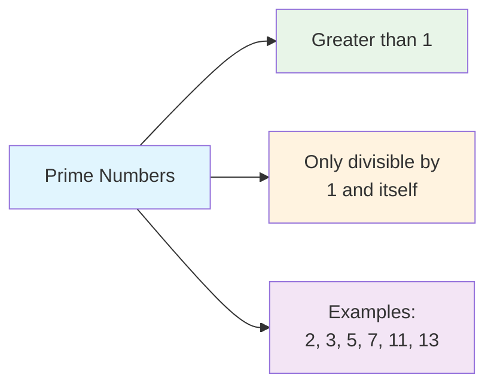

**Key Properties:**
- The number **2** is the only even prime
- All other primes are odd numbers
- Every number can be expressed as a product of primes (Fundamental Theorem of Arithmetic)

### 🎲 Naive vs. Efficient Approach

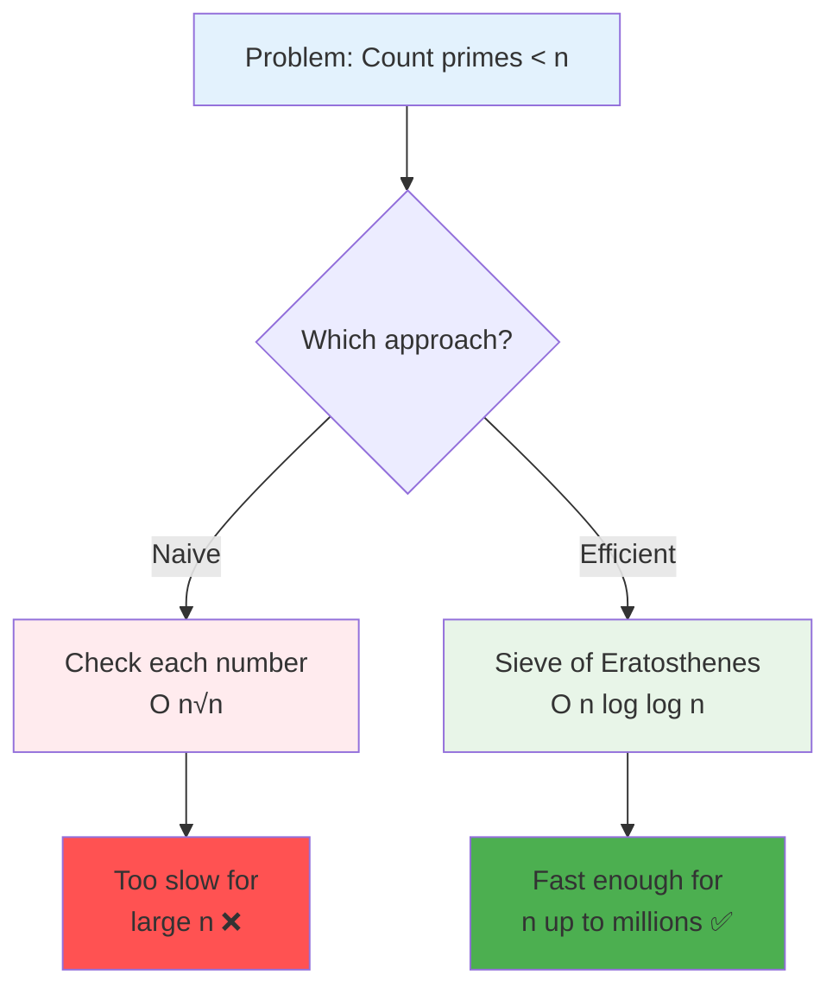

**Why Sieve is Better:**
- Instead of testing divisibility, we eliminate multiples
- Reuses work from smaller primes
- Near-linear performance in practice

---

## 📚 Step-by-Step Examples

### 🟢 Example 1: Small Number (n = 10)

**Input:** `n = 10`  
**Output:** `4` (primes: 2, 3, 5, 7)

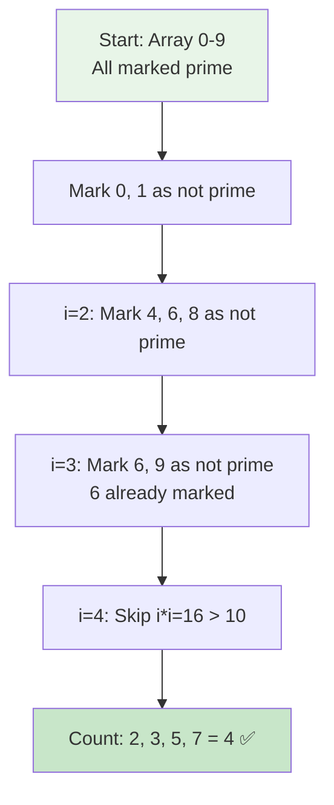

**Step-by-step visualization:**

| Index | 0 | 1 | 2 | 3 | 4 | 5 | 6 | 7 | 8 | 9 |
|-------|---|---|---|---|---|---|---|---|---|---|
| Initial | ✓ | ✓ | ✓ | ✓ | ✓ | ✓ | ✓ | ✓ | ✓ | ✓ |
| After 0,1 | ✗ | ✗ | ✓ | ✓ | ✓ | ✓ | ✓ | ✓ | ✓ | ✓ |
| After 2 | ✗ | ✗ | ✓ | ✓ | ✗ | ✓ | ✗ | ✓ | ✗ | ✓ |
| After 3 | ✗ | ✗ | ✓ | ✓ | ✗ | ✓ | ✗ | ✓ | ✗ | ✗ |
| **Primes** | | | **2** | **3** | | **5** | | **7** | | |

### 🔴 Example 2: Edge Case (n = 2)

**Input:** `n = 2`  
**Output:** `0` (no primes less than 2)

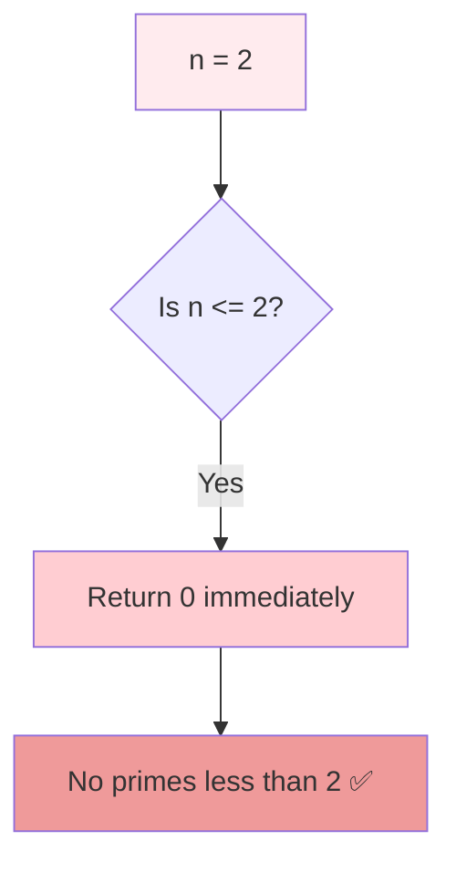

**Why?**
- By definition, primes are natural numbers **greater than 1**
- Numbers 0 and 1 are not prime
- So no primes exist less than 2

### 🟡 Example 3: Medium Number (n = 20)

**Input:** `n = 20`  
**Output:** `8` (primes: 2, 3, 5, 7, 11, 13, 17, 19)

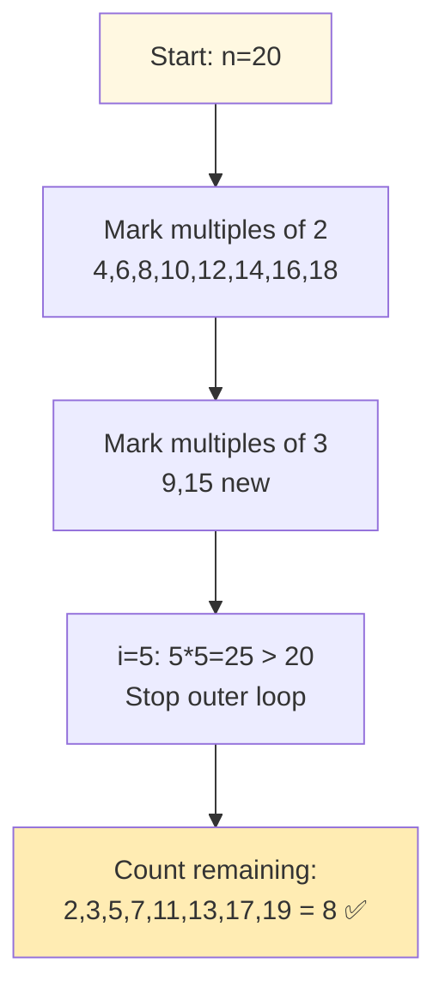

**Key Insight:** We stop at i=5 because 5² = 25 > 20. All composites less than 20 have already been marked!

### 🚨 Example 4: Understanding Why We Start from i²

**Why mark from i² instead of 2i?**

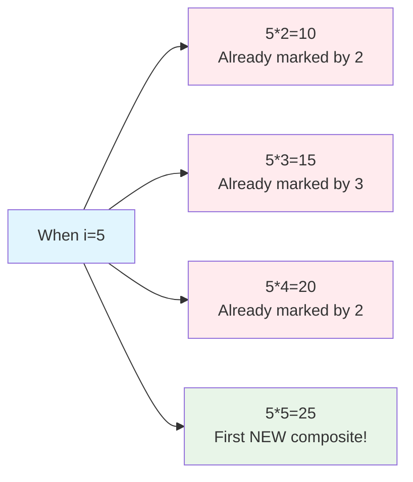

**The Math:**
- For any composite 5×k where k < 5
- That number was already marked when we processed k
- So we can start directly from 5² = 25!

---

## 🛠️ The Algorithm

### 🎯 Main Strategy: Sieve of Eratosthenes

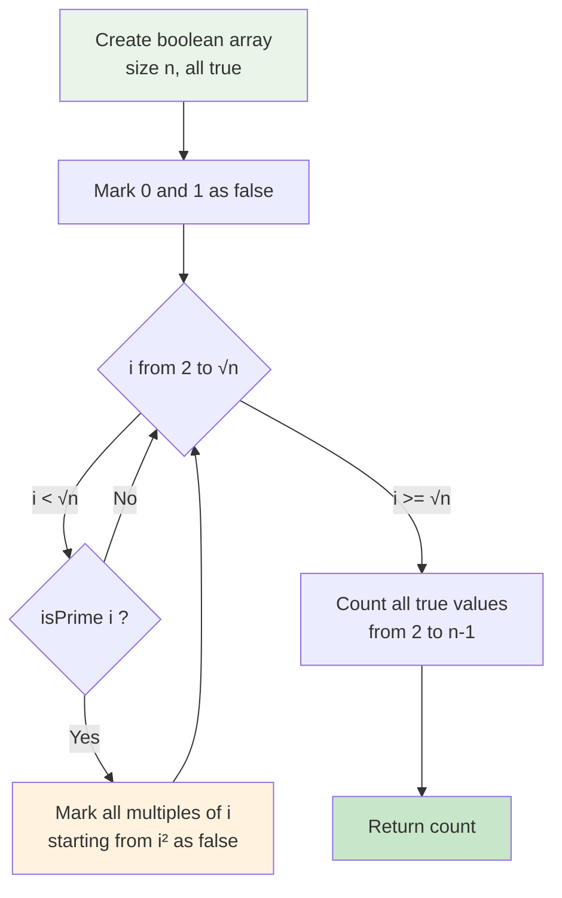

### 💻 The Code

```cpp
int countPrimes(int n) {
    if (n <= 2) return 0;
    
    // Create sieve array
    vector<bool> isPrime(n, true);
    isPrime[0] = isPrime[1] = false;
    
    // Mark composites
    for (int i = 2; i * i < n; ++i) {
        if (isPrime[i]) {
            // Start from i² and mark multiples
            for (int j = i * i; j < n; j += i) {
                isPrime[j] = false;
            }
        }
    }
    
    // Count primes
    int count = 0;
    for (int i = 2; i < n; ++i) {
        if (isPrime[i]) count++;
    }
    
    return count;
}
```

### 🛡️ Why Only Check Up to √n?

**Mathematical Proof:**

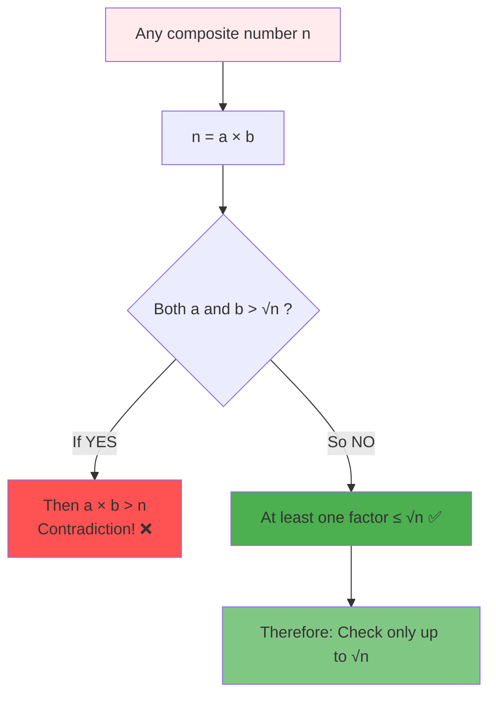

**The Logic:**
- If n = a × b and both a, b > √n
- Then a × b > √n × √n = n (impossible!)
- So at least one factor must be ≤ √n

---

## 🧪 Test Cases & Edge Cases

### ✅ Normal Cases

| Input | Output | Primes |
|-------|--------|--------|
| `10` | `4` | 2, 3, 5, 7 |
| `20` | `8` | 2, 3, 5, 7, 11, 13, 17, 19 |
| `100` | `25` | 25 primes less than 100 |

### ⚠️ Edge Cases

| Input | Output | Why |
|-------|--------|-----|
| `0` | `0` | No numbers to check |
| `1` | `0` | No primes less than 1 |
| `2` | `0` | No primes less than 2 |
| `3` | `1` | Only prime 2 |

### 🎯 Boundary Testing

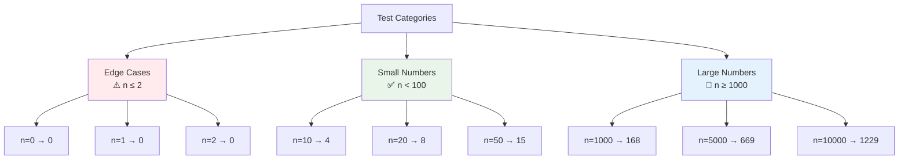

---

## 🎓 Key Concepts Mastery

### 🔢 Prime Number Properties

**1. Fundamental Properties:**
```cpp
// Only 2 is even and prime
bool isEvenPrime = (n == 2);

// All primes > 2 are odd
// But not all odd numbers are prime!
```

**2. Prime Density:**
```cpp
// Prime Number Theorem: 
// Number of primes ≤ n ≈ n / ln(n)
// Example: For n=1000000, expect ~72,382 primes
```

**3. Testing Primality:**
```cpp
// To test if n is prime, check divisors up to √n
bool isPrime(int n) {
    if (n <= 1) return false;
    if (n <= 3) return true;
    if (n % 2 == 0 || n % 3 == 0) return false;
    for (int i = 5; i * i <= n; i += 6) {
        if (n % i == 0 || n % (i + 2) == 0)
            return false;
    }
    return true;
}
```

### ⚠️ Sieve Optimization Techniques

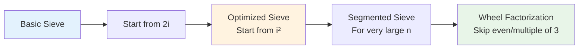

**Key Optimizations:**
1. **Start from i²**: Smaller multiples already marked
2. **Only check to √n**: Mathematical guarantee
3. **Skip even numbers**: Only 2 is even prime
4. **Use bit array**: Reduce space by 8x

### 🎯 Algorithm Comparison

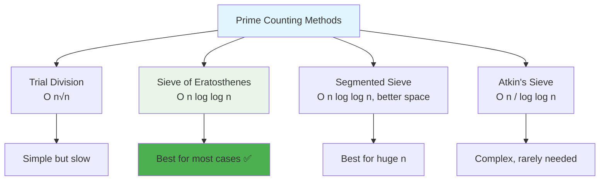

---

## 📊 Complexity Analysis

### ⏰ Time Complexity: O(n log log n)

**Why this complexity?**
- Outer loop: runs up to √n iterations
- Inner loop: for prime p, marks n/p multiples
- Total operations: n/2 + n/3 + n/5 + n/7 + ... = n(1/2 + 1/3 + 1/5 + ...)
- This sum equals O(n log log n) by prime harmonic series

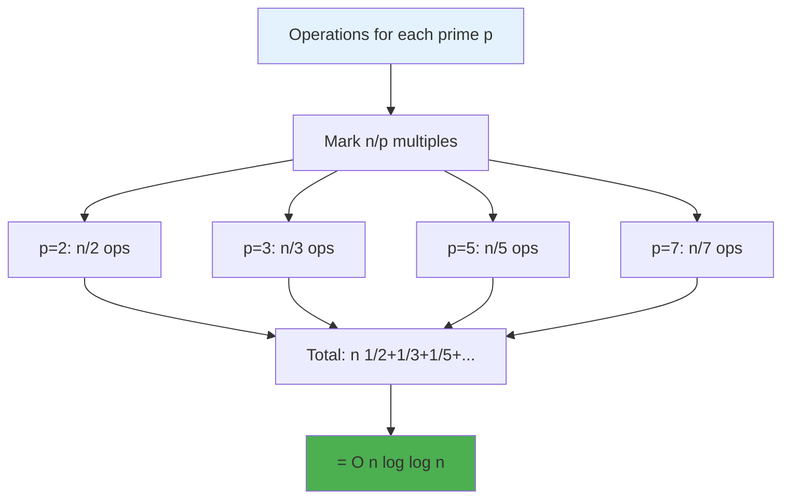

**Comparison:**
| Algorithm | Time Complexity | Notes |
|-----------|----------------|-------|
| Trial Division | O(n√n) | Too slow |
| Sieve of Eratosthenes | O(n log log n) | Best for most cases |
| Segmented Sieve | O(n log log n) | Better space |

### 💾 Space Complexity: O(n)

**Why linear space?**
- Need boolean array of size n
- Each element: 1 bit (optimized) or 1 byte (simple)
- Total: n bits or n bytes

**Space Optimization:**
```cpp
// Standard: O(n) bytes
vector<bool> isPrime(n);

// Optimized: O(n/8) bytes using bitset
bitset<10000000> isPrime;

// Segmented: O(√n) by processing chunks
```

---

## 🚀 Practice Problems

Once you master this, try these similar problems:

| Problem | Difficulty | Key Concept |
|---------|------------|-------------|
| 🔢 Prime Number of Set Bits | Easy | Prime + Bit manipulation |
| 🧮 Ugly Number II | Medium | Prime factorization |
| 💫 Count Primes in Ranges | Hard | Segmented sieve |
| 🔄 Nth Prime Number | Medium | Sieve application |

---

## 💼 Interview Questions & Answers

### ❓ Question 1: Why is the Sieve of Eratosthenes efficient?

**Answer:**  
The Sieve is efficient because it eliminates multiples rather than testing divisibility:
- Instead of testing each number (expensive), we mark composites (cheap)
- Reuses information: if we know 2 is prime, we can mark all even numbers
- Works in one pass through the array

**Simple Explanation:**  
It's like finding weeds in a garden. Instead of inspecting each plant individually, you spray herbicide that kills all weeds at once. Much faster!

---

### ❓ Question 2: Why do we start marking from i² instead of 2i?

**Answer:**  
All multiples of i less than i² have already been marked by smaller primes.

**Proof by example (i=5):**
- 5×2 = 10 (already marked when we processed 2)
- 5×3 = 15 (already marked when we processed 3)
- 5×4 = 20 (already marked when we processed 2, since 4=2×2)
- 5×5 = 25 (first NEW composite!)

**Simple Explanation:**  
If you're cleaning multiples of 5, the numbers 10, 15, 20 were already cleaned when you did 2 and 3. Start fresh from 25!

---

### ❓ Question 3: Why only check up to √n?

**Answer:**  
Any composite number n must have at least one factor ≤ √n.

**Mathematical Proof:**
- Assume n = a × b where both a, b > √n
- Then a × b > √n × √n = n (contradiction!)
- Therefore, at least one factor must be ≤ √n

**Simple Explanation:**  
Factors come in pairs. If one is big (>√n), the other must be small (≤√n). So checking small factors is enough!

**Code Example:**
```cpp
// For n = 100, only check up to 10
for (int i = 2; i * i < 100; ++i) {
    // i goes: 2, 3, 4, 5, 6, 7, 8, 9, 10
    // Checks all necessary factors
}
```

---

### ❓ Question 4: What's the time complexity and how is it derived?

**Answer:**  
**Time: O(n log log n)**

**Derivation:**
```
Operations = n/2 + n/3 + n/5 + n/7 + n/11 + ...
           = n × (1/2 + 1/3 + 1/5 + 1/7 + ...)
           = n × (sum of reciprocals of primes up to n)
           = n × O(log log n)  [by Mertens' theorem]
```

**Simple Explanation:**  
It's almost linear! The log log n part is so tiny:
- log log 1000 ≈ 2.6
- log log 1,000,000 ≈ 3.9
- log log 1,000,000,000 ≈ 5.1

So for practical purposes, it's nearly O(n)!

**Space: O(n)** - One boolean per number

---

### ❓ Question 5: Can we do better than O(n) space?

**Answer:**  
Yes! Use a **Segmented Sieve** for O(√n) space:

**Approach:**
1. Find all primes up to √n using regular sieve: O(√n) space
2. Process range [√n, n] in segments of size √n
3. For each segment, mark composites using primes from step 1

**Simple Explanation:**  
Instead of one huge array, use a small array and process the range in chunks. Like washing a big floor with a small bucket - you do sections at a time!

**Space Comparison:**
```
Regular Sieve:     O(n) space
Segmented Sieve:   O(√n) space
For n=1,000,000:   1MB vs 1KB savings!
```

---

### ❓ Question 6: How does this compare to checking each number individually?

**Answer:**  
**Naive approach:** Check if each number from 2 to n-1 is prime

```cpp
// Naive: O(n√n) time
int countPrimes(int n) {
    int count = 0;
    for (int i = 2; i < n; ++i) {
        if (isPrime(i)) count++;  // O(√i) per check
    }
    return count;
}
```

**Time Comparison:**
```
n = 100:
- Naive: ~1,000 operations
- Sieve: ~100 operations (10x faster!)

n = 1,000,000:
- Naive: ~1,000,000,000 operations
- Sieve: ~20,000,000 operations (50x faster!)
```

**Simple Explanation:**  
Naive is like knocking on every door to ask "are you prime?"  
Sieve is like sending one message that marks all non-primes. Much smarter!

---

### ❓ Question 7: What if n is very large (e.g., 10⁹)?

**Answer:**  
For extremely large n, use these techniques:

**1. Segmented Sieve:**
- Space: O(√n) instead of O(n)
- Process range in chunks

**2. Parallel Sieve:**
- Mark different ranges on different CPU cores
- Near-linear speedup with cores

**3. Bit Packing:**
- Use 1 bit per number instead of 1 byte
- 8x space reduction

**4. Skip Evens:**
- Only store odd numbers
- 2x space reduction

**Simple Explanation:**  
It's like organizing a huge library:
- Segmented: Process one shelf at a time
- Parallel: Multiple librarians working together
- Bit packing: Compress book labels
- Skip evens: Only catalog odd-numbered books

---

### ❓ Question 8: Why is 2 the only even prime?

**Answer:**  
**By definition:** All even numbers greater than 2 are divisible by 2, so they have a divisor other than 1 and themselves.

**Proof:**
- 2 is prime (only divisors: 1, 2)
- 4 = 2×2 (divisible by 2, not prime)
- 6 = 2×3 (divisible by 2, not prime)
- Any even n = 2×k where k ≥ 2 (not prime)

**Simple Explanation:**  
By definition, even means "divisible by 2". If a number > 2 is divisible by 2, it has 2 as a factor, so it's not prime!

This is why many optimizations skip even numbers entirely.

---

### ❓ Question 9: What's the difference between Sieve of Eratosthenes and Sieve of Atkin?

**Answer:**  
**Sieve of Eratosthenes:**
- Time: O(n log log n)
- Simple to implement
- Best for most practical use cases

**Sieve of Atkin:**
- Time: O(n / log log n) - theoretically faster
- Much more complex to implement
- Uses quadratic forms and modular arithmetic

**Practical Reality:**
- Atkin is faster only for n > 10¹⁰
- Eratosthenes has better cache performance
- For coding interviews: always use Eratosthenes!

**Simple Explanation:**  
Eratosthenes is like using a simple, reliable car.  
Atkin is like using a Formula 1 race car - faster on paper, but needs expert handling and only worth it for very long distances.

---

### ❓ Question 10: How do you handle the case where n ≤ 2?

**Answer:**  
**Edge case handling:**
```cpp
if (n <= 2) return 0;
```

**Reasoning:**
- n = 0: No numbers to check → 0 primes
- n = 1: Only number 0 exists, not prime → 0 primes
- n = 2: Only numbers 0, 1 exist, both not prime → 0 primes

**Simple Explanation:**  
Primes start at 2. If we're looking for primes *less than* 2, there are none!

**Why this matters:**
- Prevents array allocation for negative/zero size
- Avoids unnecessary computation
- Returns correct answer immediately

---

### 🎯 Common Interview Follow-ups

**Q: "Can you optimize space further?"**  
A: Yes! Use bitset (1 bit per number) or only store odd numbers (2x reduction).

**Q: "What if we need primes in a range [L, R] instead of [0, n]?"**  
A: Use segmented sieve: find primes up to √R, then mark composites in [L, R].

**Q: "How would you find the nth prime number?"**  
A: Run sieve up to an estimated upper bound (n × ln n × 1.3), then count to nth prime.

**Q: "Can this algorithm be parallelized?"**  
A: Yes! Different segments can be processed on different cores. Nearly linear speedup.

---

## 🎯 Quick Reference

### 🔑 Essential Code Pattern

```cpp
// Sieve of Eratosthenes template
int countPrimes(int n) {
    if (n <= 2) return 0;
    
    vector<bool> isPrime(n, true);
    isPrime[0] = isPrime[1] = false;
    
    for (int i = 2; i * i < n; ++i) {
        if (isPrime[i]) {
            for (int j = i * i; j < n; j += i) {
                isPrime[j] = false;
            }
        }
    }
    
    int count = 0;
    for (int i = 2; i < n; ++i) {
        if (isPrime[i]) count++;
    }
    return count;
}
```

### 📝 Important Facts

```cpp
// First 10 primes
int firstPrimes[] = {2, 3, 5, 7, 11, 13, 17, 19, 23, 29};

// Prime counting function approximation
// π(n) ≈ n / ln(n)  [Prime Number Theorem]

// Time complexity
// Sieve: O(n log log n)
// Naive: O(n√n)
```

### 🧠 Mental Model

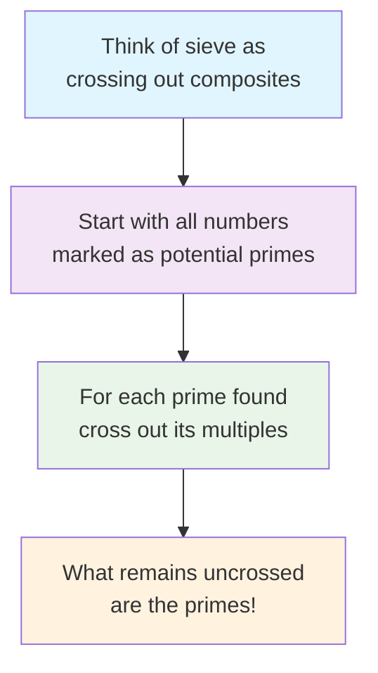

---

## 🏆 Mastery Checklist

- [ ] ✅ Understand what makes a number prime
- [ ] ✅ Know why naive approach is slow (O(n√n))
- [ ] ✅ Master Sieve of Eratosthenes algorithm
- [ ] ✅ Understand why we start marking from i²
- [ ] ✅ Know why we only check up to √n
- [ ] ✅ Grasp the O(n log log n) complexity
- [ ] ✅ Handle edge cases (n ≤ 2)
- [ ] ✅ Explain optimization techniques
- [ ] ✅ Test with various input sizes
- [ ] ✅ Answer interview questions confidently

---

## 💡 Pro Tips

1. **🛡️ Start from i²**: Crucial optimization that reduces redundant operations
2. **🔢 Check to √n**: Mathematical guarantee eliminates half the iterations
3. **🧪 Test Edge Cases**: Always test n ≤ 2, small numbers, and large numbers
4. **📚 Know the Theory**: Understand prime number theorem and complexity derivation
5. **🎯 Visualize the Process**: Draw arrays and mark composites to understand flow
6. **💼 Practice Variations**: Segmented sieve, prime ranges, nth prime problems
7. **🚀 Understand Tradeoffs**: Space vs time, simplicity vs optimization

---

**🎉 Congratulations! You now have a complete understanding of the Sieve of Eratosthenes, prime counting algorithms, and can confidently solve related problems in interviews. Keep practicing and happy coding!**
