# Day 15: 🔍 Sqrt(x) - Complete Beginner's Guide

> **Master binary search on answer space and overflow handling step by step!**

---

## 📖 What You'll Learn

By the end of this guide, you'll master:
- 🎯 **Binary Search on Answer Space** - Searching for solutions in value ranges, not arrays
- 🛡️ **Overflow Prevention** - Safely handling large number multiplications
- 📐 **Mathematical Optimization** - Reducing O(√x) to O(log x) complexity
- 🧮 **Square Root Concepts** - Understanding integer square root computation

---

## 🎯 The Problem

### 📋 Problem Statement

**Given**: A non-negative integer `x`  
**Task**: Return the integer square root of `x` rounded down to the nearest integer  
**Catch**: You cannot use any built-in exponent functions or operators!

**Important Rule**: For non-perfect squares, return the floor of the square root

### 🌟 Real-World Example

Think of it like finding perfect fits:
- **x = 4** → sqrt is **2** (perfect square: 2 × 2 = 4)
- **x = 8** → sqrt is **2** (not perfect: 2² = 4 < 8 < 9 = 3²)
- **x = 0** → sqrt is **0** (special case)

---

## 🔍 Understanding the Basics

### 🏗️ What is a Square Root?

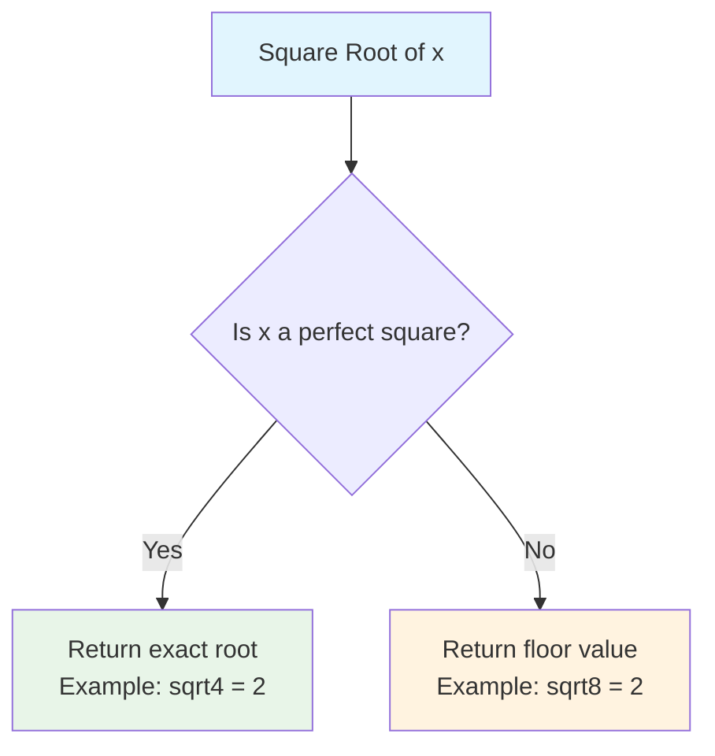

**Think of it like this:**
- Square root asks: "What number times itself gives me x?"
- If no perfect answer exists, we round down to the nearest integer

### 🎲 Binary Search on Answer Space

Here's the key insight: we're not searching in an array, we're searching for the answer itself!

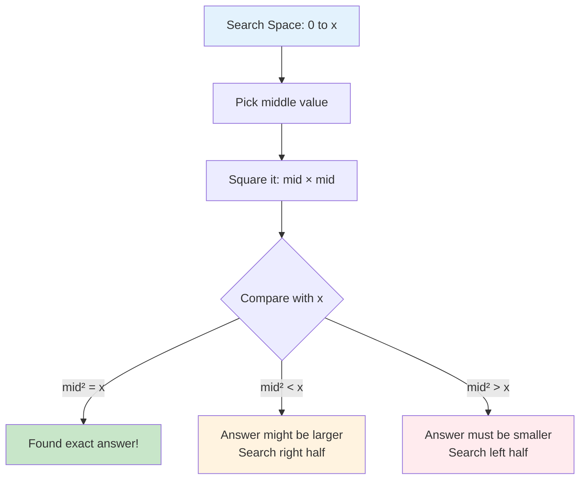

**Key Operations:**
- `mid * mid` → Test if this is the square root
- Compare `mid²` with `x` to decide where to search next
- Store valid candidates as we search

---

## 📚 Step-by-Step Examples

### 🟢 Example 1: Perfect Square

**Input:** `x = 16`  
**Output:** `4`

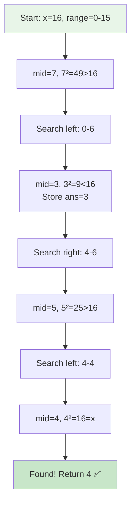

**Step-by-step breakdown:**
1. **Start:** `s = 0, e = 15, ans = -1, x = 16`
2. **Step 1:** mid = 7, 7² = 49 > 16
   - Search left: `e = 6`
3. **Step 2:** mid = 3, 3² = 9 < 16
   - Store answer: `ans = 3`
   - Search right: `s = 4`
4. **Step 3:** mid = 5, 5² = 25 > 16
   - Search left: `e = 4`
5. **Step 4:** mid = 4, 4² = 16 = x
   - Perfect match! Return `4`

### 🟡 Example 2: Non-Perfect Square

**Input:** `x = 8`  
**Output:** `2`

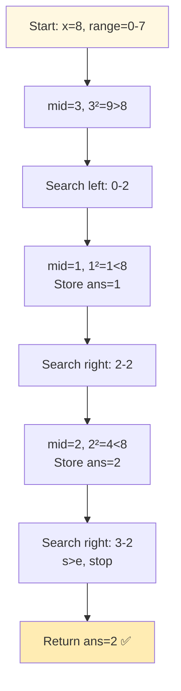

**Magic of Floor Value:**
- 2² = 4 ≤ 8 ≤ 9 = 3²
- Since 8 is between 4 and 9, we return the lower bound: 2
- This is exactly what "floor" means!

### 🔵 Example 3: Edge Cases

**Input:** `x = 0`  
**Output:** `0`

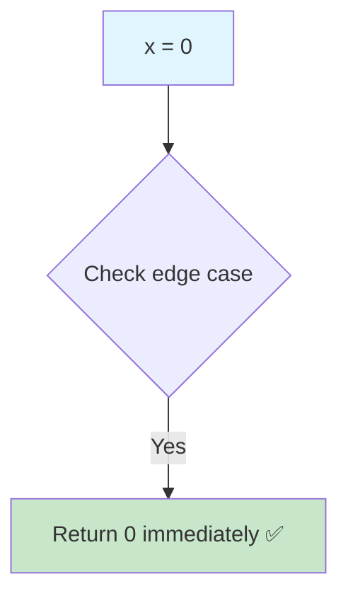

**Input:** `x = 1`  
**Output:** `1`

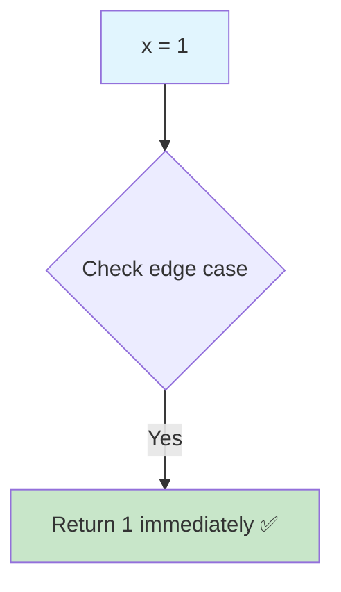

### 🚨 Example 4: Overflow Prevention

**Input:** `x = 2147483647` (INT_MAX)  
**Expected Output:** `46340`

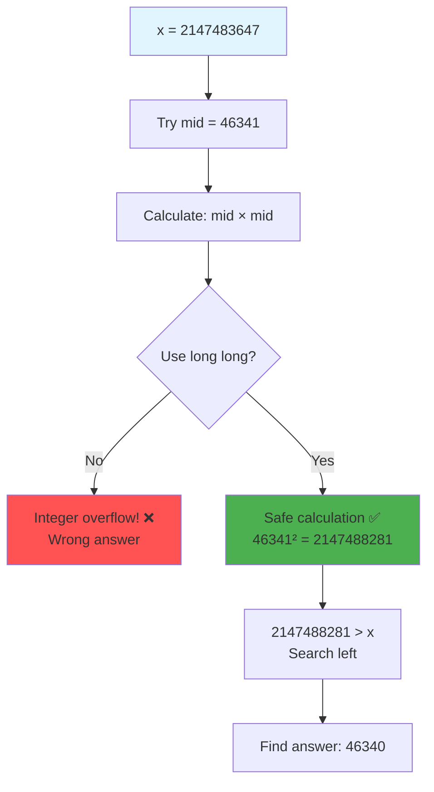

---

## 🛠️ The Algorithm

### 🎯 Main Strategy: Binary Search

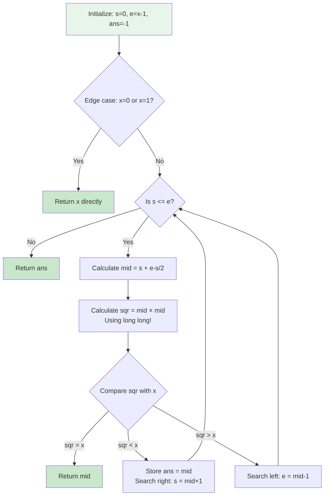

### 💻 The Code

```cpp
int mySqrt(int x) {
    int s = 0;      // Start pointer
    int e = x - 1;  // End pointer
    int ans = -1;   // Variable to store the answer
    
    // Handle edge cases
    if(x == 0) return 0;
    if(x == 1) return 1;
    
    while(s <= e) {
        // Calculate mid point to avoid overflow
        long long int mid = s + (e - s) / 2;
        
        // Calculate square using long long to prevent overflow
        long long int sqr = mid * mid;
        
        // If perfect square found, return immediately
        if(sqr == x) {
            return mid;
        }
        // If mid² < x, store and search right
        else if(sqr < x) {
            ans = mid;
            s = mid + 1;
        }
        // If mid² > x, search left
        else {
            e = mid - 1;
        }
    }
    
    return ans;
}
```

### 🛡️ Overflow Protection Explained

**Why do we use `long long`?**

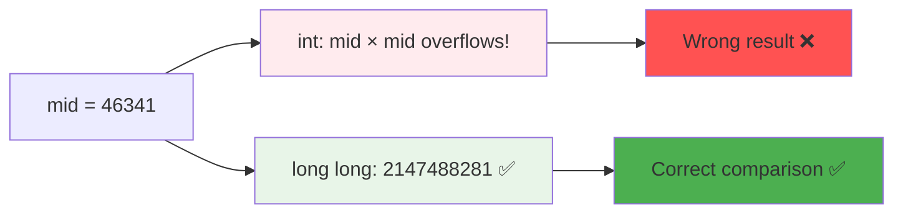

**The Math:**
- `INT_MAX = 2,147,483,647`
- `46340² = 2,147,395,600` (fits in 32-bit)
- `46341² = 2,147,488,281` (exceeds INT_MAX!)
- Solution: Use `long long` for square calculation

---

## 🧪 Test Cases & Edge Cases

### ✅ Normal Cases

| Input | Output | Why |
|-------|--------|-----|
| `16` | `4` | Perfect square |
| `8` | `2` | Floor of 2.828... |
| `2` | `1` | Floor of 1.414... |

### ⚠️ Edge Cases

| Input | Output | Why |
|-------|--------|-----|
| `0` | `0` | Special case: sqrt(0) = 0 |
| `1` | `1` | Special case: sqrt(1) = 1 |
| `2147483647` | `46340` | INT_MAX - overflow handling |

### 🎯 Boundary Testing

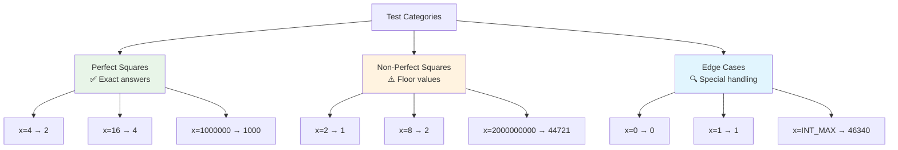

---

## 🎓 Key Concepts Mastery

### 🔢 Binary Search on Answer Pattern

**1. Identify the Search Space:**
```cpp
// For sqrt(x), answer is in range [0, x]
int s = 0;
int e = x - 1;  // Can optimize to x/2 for x > 1
```

**2. Store Valid Candidates:**
```cpp
int ans = -1;  // Track best answer so far
if (condition_satisfied) {
    ans = mid;  // Store this as potential answer
}
```

**3. Decide Search Direction:**
```cpp
if (mid² < x) {
    // Answer might be larger, search right
    s = mid + 1;
} else {
    // Answer must be smaller, search left
    e = mid - 1;
}
```

### ⚠️ Overflow Prevention Techniques

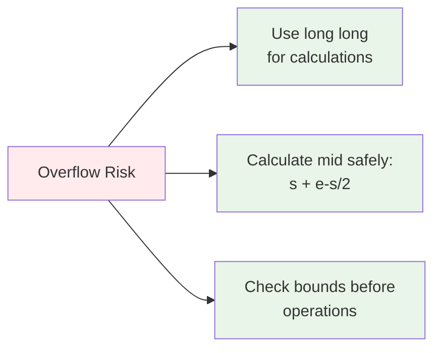

**Pattern to Remember:**
```cpp
// ALWAYS use long long for potentially large calculations
long long int mid = s + (e - s) / 2;  // Prevents overflow
long long int sqr = mid * mid;         // Safe multiplication

// Instead of:
int mid = (s + e) / 2;  // Can overflow if s+e > INT_MAX!
int sqr = mid * mid;     // Can overflow!
```

### 🎯 Problem-Solving Framework

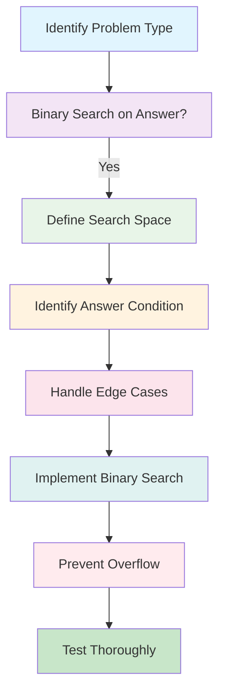

---

## 📊 Complexity Analysis

### ⏰ Time Complexity: O(log x)

**Why logarithmic?**
- Each iteration cuts the search space in half
- For a number with d digits, d ≈ log₁₀(x)
- Binary search takes log₂(x) iterations

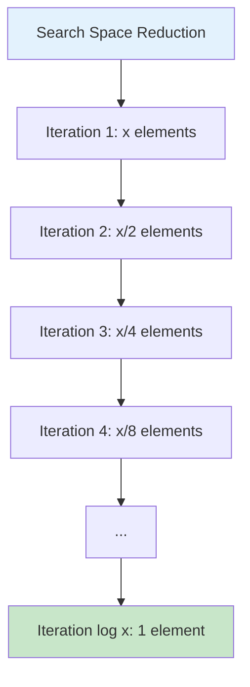

**Example:**
- x = 1,000,000 → Takes ~20 iterations
- x = 1,000,000,000 → Takes ~30 iterations
- Very efficient even for large numbers!

### 💾 Space Complexity: O(1)

**Why constant space?**
- Only use a few variables: `s`, `e`, `ans`, `mid`, `sqr`
- No arrays, lists, or recursive calls
- Memory usage doesn't grow with input size

---

## 🚀 Practice Problems

Once you master this, try these similar problems:

| Problem | Difficulty | Key Concept |
|---------|------------|-------------|
| 🔢 Valid Perfect Square | Easy | Binary search on answer |
| 🧮 Guess Number Higher or Lower | Easy | Binary search application |
| 💫 Find Peak Element | Medium | Modified binary search |
| 🔄 Search in Rotated Sorted Array | Medium | Binary search variant |

---

## 💼 Interview Questions & Answers

### ❓ Question 1: Why use binary search instead of linear search?

**Answer:**  
Binary search is much more efficient for large numbers:
- Linear search: Check 1, 2, 3, ..., sqrt(x) → O(√x) time
- Binary search: Cuts search space in half each time → O(log x) time

**Simple Explanation:**  
For x = 1,000,000:
- Linear: ~1,000 checks
- Binary: ~20 checks

It's like finding a name in a phone book - you don't start from the first page!

---

### ❓ Question 2: Why do we need `long long` for overflow prevention?

**Answer:**  
When calculating `mid * mid`, the result can exceed INT_MAX even if the final answer fits.

**Example:**
```cpp
int mid = 46341;
int sqr = mid * mid;  // Overflow! Result wraps around to negative

long long sqr = (long long)mid * mid;  // Safe! 2,147,488,281
```

**Simple Explanation:**  
It's like using a bigger container temporarily during cooking, even if the final dish fits in a small bowl.

---

### ❓ Question 3: Why is the end pointer `x - 1` instead of `x`?

**Answer:**  
For x > 1, the square root is always less than x itself.

**Math Proof:**
- sqrt(x) < x for all x > 1
- sqrt(4) = 2 < 4
- sqrt(100) = 10 < 100

So we can safely use `e = x - 1` to reduce one iteration.

**Simple Explanation:**  
You don't need to check if 100 is the square root of 100, because 100² = 10,000 ≠ 100!

---

### ❓ Question 4: How does the algorithm handle non-perfect squares?

**Answer:**  
We store the last valid answer where `mid² < x`. If no perfect square exists, this is our floor value.

**Example for x = 8:**
```
mid = 1: 1² = 1 < 8 → Store ans = 1
mid = 2: 2² = 4 < 8 → Store ans = 2 (update)
mid = 3: 3² = 9 > 8 → Don't update
Final: ans = 2 (largest value where mid² ≤ 8)
```

**Simple Explanation:**  
We keep track of the "best so far" answer as we search, so even if we don't find a perfect match, we have the closest valid answer.

---

### ❓ Question 5: What's the time complexity and why?

**Answer:**  
**Time: O(log x)** - Binary search halves the search space each iteration

**Simple Explanation:**
```
Search space size:
Start:      x
After 1:    x/2
After 2:    x/4
After 3:    x/8
...
After k:    x/(2^k) = 1

Solving: 2^k = x → k = log₂(x)
```

**Space: O(1)** - Only use 5 variables regardless of input size

---

### ❓ Question 6: Can you optimize the search space further?

**Answer:**  
Yes! For x ≥ 4, sqrt(x) ≤ x/2

**Proof:**
- sqrt(x) = x/2 → Squaring: x = x²/4 → 4 = x → Only true for x = 4
- For x > 4: sqrt(x) < x/2

**Optimized Code:**
```cpp
int e = (x >= 4) ? x / 2 : x;  // More efficient search space
```

**Simple Explanation:**  
The square root of 100 is 10, which is much less than 50 (100/2). This optimization skips checking numbers 51-99!

---

### ❓ Question 7: What about Newton's Method?

**Answer:**  
Newton's method is an alternative iterative approach:

```cpp
int mySqrtNewton(int x) {
    if (x == 0) return 0;
    double x0 = x;
    double x1 = (x0 + x / x0) / 2.0;
    
    while (abs(x0 - x1) >= 1) {
        x0 = x1;
        x1 = (x0 + x / x0) / 2.0;
    }
    
    return (int)x1;
}
```

**Pros:**
- Converges very quickly (quadratic convergence)
- Mathematically elegant

**Cons:**
- Uses floating-point arithmetic (less precise)
- Harder to prove correctness in interviews

**Binary search is preferred in interviews** because it's easier to explain and doesn't rely on floating-point precision.

---

### ❓ Question 8: How do you handle the edge case x = 0?

**Answer:**  
Handle it explicitly before the main loop:

```cpp
if (x == 0) return 0;  // sqrt(0) = 0
if (x == 1) return 1;  // sqrt(1) = 1
```

**Why separate handling?**
- Avoids division by zero in some calculations
- Makes the main algorithm cleaner
- Faster execution (no unnecessary iterations)

**Simple Explanation:**  
It's like checking if a package is empty before trying to open it!

---

### ❓ Question 9: What if the interviewer asks for decimal precision?

**Answer:**  
Modify the algorithm to search in floating-point space:

```cpp
double sqrtWithPrecision(int x, double epsilon) {
    double s = 0, e = x;
    double mid;
    
    while (e - s > epsilon) {
        mid = s + (e - s) / 2;
        double sqr = mid * mid;
        
        if (abs(sqr - x) < epsilon) {
            return mid;
        } else if (sqr < x) {
            s = mid;
        } else {
            e = mid;
        }
    }
    
    return mid;
}
```

**Key differences:**
- Use `double` instead of `int`
- Stop when difference < epsilon (precision threshold)
- Don't need overflow protection (doubles have huge range)

---

### ❓ Question 10: How would you test this function?

**Answer:**  
Comprehensive test cases should include:

**1. Perfect squares:**
```cpp
assert(mySqrt(0) == 0);
assert(mySqrt(1) == 1);
assert(mySqrt(4) == 2);
assert(mySqrt(16) == 4);
assert(mySqrt(1000000) == 1000);
```

**2. Non-perfect squares:**
```cpp
assert(mySqrt(2) == 1);
assert(mySqrt(8) == 2);
assert(mySqrt(15) == 3);
```

**3. Boundary cases:**
```cpp
assert(mySqrt(INT_MAX) == 46340);
assert(mySqrt(2147395600) == 46340);  // 46340²
```

**4. Edge cases:**
```cpp
assert(mySqrt(0) == 0);
assert(mySqrt(1) == 1);
```

---

### 🎯 Common Interview Follow-ups

**Q: "Can you optimize this further?"**  
A: The algorithm is already optimal - O(log x) time and O(1) space. We can reduce the search space to [0, x/2] for x ≥ 4, but this is a constant factor improvement, not algorithmic.

**Q: "What if we need to handle negative numbers?"**  
A: Square roots of negative numbers are imaginary (complex numbers). In this problem, input is guaranteed non-negative. For a real-world implementation, we'd return an error or throw an exception for negative inputs.

**Q: "How would you parallelize this algorithm?"**  
A: Binary search is inherently sequential - each step depends on the previous comparison. However, if you need to compute square roots for multiple numbers, you could parallelize across different inputs.

---

## 🎯 Quick Reference

### 🔑 Essential Code Patterns

```cpp
// Binary search on answer space
int s = 0, e = x - 1, ans = -1;
while (s <= e) {
    long long mid = s + (e - s) / 2;  // Prevent overflow
    long long sqr = mid * mid;         // Use long long
    
    if (sqr == x) return mid;
    else if (sqr < x) {
        ans = mid;  // Store valid answer
        s = mid + 1;
    } else {
        e = mid - 1;
    }
}
return ans;

// Edge case handling
if (x == 0) return 0;
if (x == 1) return 1;

// Overflow prevention
long long mid = s + (e - s) / 2;  // Not (s + e) / 2
long long sqr = mid * mid;         // Not int
```

### 📝 Important Constants

```cpp
INT_MAX = 2,147,483,647           // Largest 32-bit integer
sqrt(INT_MAX) = 46340             // Maximum possible answer
46340² = 2,147,395,600 < INT_MAX  // Fits in int
46341² = 2,147,488,281 > INT_MAX  // Overflows!
```

### 🧠 Mental Model

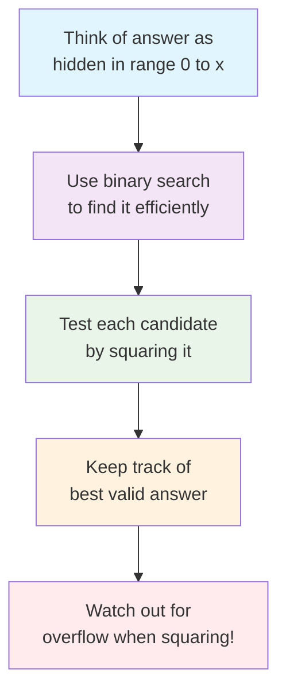

---

## 🏆 Mastery Checklist

- [ ] ✅ Understand binary search on answer space concept
- [ ] ✅ Know how to prevent integer overflow with long long
- [ ] ✅ Master the "store valid answer" pattern
- [ ] ✅ Handle edge cases (0, 1) correctly
- [ ] ✅ Calculate midpoint safely to avoid overflow
- [ ] ✅ Solve the problem in O(log x) time
- [ ] ✅ Use O(1) space only
- [ ] ✅ Test all edge cases thoroughly
- [ ] ✅ Explain algorithm clearly in interviews
- [ ] ✅ Compare with alternative approaches (Newton's method)

---

## 💡 Pro Tips

1. **🛡️ Safety First**: Always use `long long` when squaring mid values
2. **🎯 Answer Tracking**: Store valid candidates during binary search
3. **🧪 Test Edge Cases**: Zero, one, perfect squares, INT_MAX
4. **📚 Learn the Pattern**: "Binary search on answer" appears in many problems
5. **🔍 Visualize**: Draw out the search space and elimination process
6. **💼 Prepare Stories**: Be ready to explain overflow prevention clearly
7. **⚡ Optimize Wisely**: Search space [0, x/2] for x ≥ 4
8. **🧮 Know the Math**: sqrt(INT_MAX) = 46340 (useful fact!)

---

**🎉 Congratulations! You now have a complete understanding of computing integer square roots using binary search on answer space, overflow handling, and can confidently answer interview questions. Keep practicing and happy coding!**
