# Day 19: 🏔️ Peak Index in Mountain Array - Complete Beginner's Guide

> **Master binary search on mountain arrays step by step!**


---

## 📖 What You'll Learn

By the end of this guide, you'll master:
- 🔍 **Binary Search Applications** - How to adapt binary search to non-standard arrays
- ⛰️ **Mountain Array Properties** - Understanding unimodal functions
- 🎯 **Search Space Reduction** - Efficiently narrowing down possibilities
- 🧮 **Comparison Logic** - Using neighbor comparisons to guide decisions

---

## 🎯 The Problem

### 📋 Problem Statement

**Given**: An integer array `arr` that is guaranteed to be a mountain array  
**Task**: Return the index of the peak element  
**Mountain Array Definition**: 
- Length ≥ 3
- There exists an index `i` where:
  - `arr[0] < arr[1] < ... < arr[i-1] < arr[i]`
  - `arr[i] > arr[i+1] > ... > arr[arr.length - 1]`

**Important Rule**: You must solve it in O(log n) time complexity!

### 🌟 Real-World Example

Think of it like finding the peak of a mountain:
- **[0, 1, 0]** → Peak at index **1** (value: 1)
- **[0, 2, 1, 0]** → Peak at index **1** (value: 2)
- **[0, 10, 5, 2]** → Peak at index **1** (value: 10)

---

## 🔍 Understanding the Basics

### 🏗️ What is a Mountain Array?


**Think of it like climbing a mountain:**
- You start at the base (lowest point)
- You climb UP continuously to reach the peak
- You descend DOWN continuously after the peak
- There's exactly ONE peak

### 🎲 Binary Search on Mountain Arrays

Here's how we find the peak efficiently:


**Key Operations:**
- `arr[mid] < arr[mid+1]` → On ascending slope, go right
- `arr[mid] > arr[mid+1]` → On descending slope or at peak, go left

---

## 📚 Step-by-Step Examples

### 🟢 Example 1: Simple Mountain

**Input:** `arr = [0, 1, 0]`  
**Output:** `1`


**Step-by-step breakdown:**
1. **Start:** `s = 0, e = 2, arr = [0, 1, 0]`
2. **Step 1:** Calculate mid: `mid = 0 + (2-0)/2 = 1`
   - Compare: `arr[1] = 1 vs arr[2] = 0`
   - `1 > 0` → Descending, peak is left or at mid
   - Update: `e = mid = 1`
3. **Step 2:** Now `s = 0, e = 1`
   - Calculate mid: `mid = 0 + (1-0)/2 = 0`
   - Compare: `arr[0] = 0 vs arr[1] = 1`
   - `0 < 1` → Ascending, peak is right
   - Update: `s = mid + 1 = 1`
4. **Done:** `s = e = 1`, return `1`

### 🔵 Example 2: Larger Mountain

**Input:** `arr = [0, 2, 1, 0]`  
**Output:** `1`


**Why it works:**
- First comparison immediately identifies descending slope
- Binary search converges in just one iteration!

### 🟡 Example 3: Peak Near End

**Input:** `arr = [0, 10, 5, 2]`  
**Output:** `1`


### 🚀 Example 4: Large Mountain

**Input:** `arr = [0, 1, 2, 4, 8, 9, 10, 7, 5, 3, 2, 1]`  
**Output:** `6`


**Efficiency:**
- Array size: 12 elements
- Iterations: 4 (compared to 12 for linear scan)
- Time saved: ~67%!

---

## 🛠️ The Algorithm

### 🎯 Main Strategy: Binary Search with Neighbor Comparison


### 💻 The Code

```cpp
int peakIndexInMountainArray(vector<int>& arr) {
    int start = 0;
    int end = arr.size() - 1;
    
    while (start < end) {
        // Calculate middle index
        int mid = start + (end - start) / 2;
        
        // 🔍 KEY DECISION: Compare with right neighbor
        if (arr[mid] < arr[mid + 1]) {
            // ⛰️ Ascending slope - peak is ahead
            start = mid + 1;
        } else {
            // ⛰️ Descending slope - peak is behind or here
            end = mid;
        }
    }
    
    return start;
}
```

### 🛡️ Why This Works: The Logic Explained

**Why compare with right neighbor only?**


**The Math:**
- If climbing (`arr[mid] < arr[mid+1]`), peak is definitely to the right
- If descending (`arr[mid] > arr[mid+1]`), peak could be at `mid` or to the left
- We keep `mid` in search space for descending case by setting `end = mid`
- We exclude `mid` for ascending case by setting `start = mid + 1`

---

## 🧪 Test Cases & Edge Cases

### ✅ Normal Cases

| Input | Output | Peak Value | Why |
|-------|--------|------------|-----|
| `[0, 1, 0]` | `1` | `1` | Smallest mountain |
| `[0, 2, 1, 0]` | `1` | `2` | Classic mountain |
| `[0, 10, 5, 2]` | `1` | `10` | Sharp peak |

### ⚠️ Edge Cases

| Input | Output | Peak Value | Why |
|-------|--------|------------|-----|
| `[0, 1, 2, 3, 2, 1]` | `3` | `3` | Peak in middle |
| `[1, 3, 5, 4, 2]` | `2` | `5` | Long ascent |
| `[0, 5, 3, 2, 1]` | `1` | `5` | Long descent |

### 🎯 Binary Search Efficiency

```mermaid
flowchart TD
    A["Test Categories"] --> B["Small Arrays<br/>n < 10"]
    A --> C["Medium Arrays<br/>10 ≤ n < 100"]
    A --> D["Large Arrays<br/>n ≥ 100"]
    
    B --> B1["2-3 iterations"]
    C --> C1["4-7 iterations"]
    D --> D1["7-10 iterations"]
    
    B --> B2["Example: [0,1,0]"]
    C --> C2["Example: [0..10..0]"]
    D --> D2["Example: [0..100..0]"]
    
    style B fill:#e8f5e8
    style C fill:#fff3e0
    style D fill:#ffebee
```



---

## 🎓 Key Concepts Mastery

### 🔍 Binary Search Pattern Recognition

**When to use Binary Search:**
1. ✅ Array has some sort of order (sorted, rotated, mountain)
2. ✅ Can eliminate half the search space with each comparison
3. ✅ Need O(log n) time complexity

**Mountain Array Pattern:**
```cpp
// Template for mountain array binary search
while (start < end) {
    int mid = start + (end - start) / 2;
    
    if (/* condition indicating peak is right */) {
        start = mid + 1;  // Exclude mid, go right
    } else {
        end = mid;  // Include mid, go left
    }
}
return start;  // start and end converge to peak
```

### ⚠️ Common Mistakes to Avoid

```mermaid
flowchart TD
    A["Common Mistakes"] --> B["Using start <= end"]
    A --> C["Setting end = mid - 1"]
    A --> D["Comparing with left neighbor"]
    
    B --> B1["❌ Causes infinite loop<br/>✅ Use start < end"]
    C --> C1["❌ Might skip peak<br/>✅ Use end = mid"]
    D --> D1["❌ Incorrect logic<br/>✅ Compare with right"]
    
    style A fill:#e3f2fd
    style B1 fill:#ffebee
    style C1 fill:#ffebee
    style D1 fill:#ffebee
```



**Why `start < end` not `start <= end`?**
- With `<`: Loop stops when `start == end` (converged to answer)
- With `<=`: Loop continues, needs extra return logic, prone to errors

**Why `end = mid` not `end = mid - 1`?**
- Peak might BE at `mid` when descending
- Using `mid - 1` might skip the peak entirely

### 🎯 Problem-Solving Framework


---

## 📊 Complexity Analysis

### ⏰ Time Complexity: O(log n)

**Why logarithmic?**
- Each iteration cuts search space in half
- For array of size `n`, maximum iterations = ⌈log₂ n⌉
- Example: n = 1000 → max 10 iterations!


**Comparison with Linear Search:**
| Array Size | Linear O(n) | Binary O(log n) | Speedup |
|------------|-------------|-----------------|---------|
| 10 | 10 | 4 | 2.5x |
| 100 | 100 | 7 | 14x |
| 1,000 | 1,000 | 10 | 100x |
| 1,000,000 | 1,000,000 | 20 | 50,000x |

### 💾 Space Complexity: O(1)

**Why constant space?**
- Only use three variables: `start`, `end`, `mid`
- No recursion (no call stack)
- No extra data structures
- Memory usage independent of array size

---

## 🚀 Practice Problems

Once you master this, try these similar problems:

| Problem | Difficulty | Key Concept |
|---------|------------|-------------|
| 🔍 Binary Search | Easy | Basic binary search |
| 🔢 Find First and Last Position | Medium | Binary search variants |
| 🎯 Search in Rotated Sorted Array | Medium | Modified binary search |
| ⛰️ Find Peak Element | Medium | Similar peak finding |
| 🌊 Peak Index in Mountain Array II | Medium | 2D mountain arrays |

---

## 💼 Interview Questions & Answers

### ❓ Question 1: Why use binary search instead of linear scan?

**Answer:**  
Binary search is **exponentially faster** for large arrays:
- **Linear scan**: Check every element → O(n) time
- **Binary search**: Eliminate half each time → O(log n) time

**Simple Explanation:**  
It's like finding a word in a dictionary:
- **Bad way**: Read every word from start (linear)
- **Smart way**: Open to middle, decide left or right, repeat (binary)

For 1 million elements:
- Linear: 1,000,000 comparisons
- Binary: 20 comparisons
- **That's 50,000x faster!**

---

### ❓ Question 2: What if the array is not a mountain array?

**Answer:**  
The problem **guarantees** a mountain array, so we don't need to validate. But if needed:

```cpp
bool isMountainArray(vector<int>& arr) {
    if (arr.size() < 3) return false;
    
    int peak = peakIndexInMountainArray(arr);
    
    // Check strictly increasing before peak
    for (int i = 0; i < peak; i++) {
        if (arr[i] >= arr[i + 1]) return false;
    }
    
    // Check strictly decreasing after peak
    for (int i = peak; i < arr.size() - 1; i++) {
        if (arr[i] <= arr[i + 1]) return false;
    }
    
    return true;
}
```

**Simple Explanation:**  
Verify it goes UP continuously to peak, then DOWN continuously after.

---

### ❓ Question 3: Why do we compare arr[mid] with arr[mid+1] and not arr[mid-1]?

**Answer:**  
Both work, but comparing with `arr[mid+1]` is simpler:

**With right neighbor (mid+1):**
- `arr[mid] < arr[mid+1]` → Peak is right → `start = mid + 1`
- `arr[mid] > arr[mid+1]` → Peak is left or at mid → `end = mid`

**With left neighbor (mid-1):**
- `arr[mid] > arr[mid-1]` → Peak is right or at mid → `start = mid`
- `arr[mid] < arr[mid-1]` → Peak is left → `end = mid - 1`
- **Problem**: Using `start = mid` can cause infinite loop!

**Simple Explanation:**  
Right neighbor comparison leads to cleaner boundary updates without infinite loop risk.

---

### ❓ Question 4: How do you prevent infinite loops in binary search?

**Answer:**  
Follow these rules:

```cpp
while (start < end) {  // ✅ Use <, not <=
    int mid = start + (end - start) / 2;
    
    if (condition) {
        start = mid + 1;  // ✅ Move past mid
    } else {
        end = mid;  // ✅ Include mid (might be answer)
    }
}
return start;  // ✅ start == end when loop exits
```

**Key points:**
1. **Use `<` not `<=`**: Loop stops when converged
2. **Asymmetric updates**: One side excludes mid, other includes
3. **Consistent logic**: Always move boundaries properly

**Simple Explanation:**  
It's like narrowing a range: keep closing in until start and end meet at the answer.

---

### ❓ Question 5: What's the space complexity and why?

**Answer:**  
**Space: O(1)** - We only use three variables regardless of array size.

```cpp
int start = 0;      // Variable 1
int end = n - 1;    // Variable 2
int mid = ...;      // Variable 3
```

**Simple Explanation:**  
Whether array has 10 or 10 million elements, we always use just 3 variables. That's constant space!

---

### ❓ Question 6: Can you solve this with recursion?

**Answer:**  
Yes, but it's less efficient:

```cpp
int peakIndexRecursive(vector<int>& arr, int start, int end) {
    if (start == end) return start;
    
    int mid = start + (end - start) / 2;
    
    if (arr[mid] < arr[mid + 1]) {
        return peakIndexRecursive(arr, mid + 1, end);
    } else {
        return peakIndexRecursive(arr, start, mid);
    }
}
```

**Pros:** More intuitive for some people  
**Cons:** 
- Uses O(log n) call stack space (not O(1))
- Slower due to function call overhead
- Risk of stack overflow for huge arrays

---

### ❓ Question 7: What if there are multiple peaks?

**Answer:**  
The problem guarantees **exactly one peak** (mountain array definition). But if there were multiple:

```cpp
// Find ANY peak
int findAPeak(vector<int>& arr) {
    // Same binary search algorithm
    // Returns one of the peaks (any is valid)
}

// Find ALL peaks
vector<int> findAllPeaks(vector<int>& arr) {
    vector<int> peaks;
    for (int i = 1; i < arr.size() - 1; i++) {
        if (arr[i] > arr[i-1] && arr[i] > arr[i+1]) {
            peaks.push_back(i);
        }
    }
    return peaks;  // O(n) time required
}
```

**Simple Explanation:**  
Binary search finds ONE peak efficiently. Finding ALL peaks requires checking every element.

---

### ❓ Question 8: How does mid calculation prevent overflow?

**Answer:**  
```cpp
// ❌ Can overflow if start and end are large
int mid = (start + end) / 2;

// ✅ Safe from overflow
int mid = start + (end - start) / 2;
```

**Why it matters:**
```
Example: start = 1,500,000,000, end = 2,000,000,000

Wrong way:
(start + end) = 3,500,000,000
INT_MAX = 2,147,483,647
→ Overflow! 💥

Right way:
(end - start) = 500,000,000
start + 500,000,000/2 = 1,750,000,000
→ Safe! ✅
```

**Simple Explanation:**  
Adding two large numbers can exceed the maximum integer value. Calculating the difference first prevents this.

---

### ❓ Question 9: Can you visualize the search space reduction?

**Answer:**  
```
Array: [0, 1, 2, 4, 8, 9, 10, 7, 5, 3, 2, 1]
Index:  0  1  2  3  4  5   6  7  8  9 10 11

Iteration 1:
[0, 1, 2, 4, 8, 9, 10, 7, 5, 3, 2, 1]
 ^              ^                    ^
start          mid                  end
arr[5]=9 < arr[6]=10 → Go right

Iteration 2:
              [10, 7, 5, 3, 2, 1]
               ^      ^        ^
              start  mid      end
arr[8]=5 > arr[9]=3 → Go left

Iteration 3:
              [10, 7]
               ^  ^
              start/mid/end
arr[6]=10 > arr[7]=7 → Go left

Iteration 4:
              [10]
               ^
              start/end
Converged! Peak at index 6
```

**Simple Explanation:**  
Each step cuts the problem size in half until we find the peak!

---

### ❓ Question 10: What other problems use this pattern?

**Answer:**  
This "binary search on mountain array" pattern appears in:

1. **Find Peak Element (LeetCode 162)**
   - Similar logic, but array might not be strictly mountain
   
2. **Peak Index in 2D Array**
   - Apply same logic in 2D space

3. **Search in Rotated Sorted Array**
   - Use comparison to determine which side is sorted

4. **Find Minimum in Rotated Sorted Array**
   - Compare with boundaries to find rotation point

**Simple Explanation:**  
Whenever you can eliminate half the search space with one comparison, binary search is your friend!

---

### 🎯 Common Interview Follow-ups

**Q: "Can you optimize this further?"**  
A: Already optimal! O(log n) time and O(1) space. Can't do better than logarithmic for searching.

**Q: "What if array can have plateaus (equal consecutive elements)?"**  
A: Would need to modify logic to handle `arr[mid] == arr[mid+1]` case, possibly falling back to linear scan in that region.

**Q: "How would you test this function?"**  
A: Test cases should include:
- Small mountains: `[0,1,0]`
- Large mountains: `[0,1,2,...,100,...,2,1,0]`
- Peak near start: `[0,10,5,2,1]`
- Peak near end: `[0,1,2,3,4,10,5]`
- Peak in middle: `[1,2,3,4,3,2,1]`

---

## 🎯 Quick Reference

### 🔑 Essential Code Patterns

```cpp
// Binary search for mountain peak
int start = 0, end = n - 1;
while (start < end) {
    int mid = start + (end - start) / 2;
    
    if (arr[mid] < arr[mid + 1]) {
        start = mid + 1;  // Peak is right
    } else {
        end = mid;  // Peak is left or at mid
    }
}
return start;

// Key insights:
// 1. Use start < end (not <=)
// 2. Compare with RIGHT neighbor
// 3. Asymmetric updates: mid+1 vs mid
// 4. Return start (equals end at convergence)
```

### 📝 Important Properties

```cpp
// Mountain Array guarantees:
// 1. Length >= 3
// 2. Strictly increasing to peak
// 3. Strictly decreasing after peak
// 4. Exactly one peak exists

// Binary Search guarantees:
// 1. O(log n) time complexity
// 2. O(1) space complexity
// 3. Convergence to single element
```

### 🧠 Mental Model


---

## 🏆 Mastery Checklist

- [ ] ✅ Understand mountain array properties
- [ ] ✅ Know when to use binary search
- [ ] ✅ Master the comparison logic (mid vs mid+1)
- [ ] ✅ Handle boundary updates correctly
- [ ] ✅ Avoid infinite loops
- [ ] ✅ Solve in O(log n) time
- [ ] ✅ Use O(1) space only
- [ ] ✅ Test all edge cases thoroughly
- [ ] ✅ Answer common interview questions confidently
- [ ] ✅ Explain why algorithm works

---

## 💡 Pro Tips

1. **🎯 Pattern Recognition**: Mountain array = unimodal function = binary search territory
2. **🔍 Right Neighbor Rule**: Always compare with right neighbor for cleaner logic
3. **🚫 Avoid `<=` in Loop**: Use `start < end` to prevent infinite loops
4. **📏 Boundary Updates**: One side excludes mid (`mid+1`), other includes (`mid`)
5. **🧪 Test Thoroughly**: Small arrays, large arrays, peak at different positions
6. **💭 Visualize**: Draw the mountain and trace through the binary search steps
7. **⚡ Know the Math**: log₂(1,000,000) ≈ 20 iterations max!

---

**🎉 Congratulations! You now have a complete understanding of binary search on mountain arrays and can confidently solve peak finding problems in logarithmic time. Keep practicing and happy coding!**
