# Day 20: 🔢 Fibonacci Number - Complete Beginner's Guide

> **Master Dynamic Programming fundamentals step by step!**


---

## 📖 What You'll Learn

By the end of this guide, you'll master:
- 🧮 **Dynamic Programming Basics** - Understanding how to break problems into subproblems
- 🔄 **Space Optimization** - Reducing O(n) space to O(1) with rolling windows
- 📊 **Recurrence Relations** - Building solutions from mathematical patterns
- ⚡ **Iterative vs Recursive** - Comparing different solution approaches

---

## 🎯 The Problem

### 📋 Problem Statement

**Given**: A non-negative integer `n`  
**Task**: Calculate the nth Fibonacci number  
**Definition**: F(0) = 0, F(1) = 1, F(n) = F(n-1) + F(n-2) for n > 1

**Important Note**: The Fibonacci sequence is a classic introduction to Dynamic Programming!

### 🌟 Real-World Example

Think of the Fibonacci sequence like rabbit population growth:
- **F(0) = 0** - Start with no rabbits
- **F(1) = 1** - One pair of baby rabbits
- **F(2) = 1** - Still one pair (babies need time to mature)
- **F(3) = 2** - Original pair + new baby pair
- **F(4) = 3** - Previous two generations combined
- Each generation is the sum of the previous two!

---

## 🔍 Understanding the Basics

### 🏗️ What is the Fibonacci Sequence?


**Think of it like a pattern:**
- Start with 0 and 1
- Each new number is the sum of the previous two
- Pattern: 0, 1, 1, 2, 3, 5, 8, 13, 21, 34, 55, 89...

### 🎲 The Magic Formula

Here's the core mathematical relationship:


**Key Pattern:**
- `F(5) = F(4) + F(3)` → 5 = 3 + 2
- `F(6) = F(5) + F(4)` → 8 = 5 + 3
- Always look back two steps!

---

## 📚 Step-by-Step Examples

### 🟢 Example 1: Small Number

**Input:** `n = 4`  
**Output:** `3`

```mermaid
flowchart TD
    A["Start: n = 4"] --> B["Base Cases<br/>F(0) = 0, F(1) = 1"]
    B --> C["F(2) = F(1) + F(0)<br/>= 1 + 0 = 1"]
    C --> D["F(3) = F(2) + F(1)<br/>= 1 + 1 = 2"]
    D --> E["F(4) = F(3) + F(2)<br/>= 2 + 1 = 3"]
    E --> F["Final: 3 ✅"]
    
    style A fill:#e8f5e8
    style F fill:#c8e6c9
```



**Step-by-step breakdown:**
1. **Start:** Need F(4), have base cases F(0)=0, F(1)=1
2. **Step 1:** Calculate F(2) = 1 + 0 = 1
3. **Step 2:** Calculate F(3) = 1 + 1 = 2
4. **Step 3:** Calculate F(4) = 2 + 1 = 3
5. **Done:** Return 3

### 🔴 Example 2: Base Case Zero

**Input:** `n = 0`  
**Output:** `0`

```mermaid
flowchart TD
    A["Start: n = 0"] --> B{"Is n = 0?"}
    B -->|"YES"| C["Return 0 immediately ✅"]
    B -->|"NO"| D["Continue calculation"]
    
    style A fill:#e1f5fe
    style C fill:#c8e6c9
```



**Instant return:**
- F(0) is defined as 0
- No calculation needed!

### 🟡 Example 3: Base Case One

**Input:** `n = 1`  
**Output:** `1`

```mermaid
flowchart TD
    A["Start: n = 1"] --> B{"Is n = 1?"}
    B -->|"YES"| C["Return 1 immediately ✅"]
    B -->|"NO"| D["Continue calculation"]
    
    style A fill:#fff8e1
    style C fill:#c8e6c9
```



**Instant return:**
- F(1) is defined as 1
- No calculation needed!

### 🟣 Example 4: Larger Number

**Input:** `n = 10`  
**Output:** `55`

```mermaid
flowchart TD
    A["Start: n = 10"] --> B["Build sequence<br/>from F(2) to F(10)"]
    B --> C["F(2)=1, F(3)=2, F(4)=3"]
    C --> D["F(5)=5, F(6)=8, F(7)=13"]
    D --> E["F(8)=21, F(9)=34, F(10)=55"]
    E --> F["Final: 55 ✅"]
    
    style A fill:#f3e5f5
    style F fill:#c8e6c9
```



**Complete sequence:**
```
F(0)=0, F(1)=1, F(2)=1, F(3)=2, F(4)=3
F(5)=5, F(6)=8, F(7)=13, F(8)=21, F(9)=34, F(10)=55
```

---

## 🛠️ The Algorithm

### 🎯 Main Strategy: Space-Optimized Iteration


### 💻 The Code

```cpp
int fib(int n) {
    // 🎯 BASE CASES: Handle F(0) and F(1)
    if (n == 0) return 0;
    if (n == 1) return 1;
    
    // 🔧 INITIALIZE: Set up rolling window
    int prev2 = 0;  // F(i-2)
    int prev1 = 1;  // F(i-1)
    int curr;       // F(i)
    
    // 🔄 ITERATE: Build sequence from 2 to n
    for (int i = 2; i <= n; ++i) {
        // ➕ COMPUTE: Add previous two numbers
        curr = prev1 + prev2;
        
        // ⏩ SLIDE: Move window forward
        prev2 = prev1;
        prev1 = curr;
    }
    
    return curr;
}
```

### 🛡️ Space Optimization Explained

**Why do we only need 3 variables?**


**The Math:**
- To calculate F(5), we only need F(4) and F(3)
- We don't need F(0), F(1), F(2) anymore
- Keep a "sliding window" of the last two values!

---

## 🧪 Test Cases & Edge Cases

### ✅ Normal Cases

| Input | Output | Why |
|-------|--------|-----|
| `n = 2` | `1` | F(1) + F(0) = 1 + 0 = 1 |
| `n = 5` | `5` | Build sequence: 0,1,1,2,3,5 |
| `n = 10` | `55` | Tenth Fibonacci number |

### ⚠️ Edge Cases

| Input | Output | Why |
|-------|--------|-----|
| `n = 0` | `0` | Base case definition |
| `n = 1` | `1` | Base case definition |
| `n = 30` | `832040` | Large valid input |

### 🎯 Boundary Testing

```mermaid
flowchart TD
    A["Test Categories"] --> B["Base Cases<br/>✅ F(0), F(1)"]
    A --> C["Small Values<br/>✅ F(2) to F(5)"]
    A --> D["Medium Values<br/>✅ F(10) to F(20)"]
    A --> E["Large Values<br/>✅ F(25) to F(30)"]
    
    B --> B1["F(0) → 0"]
    B --> B2["F(1) → 1"]
    
    C --> C1["F(2) → 1"]
    C --> C2["F(3) → 2"]
    C --> C3["F(4) → 3"]
    
    D --> D1["F(10) → 55"]
    D --> D2["F(15) → 610"]
    
    E --> E1["F(25) → 75025"]
    E --> E2["F(30) → 832040"]
    
    style B fill:#e8f5e8
    style C fill:#e1f5fe
    style D fill:#fff3e0
    style E fill:#f3e5f5
```



---

## 🎓 Key Concepts Mastery

### 🔢 Dynamic Programming Fundamentals

**1. Identify Overlapping Subproblems:**
```cpp
// F(5) needs F(4) and F(3)
// F(4) needs F(3) and F(2)
// F(3) is computed twice! (overlapping)
```

**2. Use Previous Results:**
```cpp
// Don't recalculate F(3)
// Store it and reuse it
```

**3. Build Bottom-Up:**
```cpp
// Start from F(0), F(1)
// Build up to F(n)
```

### ⚠️ Space Complexity Optimization

**Evolution of Solutions:**

**Approach 1: Naive Recursion**
```cpp
// Time: O(2^n) - exponential!
// Space: O(n) - recursion stack
int fib(int n) {
    if (n <= 1) return n;
    return fib(n-1) + fib(n-2);  // Recalculates everything!
}
```

**Approach 2: Memoization**
```cpp
// Time: O(n) - each number calculated once
// Space: O(n) - array to store results
vector<int> memo(n+1, -1);
// Store each F(i) as we calculate it
```

**Approach 3: Space-Optimized (Our Solution)**
```cpp
// Time: O(n) - single pass
// Space: O(1) - only 3 variables!
int prev2 = 0, prev1 = 1, curr;
// Only keep what we need!
```

### 🎯 Problem-Solving Framework

**The "Rolling Window" Technique:**

```
Step 1: [prev2=0] [prev1=1] → Calculate F(2)
Step 2:           [prev2=1] [prev1=1] → Calculate F(3)
Step 3:                     [prev2=1] [prev1=2] → Calculate F(4)
...
```

**Pattern Recognition:**
- Whenever you need "last two values"
- Consider using a rolling window
- Common in DP, sliding window problems

---

## 📊 Complexity Analysis

### ⏰ Time Complexity: O(n)

**Why linear?**
- We iterate from 2 to n exactly once
- Each iteration does constant work (one addition)
- Total operations = n - 1


### 💾 Space Complexity: O(1)

**Why constant space?**
- Only use three variables: `prev2`, `prev1`, `curr`
- No arrays, no recursion stack
- Memory usage stays the same for n=10 or n=1000

**Comparison:**
```
Array approach:     O(n) space - stores all F(0) to F(n)
Recursive:          O(n) space - call stack depth
Our solution:       O(1) space - just 3 variables! ✅
```

---

## 🚀 Practice Problems

Once you master this, try these similar problems:

| Problem | Difficulty | Key Concept |
|---------|------------|-------------|
| 🪜 Climbing Stairs | Easy | Same DP pattern as Fibonacci |
| 🏠 House Robber | Medium | DP with rolling window |
| 💰 Min Cost Climbing Stairs | Easy | DP optimization |
| 🔢 Tribonacci Number | Easy | Three-way recurrence |

---

## 💼 Interview Questions & Answers

### ❓ Question 1: Why is this a Dynamic Programming problem?

**Answer:**  
Fibonacci has two key DP properties:
1. **Overlapping Subproblems**: F(5) needs F(4) and F(3), F(4) needs F(3) too
2. **Optimal Substructure**: F(n) is built from optimal solutions of F(n-1) and F(n-2)

**Simple Explanation:**  
It's like building a house - you need the previous floors completed before adding the next one. Each floor (F(n)) depends on the floors below it (F(n-1), F(n-2)).

---

### ❓ Question 2: What's wrong with naive recursion?

**Answer:**  
Naive recursion recalculates the same values exponentially many times:

```cpp
F(5) calls F(4) and F(3)
F(4) calls F(3) and F(2)  // F(3) calculated again!
F(3) calls F(2) and F(1)  // F(2) calculated again!
...
```

**Time Complexity:** O(2^n) - doubles with each increase in n!

**Simple Explanation:**  
For F(5), you calculate F(3) twice, F(2) three times, F(1) five times! It's like cooking the same meal multiple times instead of saving leftovers.

---

### ❓ Question 3: How does the space optimization work?

**Answer:**  
We observe that to calculate F(n), we only need F(n-1) and F(n-2). We don't need to store F(0) through F(n-2).

**Code Evolution:**
```cpp
// ❌ Unnecessary: Store all values
vector<int> fib(n+1);  // O(n) space

// ✅ Optimized: Only store what we need
int prev2 = 0, prev1 = 1, curr;  // O(1) space
```

**Simple Explanation:**  
It's like a relay race - you only need to pass the baton to the next runner, not carry every baton from the start!

---

### ❓ Question 4: Can you explain the "rolling window" technique?

**Answer:**  
The rolling window maintains only the last two Fibonacci numbers:

```
Initial:  [0][1]        → Ready to compute F(2)
After F(2): [1][1]      → Ready to compute F(3)
After F(3): [1][2]      → Ready to compute F(4)
After F(4): [2][3]      → Ready to compute F(5)
```

**Code Pattern:**
```cpp
for (int i = 2; i <= n; i++) {
    curr = prev1 + prev2;  // Compute next
    prev2 = prev1;         // Slide window
    prev1 = curr;          // Slide window
}
```

**Simple Explanation:**  
Think of a moving train window - you see two consecutive stations at a time, and the window slides forward. You don't need to see all stations at once!

---

### ❓ Question 5: What's the time and space complexity?

**Answer:**  
**Time: O(n)** - Single loop from 2 to n, each iteration is O(1)
**Space: O(1)** - Only three variables regardless of input size

**Simple Explanation:**
```
F(10): 9 iterations  → O(n)
F(100): 99 iterations → O(n)
F(1000): 999 iterations → O(n)

Variables used: 3 (prev2, prev1, curr) → O(1) always
```

**Comparison:**
- Recursive: Time O(2^n), Space O(n) ❌
- Memoization: Time O(n), Space O(n) ⚠️
- Our solution: Time O(n), Space O(1) ✅

---

### ❓ Question 6: How would you implement with memoization?

**Answer:**  
Store computed values to avoid recalculation:

```cpp
int fib(int n, vector<int>& memo) {
    if (n <= 1) return n;
    
    // Check if already computed
    if (memo[n] != -1) return memo[n];
    
    // Compute and store
    memo[n] = fib(n-1, memo) + fib(n-2, memo);
    return memo[n];
}
```

**Pros:** Intuitive, follows the mathematical definition  
**Cons:** Uses O(n) space, recursion overhead

**Simple Explanation:**  
It's like writing down your math homework answers in a notebook. When you see the same problem again, you just look it up instead of solving it again!

---

### ❓ Question 7: What about the Golden Ratio formula?

**Answer:**  
There's a closed-form formula using the golden ratio φ:

```cpp
F(n) = (φ^n - ψ^n) / √5
where φ = (1 + √5) / 2  (golden ratio)
      ψ = (1 - √5) / 2
```

**Why we don't use it:**
- Floating-point precision errors for large n
- Not as intuitive to understand
- Most interviewers want to see DP thinking

**Simple Explanation:**  
It's mathematically elegant but like using a calculator with rounding errors - works for small numbers but gets messy!

---

### ❓ Question 8: How does this relate to real-world problems?

**Answer:**  
Fibonacci patterns appear everywhere:

**Nature:**
- Flower petals (lily: 3, buttercup: 5, daisy: 34)
- Pine cone spirals
- Shell patterns (nautilus)

**Computer Science:**
- Algorithm analysis (Fibonacci heap)
- Recursive algorithm complexity
- Dynamic programming intro

**Finance:**
- Fibonacci retracement (stock analysis)
- Market patterns

**Simple Explanation:**  
Nature loves this pattern! Count the spirals on a sunflower or pine cone - they're Fibonacci numbers!

---

### ❓ Question 9: What if n is negative?

**Answer:**  
Fibonacci is typically defined for n ≥ 0. For negative n, there's an extension:

```
F(-n) = (-1)^(n+1) * F(n)

Examples:
F(-1) = 1
F(-2) = -1
F(-3) = 2
F(-4) = -3
```

**For interviews:** Clarify if negative inputs are expected. If yes, handle them; if no, you can assume n ≥ 0.

**Simple Explanation:**  
It's like running the sequence backwards with alternating signs. Most problems stick to non-negative inputs.

---

### ❓ Question 10: How do you handle very large n?

**Answer:**  
For large n, consider:

**1. Integer Overflow:**
```cpp
// F(47) overflows 32-bit int!
// Use long long (64-bit)
long long fib(int n) { ... }
```

**2. Matrix Exponentiation (Advanced):**
- Can compute F(n) in O(log n) time
- Uses matrix multiplication

```
[F(n+1)]   [1 1]^n   [1]
[F(n)  ] = [1 0]   × [0]
```

**3. Modular Arithmetic:**
```cpp
// Often problems ask for F(n) % MOD
const int MOD = 1e9 + 7;
curr = (prev1 + prev2) % MOD;
```

**Simple Explanation:**  
For F(50), use `long long`. For F(1000000), tell the interviewer about matrix exponentiation (they'll be impressed!).

---

### 🎯 Common Interview Follow-ups

**Q: "Can you optimize further?"**  
A: For better time complexity, use matrix exponentiation O(log n). For space, O(1) is optimal - can't do better!

**Q: "What if I want the entire sequence up to n?"**  
A: Then you DO need O(n) space to store all values. The O(1) optimization only works for getting just F(n).

**Q: "How would you test this function?"**  
A: Test cases should include:
- Base cases: `F(0)=0`, `F(1)=1`
- Small: `F(2)=1`, `F(3)=2`, `F(4)=3`
- Medium: `F(10)=55`, `F(15)=610`
- Large: `F(30)=832040`

---

## 🎯 Quick Reference

### 🔑 Essential Code Patterns

```cpp
// Space-Optimized Iterative (Best for interviews)
int fib(int n) {
    if (n <= 1) return n;
    int prev2 = 0, prev1 = 1, curr;
    for (int i = 2; i <= n; i++) {
        curr = prev1 + prev2;
        prev2 = prev1;
        prev1 = curr;
    }
    return curr;
}

// Memoization (Good for explanation)
int fib(int n, vector<int>& memo) {
    if (n <= 1) return n;
    if (memo[n] != -1) return memo[n];
    return memo[n] = fib(n-1, memo) + fib(n-2, memo);
}
```

### 📝 Important Formulas

```cpp
// Recurrence Relation
F(n) = F(n-1) + F(n-2)

// Base Cases
F(0) = 0
F(1) = 1

// First 10 Fibonacci Numbers
0, 1, 1, 2, 3, 5, 8, 13, 21, 34, 55
```

### 🧠 Mental Model

**Think of Fibonacci as:**
1. **Building Blocks**: Each number built from previous two
2. **Rolling Window**: Only need last two values
3. **Dynamic Programming**: Classic DP introduction

**Visual Pattern:**
```
Add these two:    0   1   1   2   3   5   8
                   ↓ + ↓   ↓ + ↓   ↓ + ↓
To get this:          1       2       3       5
```

---

## 🏆 Mastery Checklist

- [ ] ✅ Understand the Fibonacci sequence definition
- [ ] ✅ Explain why it's a DP problem (overlapping subproblems)
- [ ] ✅ Implement space-optimized O(1) solution
- [ ] ✅ Explain the rolling window technique
- [ ] ✅ Compare recursive vs memoization vs iterative
- [ ] ✅ Handle base cases (F(0), F(1))
- [ ] ✅ Achieve O(n) time complexity
- [ ] ✅ Test all edge cases thoroughly
- [ ] ✅ Answer interview questions confidently
- [ ] ✅ Recognize similar DP patterns in other problems

---

## 💡 Pro Tips

1. **🎯 Pattern Recognition**: Fibonacci pattern appears in Climbing Stairs, House Robber, and many DP problems
2. **🔧 Start Simple**: Write recursive solution first, then optimize to iterative
3. **📝 Draw It Out**: Visualize the sequence for small n to understand the pattern
4. **💾 Know Your Options**: Recursive (slow), Memoization (medium), Iterative (fast)
5. **🧪 Test Base Cases**: Always verify F(0), F(1), and F(2) work correctly
6. **🚀 Think Space**: In interviews, mention you can optimize from O(n) to O(1)
7. **📚 Learn the Family**: Tribonacci (3 terms), Pell numbers (similar patterns)
8. **🎓 Golden Ratio**: Mention it for bonus points, but use DP for actual solution

---

**🎉 Congratulations! You now have a complete understanding of the Fibonacci problem and foundational Dynamic Programming concepts. This is your first step into the world of DP optimization. Keep practicing and happy coding!**
