# Day 16: 🎯 Remove Duplicates from Sorted Array - Complete Beginner's Guide

> **Master the two-pointer technique and in-place array manipulation step by step!**


---

## 📖 What You'll Learn

By the end of this guide, you'll master:
- 🔀 **Two-Pointer Technique** - How to use slow and fast pointers for efficient traversal
- 📝 **In-Place Array Modification** - Changing arrays without using extra space
- 🎯 **Sorted Array Optimization** - Leveraging the sorted property for O(n) solutions
- 🧮 **Algorithm Design** - Understanding space-time tradeoffs

---

## 🎯 The Problem

### 📋 Problem Statement

**Given**: An integer array `nums` sorted in non-decreasing order  
**Task**: Remove duplicates **in-place** so each unique element appears only once  
**Return**: The number `k` of unique elements  
**Catch**: You must modify the array in-place with O(1) extra memory

**Important Rules**:
- Modify the input array directly (no extra arrays allowed!)
- First `k` elements should contain all unique values in order
- Elements beyond index `k-1` don't matter (we ignore them)

### 🌟 Real-World Example

Think of it like organizing a sorted bookshelf:
- **[1,1,2,2,3]** → Keep first copy of each book, remove duplicates → **[1,2,3,_,_]**
- **[0,0,1,1,1,2,2,3,3,4]** → Clean duplicates → **[0,1,2,3,4,_,_,_,_,_]**
- The cleaned section is at the front, duplicates at the back don't matter

---

## 🔍 Understanding the Basics

### 🏗️ What is the Two-Pointer Technique?


**Think of it like a relay race:**
- **Slow pointer (i)**: Marks where to place the next unique element
- **Fast pointer (j)**: Scans ahead to find unique elements
- Both move through the array, but at different speeds

### 🎲 How Sorted Arrays Help Us

Since the array is sorted, all duplicates are next to each other:

```mermaid
flowchart TD
    A[Sorted Array:<br/>1,1,2,2,2,3] --> B[Duplicates are<br/>adjacent]
    B --> C[Just compare<br/>neighbors!]
    C --> D[If nums[i] != nums[j]<br/>Found unique element]
    
    style A fill:#e3f2fd
    style B fill:#fff3e0
    style C fill:#e8f5e8
    style D fill:#c8e6c9
```

**Key Insight:**
- In `[1,1,2,2,3]`, all `1`s are together, all `2`s are together
- We only need to check if `nums[i] != nums[j]` to find unique elements
- No need to check the entire array!

---

## 📚 Step-by-Step Examples

### 🟢 Example 1: Simple Case

**Input:** `nums = [1,1,2]`  
**Output:** `2, nums = [1,2,_]`

```mermaid
flowchart TD
    A[Start: 1,1,2<br/>i=0, j=1] --> B{nums[0]==nums[1]?}
    B -->|YES: 1==1| C[Skip duplicate<br/>j=2]
    C --> D{nums[0]==nums[2]?}
    D -->|NO: 1!=2| E[Found unique!<br/>i++, nums[1]=2]
    E --> F[Result: 1,2,_<br/>Return 2]
    
    style A fill:#e8f5e8
    style E fill:#c8e6c9
    style F fill:#4caf50
```

**Step-by-step breakdown:**
1. **Start:** `i = 0, j = 1, nums = [1,1,2]`
2. **Step 1:** Compare `nums[0]` with `nums[1]`
   - `1 == 1` → Duplicate! Just move `j` forward
   - Now: `i = 0, j = 2`
3. **Step 2:** Compare `nums[0]` with `nums[2]`
   - `1 != 2` → Found unique element!
   - Move `i` forward: `i = 1`
   - Copy unique element: `nums[1] = nums[2] = 2`
   - Array becomes: `[1,2,2]`
4. **Done:** `j` reached end, return `i + 1 = 2`

### 🔴 Example 2: Multiple Duplicates

**Input:** `nums = [0,0,1,1,1,2,2,3,3,4]`  
**Output:** `5, nums = [0,1,2,3,4,_,_,_,_,_]`

```mermaid
flowchart TD
    A[Start: 0,0,1,1,1,2,2,3,3,4] --> B[Skip duplicate 0<br/>i=0, j=2]
    B --> C[Found 1<br/>nums[1]=1, i=1]
    C --> D[Skip two 1s<br/>j=3,4,5]
    D --> E[Found 2<br/>nums[2]=2, i=2]
    E --> F[Skip duplicate 2<br/>j=6,7]
    F --> G[Found 3<br/>nums[3]=3, i=3]
    G --> H[Skip duplicate 3<br/>j=8,9]
    H --> I[Found 4<br/>nums[4]=4, i=4]
    I --> J[Final: 0,1,2,3,4<br/>Return 5]
    
    style A fill:#ffebee
    style C fill:#fff3e0
    style E fill:#fff3e0
    style G fill:#fff3e0
    style I fill:#fff3e0
    style J fill:#ffcdd2
```

**Detailed trace:**
```
Initial: [0,0,1,1,1,2,2,3,3,4], i=0, j=1

j=1: nums[0]=0, nums[1]=0 → Same, continue
j=2: nums[0]=0, nums[2]=1 → Different! i++, nums[1]=1
     Array: [0,1,1,1,1,2,2,3,3,4], i=1

j=3: nums[1]=1, nums[3]=1 → Same, continue
j=4: nums[1]=1, nums[4]=1 → Same, continue
j=5: nums[1]=1, nums[5]=2 → Different! i++, nums[2]=2
     Array: [0,1,2,1,1,2,2,3,3,4], i=2

j=6: nums[2]=2, nums[6]=2 → Same, continue
j=7: nums[2]=2, nums[7]=3 → Different! i++, nums[3]=3
     Array: [0,1,2,3,1,2,2,3,3,4], i=3

j=8: nums[3]=3, nums[8]=3 → Same, continue
j=9: nums[3]=3, nums[9]=4 → Different! i++, nums[4]=4
     Array: [0,1,2,3,4,2,2,3,3,4], i=4

j=10: End of array
Return: i+1 = 5

Final: [0,1,2,3,4,_,_,_,_,_]
```

### 🟡 Example 3: No Duplicates

**Input:** `nums = [1,2,3,4,5]`  
**Output:** `5, nums = [1,2,3,4,5]`

```mermaid
flowchart TD
    A[All elements<br/>are unique] --> B[Every comparison<br/>nums[i] != nums[j]]
    B --> C[i increments<br/>every time]
    C --> D[Array stays<br/>unchanged]
    D --> E[Return 5]
    
    style A fill:#fff8e1
    style D fill:#ffecb3
    style E fill:#ffb74d
```

**Why it's fast:** When no duplicates exist, we still do O(n) work, but every element gets kept!

### 🚨 Example 4: All Same Elements

**Input:** `nums = [7,7,7,7,7]`  
**Output:** `1, nums = [7,_,_,_,_]`

```mermaid
flowchart TD
    A[Start: 7,7,7,7,7<br/>i=0] --> B[All comparisons<br/>nums[0] == nums[j]]
    B --> C[i never moves<br/>stays at 0]
    C --> D[Only first element<br/>is kept]
    D --> E[Return 1]
    
    style A fill:#e1f5fe
    style C fill:#ffebee
    style E fill:#ef5350
```

**Worst case for duplicates:** But still O(n) time - we scan everything once!

---

## 🛠️ The Algorithm

### 🎯 Main Strategy: Two Pointers

```mermaid
flowchart TD
    A[Initialize i=0<br/>slow pointer] --> B{Is j < array length?}
    B -->|No| G[Return i+1<br/>count of unique]
    B -->|Yes| C{nums[i] != nums[j]?}
    C -->|Yes| D[Increment i<br/>Copy nums[j] to nums[i]]
    C -->|No| E[Skip duplicate]
    D --> F[Move j forward]
    E --> F
    F --> B
    
    style A fill:#e8f5e8
    style C fill:#fff3e0
    style D fill:#c8e6c9
    style G fill:#4caf50
```

### 💻 The Code

```cpp
int removeDuplicates(vector<int>& nums) {
    // 🚨 EDGE CASE: Empty array
    if (nums.empty()) return 0;
    
    int i = 0;  // Slow pointer - tracks last unique position
    
    // 🔄 SCAN: Fast pointer j scans from index 1
    for (int j = 1; j < nums.size(); j++) {
        // 🔍 COMPARE: Is this a new unique element?
        if (nums[i] != nums[j]) {
            i++;              // ➡️ Move to next write position
            nums[i] = nums[j]; // 📝 Write the unique element
        }
        // If same, j just continues (skip duplicate)
    }
    
    // ✅ RESULT: Return count (i is 0-indexed, so add 1)
    return i + 1;
}
```

### 🛡️ Why This Works

**The Array Invariant:**


**At any point during execution:**
- `nums[0...i]` contains all unique elements found so far
- `nums[i+1...j-1]` contains duplicates or processed elements (we don't care)
- `nums[j...n-1]` contains unprocessed elements

---

## 🧪 Test Cases & Edge Cases

### ✅ Normal Cases

| Input | Output | Why |
|-------|--------|-----|
| `[1,1,2]` | `2` | Basic case with one duplicate pair |
| `[0,0,1,1,1,2,2,3,3,4]` | `5` | Multiple duplicates of different lengths |
| `[1,2,3,4,5]` | `5` | No duplicates - all unique |

### ⚠️ Edge Cases

| Input | Output | Why |
|-------|--------|-----|
| `[]` | `0` | Empty array |
| `[1]` | `1` | Single element |
| `[1,1]` | `1` | Two same elements |
| `[7,7,7,7,7]` | `1` | All elements identical |

### 🎯 Boundary Testing

```mermaid
flowchart TD
    A[Test Categories] --> B[Normal Arrays<br/>✅ Mixed duplicates]
    A --> C[Edge Cases<br/>⚠️ Special sizes]
    A --> D[Performance<br/>🚀 Large inputs]
    
    B --> B1[1,1,2 → 2]
    B --> B2[0,0,1,1,1,2,2,3,3,4 → 5]
    
    C --> C1[Empty → 0]
    C --> C2[Single → 1]
    C --> C3[All same → 1]
    
    D --> D1[10000 elements]
    D --> D2[All unique]
    D --> D3[All duplicates]
    
    style B fill:#e8f5e8
    style C fill:#fff3e0
    style D fill:#e1f5fe
```



---

## 🎓 Key Concepts Mastery

### 🔀 Two-Pointer Technique

**When to use:**
```cpp
// Use two pointers when you need to:
// 1. Partition array into sections
// 2. Process sorted arrays efficiently
// 3. Avoid using extra space
```

**The Pattern:**
```cpp
int slowPointer = 0;  // Write position
for (int fastPointer = 0; fastPointer < n; fastPointer++) {
    if (condition) {
        // Move slow pointer and process
        array[slowPointer++] = array[fastPointer];
    }
}
```

### 📝 In-Place Modification Pattern


**Benefits:**
- O(1) space complexity
- No memory allocation overhead
- Cache-friendly access patterns

### 🎯 Problem-Solving Framework


---

## 📊 Complexity Analysis

### ⏰ Time Complexity: O(n)

**Why linear?**
- We scan through each element exactly once with the fast pointer
- Each iteration does O(1) work (comparison and possibly assignment)
- Total: n iterations × O(1) = O(n)

```mermaid
flowchart TD
    A[Input Size] --> B[1 element: 1 operation]
    A --> C[10 elements: 10 operations]
    A --> D[1000 elements: 1000 operations]
    A --> E[Linear relationship<br/>T n = c × n]
    
    style A fill:#e3f2fd
    style B fill:#e8f5e8
    style C fill:#e8f5e8
    style D fill:#e8f5e8
    style E fill:#fff3e0
```



### 💾 Space Complexity: O(1)

**Why constant space?**
- Only use two integer variables: `i` and `j`
- No arrays, lists, or recursive calls
- Memory usage doesn't grow with input size

---

## 🚀 Practice Problems

Once you master this, try these similar problems:

| Problem | Difficulty | Key Concept |
|---------|------------|-------------|
| 🔢 Remove Element (LeetCode 27) | Easy | Same two-pointer pattern |
| 🧮 Move Zeroes (LeetCode 283) | Easy | Partition with two pointers |
| 💫 Remove Duplicates II (LeetCode 80) | Medium | Allow k duplicates |
| 🔄 Sort Colors (LeetCode 75) | Medium | Dutch flag problem |

---

## 💼 Interview Questions & Answers

### ❓ Question 1: Why do we need the sorted array constraint?

**Answer:**  
The sorted property guarantees all duplicates are adjacent. This means:
- We only need to compare neighbors: `nums[i]` vs `nums[j]`
- No need to check the entire array for duplicates
- Enables O(n) solution with one pass

**Simple Explanation:**  
It's like organizing books by title. All copies of "Harry Potter" are next to each other, so you can easily spot and remove duplicates by just looking at neighbors!

**Without sorting:**
```cpp
// Unsorted: [1,3,2,1,4] - need O(n²) or extra space to find duplicates
// Sorted: [1,1,2,3,4] - O(n) with two pointers!
```

---

### ❓ Question 2: What if the array was NOT sorted?

**Answer:**  
We'd need a different approach:

**Option 1: Sort first (O(n log n))**
```cpp
sort(nums.begin(), nums.end());  // O(n log n)
return removeDuplicates(nums);    // O(n)
// Total: O(n log n)
```

**Option 2: Use HashSet (O(n) time, O(k) space)**
```cpp
unordered_set<int> seen;
int writeIndex = 0;
for (int num : nums) {
    if (seen.find(num) == seen.end()) {
        seen.insert(num);
        nums[writeIndex++] = num;
    }
}
return writeIndex;
```

**Simple Explanation:**  
Without sorting, we need extra memory to remember which numbers we've seen. It's like keeping a checklist!

---

### ❓ Question 3: Why do we start `j` from index 1, not 0?

**Answer:**  
Because `nums[0]` is always unique (it's the first element)!

**Logic:**
```cpp
i = 0;  // First element is always kept
j = 1;  // Start comparing from second element

// If j started at 0:
if (nums[0] != nums[0])  // Always false! Wastes a comparison
```

**Simple Explanation:**  
The first book on your shelf is always there - no need to check if it's a duplicate of itself!

---

### ❓ Question 4: What's the difference between this and Remove Element (LeetCode 27)?

**Answer:**  
Very similar pattern, different condition!

**Remove Duplicates:**
```cpp
if (nums[i] != nums[j])  // Keep if different from previous
    nums[++i] = nums[j];
```

**Remove Element (remove value `val`):**
```cpp
if (nums[j] != val)  // Keep if not equal to target value
    nums[i++] = nums[j];
```

**Simple Explanation:**  
Same tool (two pointers), different job. One removes duplicates, the other removes a specific value.

---

### ❓ Question 5: How do you handle empty arrays or single elements?

**Answer:**  
```cpp
if (nums.empty()) return 0;   // No elements → return 0

// Single element: loop never runs (j starts at 1, condition j < 1 is false)
// Returns i + 1 = 0 + 1 = 1 automatically ✅
```

**Simple Explanation:**  
Empty array has 0 unique elements. Single element is automatically unique - no work needed!

---

### ❓ Question 6: Can we optimize this further?

**Answer:**  
The algorithm is already **asymptotically optimal** - O(n) time is the best possible because:
1. Must examine each element at least once: Ω(n)
2. Our algorithm examines each element exactly once: O(n)
3. Therefore, it's optimal: Θ(n)

**Micro-optimizations possible:**
```cpp
if (++i != j) {  // Avoid self-assignment
    nums[i] = nums[j];
}
```

**Simple Explanation:**  
You can't clean a bookshelf without looking at every book at least once. We're already doing the minimum work!

---

### ❓ Question 7: What if we need to count how many duplicates were removed?

**Answer:**  
```cpp
int removeDuplicates(vector<int>& nums) {
    if (nums.empty()) return 0;
    
    int i = 0, duplicatesRemoved = 0;
    
    for (int j = 1; j < nums.size(); j++) {
        if (nums[i] != nums[j]) {
            nums[++i] = nums[j];
        } else {
            duplicatesRemoved++;  // Count skipped elements
        }
    }
    
    cout << "Removed " << duplicatesRemoved << " duplicates\n";
    return i + 1;
}
```

**Simple Explanation:**  
Just count how many times we skip an element (when `nums[i] == nums[j]`).

---

### ❓ Question 8: Why is this called "in-place" modification?

**Answer:**  
"In-place" means we modify the original array without creating a new one.

**NOT in-place (uses extra space):**
```cpp
vector<int> result;  // New array - O(k) space
for (int i = 0; i < nums.size(); i++) {
    if (condition) result.push_back(nums[i]);
}
```

**In-place (O(1) space):**
```cpp
// Modify nums directly - no new array
nums[i] = nums[j];
```

**Simple Explanation:**  
It's like rearranging books on the same shelf vs. getting a new shelf. We save memory by reusing the original space!

---

### ❓ Question 9: What happens to elements after index `i`?

**Answer:**  
They're **undefined** / "garbage" values that we ignore.

**Example:**
```cpp
Input:  [1,1,2,2,3]
After:  [1,2,3,2,3]  → Return 3
         ↑ ↑ ↑ ↑ ↑
       unique garbage
```

**The judge only checks:** `nums[0...i]` (first `i+1` elements)

**Simple Explanation:**  
It's like cleaning the front part of your shelf. The back still has duplicates, but we tell people "only look at the first 3 books."

---

### ❓ Question 10: How would you test this function thoroughly?

**Answer:**  
Create test cases covering all scenarios:

```cpp
void testRemoveDuplicates() {
    Solution sol;
    
    // Normal cases
    vector<int> test1 = {1,1,2};
    assert(sol.removeDuplicates(test1) == 2);
    
    // Edge cases
    vector<int> test2 = {};
    assert(sol.removeDuplicates(test2) == 0);
    
    vector<int> test3 = {1};
    assert(sol.removeDuplicates(test3) == 1);
    
    // All same
    vector<int> test4 = {7,7,7,7,7};
    assert(sol.removeDuplicates(test4) == 1);
    
    // All unique
    vector<int> test5 = {1,2,3,4,5};
    assert(sol.removeDuplicates(test5) == 5);
    
    // Performance test
    vector<int> test6(30000, 1);  // 30000 same elements
    assert(sol.removeDuplicates(test6) == 1);
    
    cout << "All tests passed!" << endl;
}
```

**Simple Explanation:**  
Test the extremes: empty, single element, all same, all different, and large inputs. If it works for all these, it's solid!

---

### 🎯 Common Interview Follow-ups

**Q: "Can you optimize this further?"**  
A: The algorithm is already optimal - O(n) time and O(1) space. Can't do better asymptotically!

**Q: "What if we allow k duplicates instead of removing all?"**  
A: That's LeetCode 80 - slight modification to keep track of count per element.

**Q: "How would you test this function?"**  
A: Test cases should include:
- Normal cases: `[1,1,2]`, `[0,0,1,1,1,2,2,3,3,4]`
- Edge cases: `[]`, `[1]`, `[1,1]`
- All same: `[7,7,7,7,7]`
- All unique: `[1,2,3,4,5]`
- Performance: Large arrays (30000 elements)

---

## 🎯 Quick Reference

### 🔑 Essential Code Patterns

```cpp
// Two-pointer pattern for removing duplicates
int i = 0;  // Slow pointer - write position
for (int j = 1; j < nums.size(); j++) {  // Fast pointer - read position
    if (nums[i] != nums[j]) {
        nums[++i] = nums[j];  // Found unique, copy it
    }
}
return i + 1;  // Count of unique elements

// Check for empty array
if (nums.empty()) return 0;

// The array invariant maintained throughout
// [0...i]: unique elements
// [i+1...j-1]: duplicates/processed
// [j...n-1]: unprocessed
```

### 📝 Important Points

```cpp
// Key facts to remember:
// 1. Array must be sorted for O(n) solution
// 2. Duplicates are always adjacent in sorted array
// 3. First element is always unique (no comparison needed)
// 4. Return value is count of unique elements (i+1)
// 5. Elements after index i are garbage (don't matter)
```

### 🧠 Mental Model


---

## 🏆 Mastery Checklist

- [ ] ✅ Understand the two-pointer technique (slow and fast pointers)
- [ ] ✅ Know how to leverage sorted array property
- [ ] ✅ Master in-place array modification
- [ ] ✅ Handle edge cases (empty, single element, all same)
- [ ] ✅ Explain why algorithm is O(n) time and O(1) space
- [ ] ✅ Solve the problem without looking at solution
- [ ] ✅ Code it from scratch in under 5 minutes
- [ ] ✅ Answer all interview questions confidently
- [ ] ✅ Apply pattern to similar problems (LeetCode 27, 80, 283)

---

## 💡 Pro Tips

1. **🛡️ Edge Cases First**: Always check for empty array before processing
2. **🔢 Start Fast Pointer at 1**: First element is always unique, no need to compare with itself
3. **🧪 Test Extremes**: Empty, single, all same, all unique - cover all scenarios
4. **📚 Learn the Pattern**: This two-pointer pattern appears in many array problems
5. **🎯 Visualize**: Draw out the array state at each step for better understanding
6. **💼 Practice Explaining**: Be ready to explain your logic clearly in interviews
7. **🚀 Know Alternatives**: Understand HashSet and STL unique() approaches for comparison

---

**🎉 Congratulations! You now have a complete understanding of the two-pointer technique, in-place array modification, and can confidently answer interview questions. Keep practicing and happy coding!**
