# 🔄 Reverse Integer - Complete Beginner's Guide

> **Master integer manipulation and overflow handling step by step!**

---

## 📖 What You'll Learn

By the end of this guide, you'll master:
- 🔢 **Integer Digit Manipulation** - How to extract and work with individual digits
- ⚠️ **Overflow Detection** - Preventing numbers from getting too big
- 🎯 **Boundary Handling** - Understanding number limits
- 🧮 **Mathematical Operations** - Using modulo and division like a pro

---

## 🎯 The Problem

### 📋 Problem Statement

**Given**: A signed 32-bit integer `x`  
**Task**: Return `x` with its digits reversed  
**Catch**: If the reversed number is too big/small, return `0`

**Important Rule**: You can't use 64-bit integers (no cheating with bigger numbers!)

### 🌟 Real-World Example

Think of it like reading a number backwards:
- **123** becomes **321** (like reading "one-two-three" as "three-two-one")
- **-456** becomes **-654** (negative sign stays at the front)
- **1200** becomes **21** (leading zeros disappear)

---

## 🔍 Understanding the Basics

### 🏗️ What Are 32-bit Integers?


**Think of it like a container:**
- It can only hold numbers from `-2,147,483,648` to `+2,147,483,647`
- If you try to put a bigger number, it "overflows" (breaks)

### 🎲 Digit Extraction Magic

Here's how we extract digits from a number:

```mermaid
flowchart TD
    A[Number: 1234] --> B[1234 % 10 = 4<br/>Extract last digit]
    B --> C[1234 ÷ 10 = 123<br/>Remove last digit]
    C --> D[123 % 10 = 3<br/>Extract next digit]
    D --> E[123 ÷ 10 = 12<br/>Remove digit]
    E --> F[Continue until 0]
    
    style A fill:#e3f2fd
    style B fill:#fff3e0
    style D fill:#fff3e0
```



**Key Operations:**
- `number % 10` → Gets the last digit
- `number ÷ 10` → Removes the last digit

---

## 📚 Step-by-Step Examples

### 🟢 Example 1: Simple Positive Number

**Input:** `x = 123`  
**Output:** `321`

```mermaid
graph TD
    A[Start: 123] --> B[Extract 3<br/>Result = 3]
    B --> C[Extract 2<br/>Result = 32]
    C --> D[Extract 1<br/>Result = 321]
    D --> E[Final: 321 ✅]
    
    style A fill:#e8f5e8
    style E fill:#c8e6c9
```



**Step-by-step breakdown:**
1. **Start:** `ans = 0, x = 123`
2. **Step 1:** Get last digit: `123 % 10 = 3`
   - Build result: `ans = 0 × 10 + 3 = 3`
   - Remove digit: `x = 123 ÷ 10 = 12`
3. **Step 2:** Get last digit: `12 % 10 = 2`
   - Build result: `ans = 3 × 10 + 2 = 32`
   - Remove digit: `x = 12 ÷ 10 = 1`
4. **Step 3:** Get last digit: `1 % 10 = 1`
   - Build result: `ans = 32 × 10 + 1 = 321`
   - Remove digit: `x = 1 ÷ 10 = 0`
5. **Done:** `x = 0`, return `321`

### 🔴 Example 2: Negative Number

**Input:** `x = -123`  
**Output:** `-321`

```mermaid
graph TD
    A[Start: -123] --> B[Extract -3<br/>Result = -3]
    B --> C[Extract -2<br/>Result = -32]
    C --> D[Extract -1<br/>Result = -321]
    D --> E[Final: -321 ✅]
    
    style A fill:#ffebee
    style E fill:#ffcdd2
```



**Magic of Negative Numbers:**
- In programming, `-123 % 10 = -3` (not `7`)
- The negative sign is preserved automatically!

### 🟡 Example 3: Trailing Zeros

**Input:** `x = 1200`  
**Output:** `21`

```mermaid
graph TD
    A[Start: 1200] --> B[Extract 0<br/>Result = 0]
    B --> C[Extract 0<br/>Result = 0]
    C --> D[Extract 2<br/>Result = 2]
    D --> E[Extract 1<br/>Result = 21]
    E --> F[Final: 21 ✅<br/>Leading zeros vanish!]
    
    style A fill:#fff8e1
    style F fill:#ffecb3
```



### 🚨 Example 4: Overflow Case

**Input:** `x = 1534236469`  
**Expected Reverse:** `9646324351`  
**Problem:** `9646324351 > 2,147,483,647` (too big!)  
**Output:** `0`

```mermaid
graph TD
    A[Start: 1534236469] --> B[Build: 964632435]
    B --> C[Next would be: 9646324351]
    C --> D{Check: > INT_MAX?}
    D -->|YES| E[Return 0 ❌]
    D -->|NO| F[Continue building]
    
    style A fill:#e1f5fe
    style E fill:#ffebee
```



---

## 🛠️ The Algorithm

### 🎯 Main Strategy: Build Backwards


### 💻 The Code

```cpp
int reverse(int x) {
    int ans = 0;
    
    while(x != 0) {
        // 🚨 SAFETY CHECK: Will next operation overflow?
        if(ans < INT_MIN/10 || ans > INT_MAX/10) {
            return 0;  // Overflow detected!
        }
        
        // 🔧 BUILD: Add next digit to result
        ans = ans * 10 + x % 10;
        
        // ✂️ REMOVE: Delete last digit from x
        x = x / 10;
    }
    
    return ans;
}
```

### 🛡️ Overflow Protection Explained

**Why do we check `ans > INT_MAX/10`?**


**The Math:**
- `INT_MAX = 2,147,483,647`
- `INT_MAX ÷ 10 = 214,748,364`
- If `ans > 214,748,364`, then `ans × 10` will definitely overflow!

---

## 🧪 Test Cases & Edge Cases

### ✅ Normal Cases

| Input | Output | Why |
|-------|--------|-----|
| `123` | `321` | Basic reversal |
| `-123` | `-321` | Negative preserved |
| `120` | `21` | Trailing zeros removed |

### ⚠️ Edge Cases

| Input | Output | Why |
|-------|--------|-----|
| `0` | `0` | Zero stays zero |
| `7` | `7` | Single digit unchanged |
| `1534236469` | `0` | Overflow detected |
| `-2147483648` | `0` | Negative overflow |

### 🎯 Boundary Testing


---

## 🎓 Key Concepts Mastery

### 🔢 Digit Manipulation Techniques

**1. Extract Last Digit:**
```cpp
int lastDigit = number % 10;
// Example: 1234 % 10 = 4
```

**2. Remove Last Digit:**
```cpp
number = number / 10;
// Example: 1234 / 10 = 123
```

**3. Build Number from Digits:**
```cpp
result = result * 10 + digit;
// Example: 32 * 10 + 1 = 321
```

### ⚠️ Overflow Detection Patterns


**Pattern to Remember:**
```cpp
// Always check BEFORE multiplying by 10
if (result > INT_MAX/10 || result < INT_MIN/10) {
    return 0;  // Prevent overflow
}
result = result * 10 + digit;  // Safe to proceed
```

### 🎯 Problem-Solving Framework


---

## 📊 Complexity Analysis

### ⏰ Time Complexity: O(log x)

**Why logarithmic?**
- We process each digit once
- Number of digits in `x` = ⌊log₁₀|x|⌋ + 1
- For 32-bit integers: maximum 10 digits


### 💾 Space Complexity: O(1)

**Why constant space?**
- Only use a few variables: `ans`, `x`
- No arrays, lists, or recursive calls
- Memory usage doesn't grow with input size

---

## 🚀 Practice Problems

Once you master this, try these similar problems:

| Problem | Difficulty | Key Concept |
|---------|------------|-------------|
| 🔢 Palindrome Number | Easy | Digit extraction |
| 🧮 Plus One | Easy | Digit manipulation |
| 💫 Power of Three | Easy | Mathematical properties |
| 🔄 Add Digits | Easy | Digit processing |

---

## 💼 Interview Questions & Answers

### ❓ Question 1: Why can't we use 64-bit integers?

**Answer:**  
The problem wants to test if you can handle overflow properly. Using 64-bit integers would be "cheating" because:
- You could store any reversed 32-bit number without overflow
- Real-world systems often have strict memory limits
- The interviewer wants to see if you understand boundary checking

**Simple Explanation:**  
It's like being asked to carry water in a small cup (32-bit) instead of a bucket (64-bit). The challenge is handling the small cup carefully!

---

### ❓ Question 2: What happens to negative numbers in modulo operation?

**Answer:**  
In C++/Java, negative numbers keep their sign in modulo:
- `-123 % 10 = -3` (not `7`)
- `-456 % 10 = -6` (not `4`)

**Simple Explanation:**  
Think of it like this: if you owe 123 rupees and take out the last digit, you still owe 3 rupees (it stays negative).

**Code Example:**
```cpp
int x = -123;
int digit = x % 10;  // digit = -3
x = x / 10;          // x = -12 (not -13!)
```

---

### ❓ Question 3: Why do we check `ans > INT_MAX/10` instead of `ans * 10 > INT_MAX`?

**Answer:**  
Because `ans * 10` might already overflow before we can compare it!

**Simple Explanation:**
```
Wrong way:  if (ans * 10 > INT_MAX)  // ans*10 overflows first! 💥
Right way:  if (ans > INT_MAX/10)    // Safe comparison ✅
```

It's like checking if your bag can hold more items BEFORE adding them, not AFTER the bag has already burst!

---

### ❓ Question 4: How do you handle the last digit check?

**Answer:**  
We also need to check if the last digit will cause overflow:

```cpp
if (ans > INT_MAX/10 || (ans == INT_MAX/10 && digit > 7)) {
    return 0;
}
```

**Simple Explanation:**  
- `INT_MAX = 2,147,483,647`
- `INT_MAX/10 = 214,748,364`
- If `ans = 214,748,364` and next digit is `8` or `9`, we'll overflow!
- So we check: is digit greater than `7` (last digit of INT_MAX)?

---

### ❓ Question 5: What's the time complexity and why?

**Answer:**  
**Time: O(log₁₀ x)** - We process each digit once, and number of digits = log₁₀(x)

**Simple Explanation:**  
```
123 has 3 digits → 3 operations
1234 has 4 digits → 4 operations
12345 has 5 digits → 5 operations
```
For 32-bit integers, maximum is 10 digits, so it's actually O(1) in practice!

**Space: O(1)** - We only use 2 variables (`ans` and `x`)

---

### ❓ Question 6: How would you solve this without using `%` and `/` operators?

**Answer:**  
Convert to string and reverse it:

```cpp
int reverse(int x) {
    string s = to_string(abs(x));  // Convert to string
    reverse(s.begin(), s.end());   // Reverse the string
    
    long long result = stoll(s);   // Convert back to number
    if (x < 0) result = -result;   // Add negative sign back
    
    // Check overflow
    if (result > INT_MAX || result < INT_MIN) return 0;
    
    return result;
}
```

**Pros:** Easier to understand  
**Cons:** Uses extra space O(log x), and string operations are slower

---

### ❓ Question 7: Can you explain overflow with a real example?

**Answer:**  
Let's reverse `1534236469`:

```
Step-by-step:
ans = 0
ans = 9 → Safe ✅
ans = 96 → Safe ✅
ans = 964 → Safe ✅
ans = 9646 → Safe ✅
ans = 96463 → Safe ✅
ans = 964632 → Safe ✅
ans = 9646324 → Safe ✅
ans = 96463243 → Safe ✅
ans = 964632435 → Safe ✅

Next: ans = 964632435
      ans > INT_MAX/10? 
      964632435 > 214748364? YES! ⚠️
      Return 0 (overflow would happen)
```

**Simple Explanation:**  
It's like filling a glass with water. We stop BEFORE it overflows, not after!

---

### ❓ Question 8: What if input is `0` or single digit?

**Answer:**  
```cpp
reverse(0) = 0    // Zero stays zero
reverse(5) = 5    // Single digit stays same
reverse(-7) = -7  // Works for negative too
```

**Simple Explanation:**  
The loop runs once (for single digit) or doesn't run at all (for zero). The algorithm handles these automatically!

---

### ❓ Question 9: How do trailing zeros disappear?

**Answer:**  
```
x = 1200
Step 1: digit = 0, ans = 0*10 + 0 = 0
Step 2: digit = 0, ans = 0*10 + 0 = 0
Step 3: digit = 2, ans = 0*10 + 2 = 2
Step 4: digit = 1, ans = 2*10 + 1 = 21
```

**Simple Explanation:**  
When we build the number, multiplying `0 × 10` keeps it zero. The significant digits only appear when we process them. It's like writing "00021" - the leading zeros don't add value!

---

### ❓ Question 10: What's the difference between `/` and `%` operators?

**Answer:**  

```cpp
int x = 1234;

x % 10  →  4    // Gives REMAINDER (last digit)
x / 10  →  123  // Gives QUOTIENT (removes last digit)
```

**Visual Example:**
```
1234 ÷ 10 = 123 remainder 4
         ↑              ↑
      x / 10         x % 10
```

**Simple Explanation:**  
- `%` (modulo) = "What's left over?" 
- `/` (division) = "How many times does it fit?"

Think of sharing 1234 candies among 10 friends:
- Each gets 123 candies (`/`)
- 4 candies remain (`%`)

---

### 🎯 Common Interview Follow-ups

**Q: "Can you optimize this further?"**  
A: The algorithm is already optimal - O(log x) time and O(1) space. Can't do better!

**Q: "What if we allow 64-bit integers?"**  
A: Then we'd multiply by 10 without overflow checks, making it simpler but "cheating" the problem's intent.

**Q: "How would you test this function?"**  
A: Test cases should include:
- Normal cases: `123`, `-456`
- Edge cases: `0`, `5`, `-7`
- Overflow cases: `1534236469`, `2147483647`
- Trailing zeros: `1200`, `10000`

---

## 🎯 Quick Reference

### 🔑 Essential Code Patterns

```cpp
// Extract digits from right to left
while (x != 0) {
    int digit = x % 10;  // Get last digit
    x = x / 10;          // Remove last digit
}

// Build number from digits
int result = 0;
result = result * 10 + digit;

// Check overflow before multiplication
if (result > INT_MAX/10 || result < INT_MIN/10) {
    return 0;
}
```

### 📝 Important Constants

```cpp
INT_MIN = -2,147,483,648  // Smallest 32-bit integer
INT_MAX =  2,147,483,647  // Largest 32-bit integer
```

### 🧠 Mental Model


---

## 🏆 Mastery Checklist

- [ ] ✅ Understand digit extraction using `%` and `/`
- [ ] ✅ Know how to build numbers digit by digit
- [ ] ✅ Master overflow detection techniques
- [ ] ✅ Handle negative numbers correctly
- [ ] ✅ Deal with trailing zeros
- [ ] ✅ Solve the problem in O(log x) time
- [ ] ✅ Use O(1) space only
- [ ] ✅ Test all edge cases thoroughly
- [ ] ✅ Answer common interview questions confidently

---

## 💡 Pro Tips

1. **🛡️ Safety First**: Always check for overflow BEFORE performing operations
2. **🔢 Practice Mental Math**: Understand what `123 % 10` and `123 / 10` do
3. **🧪 Test Edge Cases**: Zero, single digits, negative numbers, overflow cases
4. **📚 Learn the Pattern**: This digit manipulation technique appears in many problems
5. **🎯 Visualize**: Draw out the step-by-step process for complex examples
6. **💼 Prepare Stories**: Be ready to explain your logic clearly in interviews

---

**🎉 Congratulations! You now have a complete understanding of integer reversal, overflow handling, and can confidently answer interview questions. Keep practicing and happy coding!**
