# Complete Learning Guide: First-Order Ordinary Differential Equations

**Course**: Differential Equations (UG 2nd Year)  
**Prerequisites**: Basic Calculus (differentiation and integration)  
**Companion Document**: formulas-reference.md

---

## Table of Contents

1. [Introduction to First-Order ODEs](#1-introduction-to-first-order-odes)
2. [Separable Differential Equations](#2-separable-differential-equations)
3. [Exact Differential Equations](#3-exact-differential-equations)
4. [Integrating Factors](#4-integrating-factors)
5. [Linear Differential Equations](#5-linear-differential-equations)
6. [Bernoulli Equations](#6-bernoulli-equations)
7. [Homogeneous Equations](#7-homogeneous-equations)
8. [Initial Value Problems](#8-initial-value-problems)
9. [Exam Preparation Strategies](#9-exam-preparation-strategies)

---

## 1. Introduction to First-Order ODEs

### 1.1 What is a Differential Equation?

A **differential equation** is an equation that relates a function to its derivatives.

**Example**: $\frac{dy}{dx} = 2x$

This says: "The rate of change of $y$ with respect to $x$ equals $2x$"

**First-order** means the highest derivative is the first derivative ($\frac{dy}{dx}$ or $y'$).

### 1.2 Basic Concepts

#### Order and Degree

**Order**: Highest derivative in the equation
- $\frac{dy}{dx} = x + y$ → **Order 1**
- $\frac{d^2y}{dx^2} + 3\frac{dy}{dx} = 0$ → **Order 2**

**Degree**: Power of the highest order derivative
- $\left(\frac{dy}{dx}\right)^2 = x$ → **Degree 2**
- $\frac{dy}{dx} = x^2$ → **Degree 1**

### 1.3 Solutions: General vs Particular

#### General Solution
Contains an arbitrary constant $C$ and represents a **family of curves**.

**Example**: 
$$\frac{dy}{dx} = 2x$$
$$y = x^2 + C$$

This represents infinitely many parabolas (one for each value of $C$).

#### Particular Solution
A specific solution obtained by determining the value of $C$ using an **initial condition**.

**Example**: 
Given $y(0) = 3$:
$$y = x^2 + C$$
$$3 = 0^2 + C \Rightarrow C = 3$$
$$y = x^2 + 3$$

### 1.4 Classification of First-Order ODEs

```mermaid
graph TD
    A[First-Order ODE] --> B{Can separate variables?}
    B -->|Yes| C[Separable]
    B -->|No| D{Form: M dx + N dy = 0?}
    D -->|Yes| E{Test: ∂M/∂y = ∂N/∂x?}
    E -->|Yes| F[Exact]
    E -->|No| G[Use Integrating Factor]
    D -->|No| H{Form: dy/dx + Py = Q?}
    H -->|Yes| I[Linear]
    H -->|No| J{Form: dy/dx + Py = Qy^n?}
    J -->|Yes| K[Bernoulli]
    J -->|No| L{Form: dy/dx = f_of_y/x?}
    L -->|Yes| M[Homogeneous]
    L -->|No| N[Special Methods]
```



### 1.5 Why Study ODEs?

**Real-World Applications**:
- **Physics**: Newton's laws of motion
- **Biology**: Population growth models
- **Economics**: Supply-demand dynamics
- **Engineering**: Circuit analysis, heat transfer
- **Chemistry**: Reaction rates

**Exam Relevance**: ODEs are fundamental to higher mathematics and engineering courses!

---

## 2. Separable Differential Equations

### 2.1 Concept Introduction

A differential equation is **separable** if it can be written as:
$$\frac{dy}{dx} = g(x) \cdot h(y)$$

The key idea: We can "separate" the variables so all $y$ terms are on one side and all $x$ terms are on the other.

**Why This Matters**: Separable equations are the **easiest** type to solve and should always be your first check!

### 2.2 Solution Method (Algorithm)


**Step-by-Step Process**:

1. **Identify** if equation is separable: Can you write it as $\frac{dy}{dx} = g(x) \cdot h(y)$?
2. **Separate** variables: $\frac{dy}{h(y)} = g(x) \, dx$
3. **Integrate** both sides: $\int \frac{dy}{h(y)} = \int g(x) \, dx$
4. **Add constant** $C$ to one side only (usually the right)
5. **Solve for y** if possible (sometimes you leave it implicit)
6. **Apply initial condition** to find specific value of $C$

### 2.3 Visual Understanding

Consider $\frac{dy}{dx} = y$:

```
Solution curves for dy/dx = y with different values of C:

    y
    ↑
  8 |           ,'''' (C=1)
    |         ,''
  6 |       ,''
    |     ,''    ,''  (C=0.5)
  4 |   ,''    ,''
    | ,''    ,''
  2 |''    ,''_________ y = 0 (C=0)
    |   ,''  
  0 |_________________→ x
    0   1   2   3   4

All curves are y = Ce^x (exponential family)
```

### 2.4 Worked Example 1: Basic Separable

**Problem**: Solve $\frac{dy}{dx} = xy$

**Solution**:

**Step 1**: Check if separable
- Right side = $x \cdot y$ ✓
- This is $g(x) = x$ and $h(y) = y$

**Step 2**: Separate variables
$$\frac{dy}{y} = x \, dx$$

**Step 3**: Integrate both sides
$$\int \frac{dy}{y} = \int x \, dx$$
$$\ln|y| = \frac{x^2}{2} + C$$

**Step 4**: Solve for $y$
$$|y| = e^{x^2/2 + C} = e^C \cdot e^{x^2/2}$$

Let $A = \pm e^C$ (absorbs the ±):
$$y = Ae^{x^2/2}$$

**Final Answer**: $y = Ae^{x^2/2}$ where $A$ is an arbitrary constant.

**Exam Tip**: Write $A$ instead of $e^C$ for cleaner final answer!

### 2.5 Worked Example 2: With Initial Condition

**Problem**: Solve $\frac{dy}{dx} = \frac{y^2}{x}$ with $y(1) = 2$

**Solution**:

**Step 1**: Separate variables
$$\frac{dy}{y^2} = \frac{dx}{x}$$

**Step 2**: Integrate
$$\int y^{-2} \, dy = \int x^{-1} \, dx$$
$$-\frac{1}{y} = \ln|x| + C$$

**Step 3**: Solve for $y$
$$\frac{1}{y} = -\ln|x| - C$$
$$y = \frac{1}{-\ln|x| - C} = \frac{-1}{\ln|x| + C}$$

**Step 4**: Apply initial condition $y(1) = 2$
$$2 = \frac{-1}{\ln|1| + C}$$
$$2 = \frac{-1}{0 + C}$$
$$2C = -1$$
$$C = -\frac{1}{2}$$

**Final Answer**: $y = \frac{-1}{\ln|x| - \frac{1}{2}} = \frac{2}{1 - 2\ln|x|}$

### 2.6 Worked Example 3: Implicit Solution

**Problem**: Solve $\frac{dy}{dx} = \frac{1 + y^2}{1 + x^2}$

**Solution**:

**Step 1**: Separate
$$\frac{dy}{1 + y^2} = \frac{dx}{1 + x^2}$$

**Step 2**: Integrate (recognize arctan formula!)
$$\int \frac{dy}{1 + y^2} = \int \frac{dx}{1 + x^2}$$
$$\arctan(y) = \arctan(x) + C$$

**Step 3**: Solve for $y$ (optional)
$$y = \tan(\arctan(x) + C)$$

**Final Answer**: $\arctan(y) = \arctan(x) + C$ or $y = \tan(\arctan(x) + C)$

**Exam Tip**: Implicit form is perfectly acceptable if explicit form is messy!

### 2.7 Practice Problems

**Problem 1**: Solve $\frac{dy}{dx} = e^{x-y}$

**Problem 2**: Solve $x\frac{dy}{dx} = y$ with $y(1) = 3$

**Problem 3**: Solve $\frac{dy}{dx} = \frac{y \cos x}{1 + 2y^2}$

<details>
<summary><b>Solution to Problem 1</b></summary>

$$\frac{dy}{dx} = e^{x-y} = e^x \cdot e^{-y}$$

Separate:
$$e^y \, dy = e^x \, dx$$

Integrate:
$$e^y = e^x + C$$

**Answer**: $e^y = e^x + C$ or $y = \ln(e^x + C)$
</details>

<details>
<summary><b>Solution to Problem 2</b></summary>

$$x\frac{dy}{dx} = y$$
$$\frac{dy}{y} = \frac{dx}{x}$$

Integrate:
$$\ln|y| = \ln|x| + C$$
$$y = Ax$$ (where $A = e^C$)

Apply $y(1) = 3$:
$$3 = A(1) \Rightarrow A = 3$$

**Answer**: $y = 3x$
</details>

<details>
<summary><b>Solution to Problem 3</b></summary>

$$(1 + 2y^2) \, dy = y \cos x \, dx$$
$$\frac{1 + 2y^2}{y} \, dy = \cos x \, dx$$
$$\left(\frac{1}{y} + 2y\right) dy = \cos x \, dx$$

Integrate:
$$\ln|y| + y^2 = \sin x + C$$

**Answer**: $\ln|y| + y^2 = \sin x + C$ (implicit form)
</details>

### 2.8 Common Mistakes to Avoid

❌ **Mistake 1**: Forgetting absolute value in logarithms
$$\int \frac{dy}{y} = \ln|y|$$ NOT $\ln y$

❌ **Mistake 2**: Adding $C$ to both sides
- Correct: $\int f(y) \, dy = \int g(x) \, dx + C$
- Wrong: $\int f(y) \, dy + C_1 = \int g(x) \, dx + C_2$

❌ **Mistake 3**: Not checking if equation is actually separable
- $\frac{dy}{dx} = x + y$ is NOT separable! (It's linear)

### 2.9 Exam Tips for Separable Equations

✅ **MCQ Strategy**:
- If answer has both $x$ and $y$ intertwined, likely NOT separable
- Look for products like $xy$, $e^{x-y}$, $\frac{f(x)}{g(y)}$

✅ **Written Exam**:
- Always write "separating variables" to show your method
- Show integration step clearly for partial credit
- State your final answer explicitly

✅ **Time Saver**:
- Check separable first—it's fastest to solve!
- If you can separate in 5 seconds, it's separable

---

## 3. Exact Differential Equations

### 3.1 Concept Introduction

An equation of the form:
$$M(x,y) \, dx + N(x,y) \, dy = 0$$

is **exact** if there exists a function $F(x,y)$ such that:
$$dF = \frac{\partial F}{\partial x}dx + \frac{\partial F}{\partial y}dy = M \, dx + N \, dy$$

**Intuition**: The left side is the total differential of some function $F(x,y)$.

### 3.2 The Exactness Test

**Theorem**: The equation $M \, dx + N \, dy = 0$ is exact if and only if:
$$\frac{\partial M}{\partial y} = \frac{\partial N}{\partial x}$$

**Why It Works**: If $F$ exists, then:
- $M = \frac{\partial F}{\partial x}$
- $N = \frac{\partial F}{\partial y}$

Mixed partials must be equal:
$$\frac{\partial M}{\partial y} = \frac{\partial^2 F}{\partial y \partial x} = \frac{\partial^2 F}{\partial x \partial y} = \frac{\partial N}{\partial x}$$

### 3.3 Solution Algorithm

```mermaid
graph LR
    A[M dx + N dy = 0] --> B[Test: ∂M/∂y = ∂N/∂x?]
    B -->|Yes| C[Find F_x_y]
    B -->|No| D[Use IF]
    C --> E[F = ∫M dx + g_y]
    E --> F[Solution: F_x_y = C]
```



**Step-by-Step**:

1. **Test exactness**: Compute $\frac{\partial M}{\partial y}$ and $\frac{\partial N}{\partial x}$
2. **If equal**, proceed; if not, find integrating factor
3. **Find F(x,y)**: 
   - Method A: $F = \int M \, dx$ (treat $y$ as constant) + $g(y)$
   - Method B: $F = \int N \, dy$ (treat $x$ as constant) + $h(x)$
4. **Find unknown function**:
   - If using Method A: $\frac{\partial F}{\partial y} = N$ gives you $g(y)$
   - If using Method B: $\frac{\partial F}{\partial x} = M$ gives you $h(x)$
5. **Write solution**: $F(x,y) = C$

### 3.4 Worked Example 1: Basic Exact Equation

**Problem**: Solve $(2xy + 3) \, dx + (x^2 - 1) \, dy = 0$

**Solution**:

**Step 1**: Identify $M$ and $N$
- $M(x,y) = 2xy + 3$
- $N(x,y) = x^2 - 1$

**Step 2**: Test exactness
$$\frac{\partial M}{\partial y} = 2x$$
$$\frac{\partial N}{\partial x} = 2x$$

Since $\frac{\partial M}{\partial y} = \frac{\partial N}{\partial x}$, the equation is **exact**! ✓

**Step 3**: Find $F(x,y)$ using Method A
$$F(x,y) = \int M \, dx = \int (2xy + 3) \, dx$$

Treating $y$ as constant:
$$F(x,y) = x^2y + 3x + g(y)$$

**Step 4**: Find $g(y)$

Differentiate $F$ with respect to $y$:
$$\frac{\partial F}{\partial y} = x^2 + g'(y)$$

But we know $\frac{\partial F}{\partial y} = N = x^2 - 1$:
$$x^2 + g'(y) = x^2 - 1$$
$$g'(y) = -1$$
$$g(y) = -y$$

**Step 5**: Write final answer
$$F(x,y) = x^2y + 3x - y$$

**Solution**: $x^2y + 3x - y = C$

### 3.5 Worked Example 2: Using Method B

**Problem**: Solve $(e^x + y) \, dx + (x + \sin y) \, dy = 0$

**Solution**:

**Step 1**: Test exactness
- $M = e^x + y$, so $\frac{\partial M}{\partial y} = 1$
- $N = x + \sin y$, so $\frac{\partial N}{\partial x} = 1$

Exact! ✓

**Step 2**: Find $F$ using Method B (integrating $N$)
$$F(x,y) = \int N \, dy = \int (x + \sin y) \, dy$$

Treating $x$ as constant:
$$F(x,y) = xy - \cos y + h(x)$$

**Step 3**: Find $h(x)$
$$\frac{\partial F}{\partial x} = y + h'(x)$$

But $\frac{\partial F}{\partial x} = M = e^x + y$:
$$y + h'(x) = e^x + y$$
$$h'(x) = e^x$$
$$h(x) = e^x$$

**Step 4**: Solution
$$F(x,y) = xy - \cos y + e^x$$

**Answer**: $xy - \cos y + e^x = C$

### 3.6 Worked Example 3: With Initial Condition

**Problem**: Solve $(3x^2 + 2y) \, dx + (2x + 4y) \, dy = 0$ with $y(0) = 1$

**Solution**:

**Step 1**: Test exactness
- $\frac{\partial M}{\partial y} = 2$
- $\frac{\partial N}{\partial x} = 2$

Exact! ✓

**Step 2**: Find $F$
$$F = \int (3x^2 + 2y) \, dx = x^3 + 2xy + g(y)$$

$$\frac{\partial F}{\partial y} = 2x + g'(y) = 2x + 4y$$
$$g'(y) = 4y$$
$$g(y) = 2y^2$$

**Step 3**: General solution
$$F(x,y) = x^3 + 2xy + 2y^2 = C$$

**Step 4**: Apply $y(0) = 1$
$$0^3 + 2(0)(1) + 2(1)^2 = C$$
$$C = 2$$

**Answer**: $x^3 + 2xy + 2y^2 = 2$

### 3.7 Practice Problems

**Problem 1**: Solve $(2x - y) \, dx + (2y - x) \, dy = 0$

**Problem 2**: Solve $(\cos x \cos y - 2x) \, dx - \sin x \sin y \, dy = 0$

**Problem 3**: Is $(x^2 + y) \, dx + (y^2 + x) \, dy = 0$ exact? If yes, solve it.

<details>
<summary><b>Solution to Problem 1</b></summary>

Test: $\frac{\partial M}{\partial y} = -1$, $\frac{\partial N}{\partial x} = -1$ ✓ Exact!

$$F = \int (2x - y) \, dx = x^2 - xy + g(y)$$
$$\frac{\partial F}{\partial y} = -x + g'(y) = 2y - x$$
$$g'(y) = 2y \Rightarrow g(y) = y^2$$

**Answer**: $x^2 - xy + y^2 = C$
</details>

<details>
<summary><b>Solution to Problem 2</b></summary>

Test: $\frac{\partial M}{\partial y} = -\cos x \sin y$
$\frac{\partial N}{\partial x} = -\cos x \sin y$ ✓ Exact!

$$F = \int (\cos x \cos y - 2x) \, dx = \sin x \cos y - x^2 + g(y)$$
$$\frac{\partial F}{\partial y} = -\sin x \sin y + g'(y) = -\sin x \sin y$$
$$g'(y) = 0 \Rightarrow g(y) = 0$$

**Answer**: $\sin x \cos y - x^2 = C$
</details>

<details>
<summary><b>Solution to Problem 3</b></summary>

Test: $\frac{\partial M}{\partial y} = 1$, $\frac{\partial N}{\partial x} = 1$ ✓ Exact!

$$F = \int (x^2 + y) \, dx = \frac{x^3}{3} + xy + g(y)$$
$$\frac{\partial F}{\partial y} = x + g'(y) = y^2 + x$$
$$g'(y) = y^2 \Rightarrow g(y) = \frac{y^3}{3}$$

**Answer**: $\frac{x^3}{3} + xy + \frac{y^3}{3} = C$ or $x^3 + 3xy + y^3 = K$
</details>

### 3.8 Common Mistakes

❌ **Mistake 1**: Forgetting to treat the other variable as constant during integration
- When integrating $M$ w.r.t. $x$, treat $y$ as constant!

❌ **Mistake 2**: Not checking exactness first
- Always test $\frac{\partial M}{\partial y} = \frac{\partial N}{\partial x}$ before proceeding

❌ **Mistake 3**: Missing the unknown function $g(y)$ or $h(x)$
- After first integration, don't forget "+ $g(y)$"!

### 3.9 Exam Tips

✅ **MCQ Strategy**:
- Quick test: Compute partial derivatives mentally
- If given solution, verify by taking partial derivatives

✅ **Written Exam**:
- Always show exactness test explicitly
- Write "The equation is exact" before solving
- Show steps for finding $g(y)$ or $h(x)$ clearly

✅ **Time Management**:
- Exactness test: 30 seconds
- Finding $F$: 2-3 minutes
- Total: 3-4 minutes for standard problem

---

## 4. Integrating Factors

### 4.1 Concept Introduction

Sometimes an equation $M \, dx + N \, dy = 0$ is **not exact**, but we can make it exact by multiplying by a suitable function $\mu(x,y)$ called an **integrating factor**.

After multiplication:
$$\mu M \, dx + \mu N \, dy = 0$$

becomes exact.

**Goal**: Find $\mu$ such that:
$$\frac{\partial(\mu M)}{\partial y} = \frac{\partial(\mu N)}{\partial x}$$

### 4.2 Types of Integrating Factors

```mermaid
graph TD
    A[Not Exact] --> B{Which type?}
    B --> C[IF = μ_x only]
    B --> D[IF = μ_y only]
    B --> E[Special forms]
    C --> F[Test: 1/N_times_M_y_minus_N_x = f_x]
    D --> G[Test: 1/M_times_N_x_minus_M_y = g_y]
```



### 4.3 Integrating Factor Depending on x Only

**Condition**:
$$\frac{1}{N}\left(\frac{\partial M}{\partial y} - \frac{\partial N}{\partial x}\right) = f(x)$$

where $f(x)$ is a function of $x$ alone.

**Then**: 
$$\mu(x) = e^{\int f(x) \, dx}$$

### 4.4 Integrating Factor Depending on y Only

**Condition**:
$$\frac{1}{M}\left(\frac{\partial N}{\partial x} - \frac{\partial M}{\partial y}\right) = g(y)$$

where $g(y)$ is a function of $y$ alone.

**Then**:
$$\mu(y) = e^{\int g(y) \, dy}$$

### 4.5 Worked Example 1: IF Depending on x

**Problem**: Solve $(x^2 + y^2 + x) \, dx + xy \, dy = 0$

**Solution**:

**Step 1**: Test exactness
- $M = x^2 + y^2 + x$, so $\frac{\partial M}{\partial y} = 2y$
- $N = xy$, so $\frac{\partial N}{\partial x} = y$

Since $2y \neq y$, NOT exact.

**Step 2**: Try IF depending on $x$
$$\frac{1}{N}\left(\frac{\partial M}{\partial y} - \frac{\partial N}{\partial x}\right) = \frac{1}{xy}(2y - y) = \frac{y}{xy} = \frac{1}{x}$$

This is $f(x) = \frac{1}{x}$ (function of $x$ only)! ✓

**Step 3**: Find IF
$$\mu(x) = e^{\int \frac{1}{x} dx} = e^{\ln|x|} = x$$

**Step 4**: Multiply equation by $\mu = x$
$$x(x^2 + y^2 + x) \, dx + x(xy) \, dy = 0$$
$$(x^3 + xy^2 + x^2) \, dx + x^2y \, dy = 0$$

**Step 5**: Verify it's now exact
- New $M = x^3 + xy^2 + x^2$, so $\frac{\partial M}{\partial y} = 2xy$
- New $N = x^2y$, so $\frac{\partial N}{\partial x} = 2xy$

Exact! ✓

**Step 6**: Solve exact equation
$$F = \int (x^3 + xy^2 + x^2) \, dx = \frac{x^4}{4} + \frac{x^2y^2}{2} + \frac{x^3}{3} + g(y)$$

$$\frac{\partial F}{\partial y} = x^2y + g'(y) = x^2y$$
$$g'(y) = 0 \Rightarrow g(y) = 0$$

**Answer**: $\frac{x^4}{4} + \frac{x^2y^2}{2} + \frac{x^3}{3} = C$

or multiply by 12: $3x^4 + 6x^2y^2 + 4x^3 = K$

### 4.6 Worked Example 2: IF Depending on y

**Problem**: Solve $(3y + 4xy^2) \, dx + (2x + 3x^2y) \, dy = 0$

**Solution**:

**Step 1**: Test exactness
- $\frac{\partial M}{\partial y} = 3 + 8xy$
- $\frac{\partial N}{\partial x} = 2 + 6xy$

Not exact ($3 + 8xy \neq 2 + 6xy$).

**Step 2**: Try IF depending on $x$
$$\frac{1}{N}(M_y - N_x) = \frac{3 + 8xy - 2 - 6xy}{2x + 3x^2y} = \frac{1 + 2xy}{x(2 + 3xy)}$$

Not a function of $x$ only. ✗

**Step 3**: Try IF depending on $y$
$$\frac{1}{M}(N_x - M_y) = \frac{2 + 6xy - 3 - 8xy}{3y + 4xy^2} = \frac{-1 - 2xy}{y(3 + 4xy)}$$

Not obviously a function of $y$ only either.

**For exam purposes**, if standard IFs don't work, state this and try special forms or mark for review.

### 4.7 Common Integrating Factors (Memorize These!)

| **Equation Form** | **Integrating Factor** |
|-------------------|------------------------|
| $x \, dy - y \, dx = 0$ | $\mu = \frac{1}{x^2}$ or $\frac{1}{y^2}$ or $\frac{1}{xy}$ |
| $y \, dx - x \, dy = 0$ | $\mu = \frac{1}{xy}$ |
| Terms with $x^2 + y^2$ | Try $\mu = x$ or $\mu = y$ |
| Homogeneous in $M, N$ | Try $\mu = \frac{1}{Mx + Ny}$ |

### 4.8 Practice Problems

**Problem 1**: Find IF for $(y^2 + 2xy) \, dx - x^2 \, dy = 0$

**Problem 2**: Solve $(2xy^2 - 3y^3) \, dx + (3x^2y - 4xy^2) \, dy = 0$ using IF

**Problem 3**: Solve $y \, dx - (x + y^3) \, dy = 0$

<details>
<summary><b>Hints</b></summary>

**Problem 1**: Try IF depending on $y$: $\mu = \frac{1}{y^3}$

**Problem 2**: Try IF depending on $x$

**Problem 3**: Rewrite and try IF = $\frac{1}{y^2}$
</details>

### 4.9 Common Mistakes

❌ **Mistake 1**: Not testing for exactness first
- Always check if equation is already exact before finding IF!

❌ **Mistake 2**: Wrong formula for IF test
- For $\mu(x)$: Use $\frac{1}{N}(M_y - N_x)$
- For $\mu(y)$: Use $\frac{1}{M}(N_x - M_y)$

❌ **Mistake 3**: Forgetting to verify new equation is exact
- After multiplying by IF, always verify exactness!

### 4.10 Exam Tips

✅ **MCQ Strategy**:
- If choices include $e^x$, $e^y$, $x$, $y$: try standard IFs first
- Eliminate options by dimensional analysis

✅ **Written Exam**:
- Show both IF tests clearly
- Write "After multiplying by IF, the equation becomes exact"
- Partial credit for correct IF even if you don't solve

✅ **Time Management**:
- Finding IF: 2 minutes
- Solving exact equation: 3 minutes
- Total: 5 minutes

---

## 5. Linear Differential Equations

### 5.1 Concept Introduction

A **first-order linear differential equation** has the form:
$\frac{dy}{dx} + P(x)y = Q(x)$

**Key Features**:
- $y$ and $\frac{dy}{dx}$ appear to the **first power only**
- No terms like $y^2$, $\sqrt{y}$, $\frac{dy}{dx} \cdot y$, etc.
- Coefficients $P(x)$ and $Q(x)$ are functions of $x$ only

**Why Important**: Linear ODEs are the most common type in applications!

### 5.2 Standard Form

**Critical**: Always write in standard form first!

$\frac{dy}{dx} + P(x)y = Q(x)$

where coefficient of $\frac{dy}{dx}$ is **exactly 1**.

**Example of converting to standard form**:
$3\frac{dy}{dx} + 6xy = 9x^2$

Divide by 3:
$\frac{dy}{dx} + 2xy = 3x^2$

Now: $P(x) = 2x$ and $Q(x) = 3x^2$

### 5.3 Solution Method

```mermaid
graph LR
    A[dy/dx + Py = Q] --> B[Find μ = exp_int_P_dx]
    B --> C[Multiply by μ]
    C --> D[Left = d/dx_of_μy]
    D --> E[Integrate]
    E --> F[Solve for y]
```



**Step-by-Step Algorithm**:

1. **Write in standard form**: $\frac{dy}{dx} + P(x)y = Q(x)$
2. **Find integrating factor**: $\mu(x) = e^{\int P(x) \, dx}$ (no $+C$ here!)
3. **Multiply equation by $\mu$**: $\mu \frac{dy}{dx} + \mu P(x) y = \mu Q(x)$
4. **Recognize left side**: $\frac{d}{dx}[\mu y] = \mu Q(x)$
5. **Integrate**: $\mu y = \int \mu Q(x) \, dx + C$
6. **Solve for y**: $y = \frac{1}{\mu}\left[\int \mu Q(x) \, dx + C\right]$

### 5.4 Why the Integrating Factor Works

Starting with: $\frac{dy}{dx} + P(x)y = Q(x)$

Multiply by $\mu = e^{\int P dx}$:
$e^{\int P dx} \frac{dy}{dx} + e^{\int P dx} P(x) y = e^{\int P dx} Q(x)$

**Key observation**: $\frac{d\mu}{dx} = \mu P(x)$ because $\mu = e^{\int P dx}$

So the left side is exactly:
$\frac{d}{dx}\left[y \cdot e^{\int P dx}\right]$

This is the product rule in reverse!

### 5.5 Worked Example 1: Basic Linear ODE

**Problem**: Solve $\frac{dy}{dx} + 2xy = 4x$

**Solution**:

**Step 1**: Already in standard form ✓
- $P(x) = 2x$
- $Q(x) = 4x$

**Step 2**: Find integrating factor
$\mu = e^{\int 2x \, dx} = e^{x^2}$

**Step 3**: Multiply equation by $\mu = e^{x^2}$
$e^{x^2}\frac{dy}{dx} + 2xe^{x^2}y = 4xe^{x^2}$

**Step 4**: Recognize left side as derivative
$\frac{d}{dx}\left[y \cdot e^{x^2}\right] = 4xe^{x^2}$

**Step 5**: Integrate both sides
$y \cdot e^{x^2} = \int 4xe^{x^2} \, dx$

Let $u = x^2$, then $du = 2x \, dx$:
$= 2\int e^u \, du = 2e^u + C = 2e^{x^2} + C$

**Step 6**: Solve for $y$
$y = \frac{2e^{x^2} + C}{e^{x^2}} = 2 + Ce^{-x^2}$

**Final Answer**: $y = 2 + Ce^{-x^2}$

### 5.6 Worked Example 2: With Initial Condition

**Problem**: Solve $\frac{dy}{dx} - \frac{y}{x} = x^2$ with $y(1) = 5$

**Solution**:

**Step 1**: In standard form (note the minus sign!)
- $P(x) = -\frac{1}{x}$
- $Q(x) = x^2$

**Step 2**: Find IF
$\mu = e^{\int -\frac{1}{x} dx} = e^{-\ln|x|} = e^{\ln|x|^{-1}} = \frac{1}{|x|} = \frac{1}{x}$ (for $x > 0$)

**Step 3**: Multiply by $\mu = \frac{1}{x}$
$\frac{1}{x}\frac{dy}{dx} - \frac{y}{x^2} = x$

**Step 4**: Left side is $\frac{d}{dx}\left[\frac{y}{x}\right]$
$\frac{d}{dx}\left[\frac{y}{x}\right] = x$

**Step 5**: Integrate
$\frac{y}{x} = \int x \, dx = \frac{x^2}{2} + C$

**Step 6**: Solve for $y$
$y = x \cdot \left(\frac{x^2}{2} + C\right) = \frac{x^3}{2} + Cx$

**Step 7**: Apply $y(1) = 5$
$5 = \frac{1^3}{2} + C(1)$
$5 = \frac{1}{2} + C$
$C = \frac{9}{2}$

**Final Answer**: $y = \frac{x^3}{2} + \frac{9x}{2} = \frac{x^3 + 9x}{2}$

### 5.7 Worked Example 3: Requires Simplification

**Problem**: Solve $x\frac{dy}{dx} + 2y = \sin x$ for $x > 0$

**Solution**:

**Step 1**: Convert to standard form (divide by $x$)
$\frac{dy}{dx} + \frac{2}{x}y = \frac{\sin x}{x}$

Now: $P(x) = \frac{2}{x}$, $Q(x) = \frac{\sin x}{x}$

**Step 2**: Find IF
$\mu = e^{\int \frac{2}{x} dx} = e^{2\ln|x|} = e^{\ln x^2} = x^2$

**Step 3**: Multiply by $\mu = x^2$
$x^2\frac{dy}{dx} + 2xy = x\sin x$

**Step 4**: This is $\frac{d}{dx}[x^2 y] = x\sin x$

**Step 5**: Integrate (by parts!)
$x^2 y = \int x\sin x \, dx$

Using integration by parts: $u = x$, $dv = \sin x \, dx$
$= -x\cos x + \int \cos x \, dx$
$= -x\cos x + \sin x + C$

**Step 6**: Solve for $y$
$y = \frac{-x\cos x + \sin x + C}{x^2}$

**Final Answer**: $y = \frac{\sin x - x\cos x + C}{x^2}$

### 5.8 Special Case: Homogeneous Linear ODE

When $Q(x) = 0$:
$\frac{dy}{dx} + P(x)y = 0$

This is **separable**:
$\frac{dy}{y} = -P(x) \, dx$
$\ln|y| = -\int P(x) \, dx + C$
$y = Ae^{-\int P(x) dx}$

**Quick Solution**: $y = Ce^{-\int P(x) dx}$

### 5.9 Practice Problems

**Problem 1**: Solve $\frac{dy}{dx} + y = e^x$

**Problem 2**: Solve $\frac{dy}{dx} - 3y = 6$ with $y(0) = 4$

**Problem 3**: Solve $x\frac{dy}{dx} + y = x^3 - x$ for $x > 0$

<details>
<summary><b>Solution to Problem 1</b></summary>

$P(x) = 1$, $Q(x) = e^x$

$\mu = e^{\int 1 \, dx} = e^x$

Multiply: $e^x \frac{dy}{dx} + e^x y = e^{2x}$

$\frac{d}{dx}[ye^x] = e^{2x}$

$ye^x = \frac{e^{2x}}{2} + C$

**Answer**: $y = \frac{e^x}{2} + Ce^{-x}$
</details>

<details>
<summary><b>Solution to Problem 2</b></summary>

$P(x) = -3$, $Q(x) = 6$

$\mu = e^{-3x}$

$\frac{d}{dx}[ye^{-3x}] = 6e^{-3x}$

$ye^{-3x} = -2e^{-3x} + C$

$y = -2 + Ce^{3x}$

Apply $y(0) = 4$: $4 = -2 + C \Rightarrow C = 6$

**Answer**: $y = -2 + 6e^{3x}$
</details>

<details>
<summary><b>Solution to Problem 3</b></summary>

Standard form: $\frac{dy}{dx} + \frac{y}{x} = x^2 - 1$

$P(x) = \frac{1}{x}$, so $\mu = e^{\ln x} = x$

$\frac{d}{dx}[xy] = x^3 - x$

$xy = \frac{x^4}{4} - \frac{x^2}{2} + C$

**Answer**: $y = \frac{x^3}{4} - \frac{x}{2} + \frac{C}{x}$
</details>

### 5.10 Common Mistakes

❌ **Mistake 1**: Forgetting to convert to standard form
- Coefficient of $\frac{dy}{dx}$ MUST be 1!

❌ **Mistake 2**: Adding $+C$ when finding integrating factor
- $\mu = e^{\int P dx}$ with NO constant!

❌ **Mistake 3**: Not recognizing left side pattern
- After multiplying by $\mu$, left side is always $\frac{d}{dx}[\mu y]$

### 5.11 Exam Tips

✅ **MCQ Quick Check**:
- Substitute answer back into original equation
- Check if $y$ satisfies initial condition

✅ **Written Exam Structure**:
1. "Converting to standard form..."
2. "Finding integrating factor: $\mu = ...$"
3. "Multiplying both sides by $\mu$..."
4. "The left side becomes $\frac{d}{dx}[\mu y]$..."
5. "Integrating both sides..."

✅ **Most Common**: $P(x)$ is constant or $\frac{1}{x}$ or $x$
- Practice these extensively!

---

## 6. Bernoulli Equations

### 6.1 Concept Introduction

A **Bernoulli equation** has the form:
$\frac{dy}{dx} + P(x)y = Q(x)y^n$

where $n \neq 0$ and $n \neq 1$.

**Key Insight**: This is almost linear, except for the $y^n$ term on the right!

**Why Special Cases**:
- If $n = 0$: $\frac{dy}{dx} + P(x)y = Q(x)$ → **Linear** (Section 5)
- If $n = 1$: $\frac{dy}{dx} + P(x)y = Q(x)y$ → **Separable**

### 6.2 Solution Strategy

**Main Idea**: Transform Bernoulli equation into a linear equation using substitution.

**Substitution**: $v = y^{1-n}$

Then: $\frac{dv}{dx} = (1-n)y^{-n}\frac{dy}{dx}$

### 6.3 Solution Algorithm


**Step-by-Step**:

1. **Identify $n$**: Look for power of $y$ on right side
2. **Divide by $y^n$**: Get $y^{-n}\frac{dy}{dx} + P(x)y^{1-n} = Q(x)$
3. **Substitute**: Let $v = y^{1-n}$
4. **Find $\frac{dv}{dx}$**: $\frac{dv}{dx} = (1-n)y^{-n}\frac{dy}{dx}$
5. **Rewrite**: $\frac{1}{1-n}\frac{dv}{dx} + P(x)v = Q(x)$
6. **Simplify**: $\frac{dv}{dx} + (1-n)P(x)v = (1-n)Q(x)$
7. **Solve linear equation** in $v$
8. **Convert back**: $y = v^{\frac{1}{1-n}}$

### 6.4 Worked Example 1: n = 2 (Most Common!)

**Problem**: Solve $\frac{dy}{dx} + \frac{y}{x} = xy^2$

**Solution**:

**Step 1**: Identify the form
- Bernoulli with $n = 2$
- $P(x) = \frac{1}{x}$, $Q(x) = x$

**Step 2**: Divide by $y^2$
$y^{-2}\frac{dy}{dx} + \frac{1}{x}y^{-1} = x$

**Step 3**: Substitute $v = y^{1-2} = y^{-1} = \frac{1}{y}$

Then: $\frac{dv}{dx} = -y^{-2}\frac{dy}{dx}$

So: $y^{-2}\frac{dy}{dx} = -\frac{dv}{dx}$

**Step 4**: Rewrite equation in terms of $v$
$-\frac{dv}{dx} + \frac{1}{x}v = x$

Multiply by $-1$:
$\frac{dv}{dx} - \frac{1}{x}v = -x$

**Step 5**: This is linear in $v$! Solve using IF
- $P(x) = -\frac{1}{x}$
- $\mu = e^{-\int \frac{1}{x}dx} = e^{-\ln x} = \frac{1}{x}$

Multiply by $\mu = \frac{1}{x}$:
$\frac{1}{x}\frac{dv}{dx} - \frac{v}{x^2} = -1$

$\frac{d}{dx}\left[\frac{v}{x}\right] = -1$

$\frac{v}{x} = -x + C$

$v = -x^2 + Cx$

**Step 6**: Convert back to $y$
$\frac{1}{y} = -x^2 + Cx$

$y = \frac{1}{Cx - x^2} = \frac{1}{x(C - x)}$

**Final Answer**: $y = \frac{1}{x(C-x)}$ or $y = \frac{-1}{x^2 - Cx}$

### 6.5 Worked Example 2: n = 3

**Problem**: Solve $\frac{dy}{dx} - 2xy = 2x^3y^3$

**Solution**:

**Step 1**: Identify
- $n = 3$, $P(x) = -2x$, $Q(x) = 2x^3$
- $1 - n = 1 - 3 = -2$

**Step 2**: Divide by $y^3$
$y^{-3}\frac{dy}{dx} - 2xy^{-2} = 2x^3$

**Step 3**: Substitute $v = y^{-2}$

$\frac{dv}{dx} = -2y^{-3}\frac{dy}{dx}$

So: $y^{-3}\frac{dy}{dx} = -\frac{1}{2}\frac{dv}{dx}$

**Step 4**: Equation becomes
$-\frac{1}{2}\frac{dv}{dx} - 2xv = 2x^3$

Multiply by $-2$:
$\frac{dv}{dx} + 4xv = -4x^3$

**Step 5**: Linear in $v$! Find IF
$\mu = e^{\int 4x dx} = e^{2x^2}$

$\frac{d}{dx}[ve^{2x^2}] = -4x^3e^{2x^2}$

**Step 6**: Integrate (this requires substitution)
$ve^{2x^2} = \int -4x^3e^{2x^2} dx$

This integral is complex. For exam purposes, you can leave it in this form or use integration by parts.

**Final Answer**: $v = e^{-2x^2}\left[\int -4x^3e^{2x^2}dx + C\right]$, then $y = v^{-1/2}$

**Note**: In exams, if integration is too complex, leave in integral form!

### 6.6 Quick Reference: Common Values of n

| **n** | **v = y^(1-n)** | **dv/dx** | **Multiplier (1-n)** |
|-------|-----------------|-----------|----------------------|
| 2 | $v = y^{-1} = 1/y$ | $-y^{-2}dy/dx$ | $-1$ |
| 3 | $v = y^{-2}$ | $-2y^{-3}dy/dx$ | $-2$ |
| -1 | $v = y^2$ | $2y \, dy/dx$ | $2$ |
| 1/2 | $v = y^{1/2}$ | $\frac{1}{2}y^{-1/2}dy/dx$ | $1/2$ |

### 6.7 Practice Problems

**Problem 1**: Solve $\frac{dy}{dx} + y = xy^2$

**Problem 2**: Solve $\frac{dy}{dx} - y = e^x y^3$

**Problem 3**: Solve $x\frac{dy}{dx} + y = x^2y^2$ for $x > 0$

<details>
<summary><b>Solution to Problem 1</b></summary>

Bernoulli with $n = 2$. Let $v = y^{-1}$

$\frac{dv}{dx} - v = -x$

IF: $\mu = e^{-x}$

$ve^{-x} = \int -xe^{-x}dx = xe^{-x} + e^{-x} + C$

$v = x + 1 + Ce^x$

**Answer**: $y = \frac{1}{x + 1 + Ce^x}$
</details>

<details>
<summary><b>Solution to Problem 2</b></summary>

$n = 3$, let $v = y^{-2}$

$\frac{dv}{dx} + 2v = -2e^x$

IF: $\mu = e^{2x}$

$ve^{2x} = \int -2e^{3x}dx = -\frac{2}{3}e^{3x} + C$

$v = -\frac{2}{3}e^x + Ce^{-2x}$

**Answer**: $y = \left(-\frac{2}{3}e^x + Ce^{-2x}\right)^{-1/2}$
</details>

### 6.8 Common Mistakes

❌ **Mistake 1**: Confusing with linear equation
- Check power of $y$ on right side!

❌ **Mistake 2**: Wrong sign when finding $\frac{dv}{dx}$
- Carefully apply chain rule: $\frac{dv}{dx} = (1-n)y^{-n}\frac{dy}{dx}$

❌ **Mistake 3**: Not converting back to $y$
- Final answer should be in terms of original variable!

### 6.9 Exam Tips

✅ **Recognition**: Look for $y^n$ on right side where $n \neq 0, 1$

✅ **n = 2 is most common**: Practice this case extensively!

✅ **Partial Credit**: 
- Correct substitution: 30%
- Linear equation setup: 40%
- Solving linear equation: 30%

---

## 7. Homogeneous Equations

### 7.1 Concept Introduction

A function $f(x,y)$ is **homogeneous of degree n** if:
$f(tx, ty) = t^n f(x, y)$

A differential equation $\frac{dy}{dx} = f(x,y)$ is **homogeneous** if:
$\frac{dy}{dx} = g\left(\frac{y}{x}\right)$

Or equivalently, it can be written as:
$\frac{dy}{dx} = \frac{M(x,y)}{N(x,y)}$

where $M$ and $N$ are homogeneous of the same degree.

### 7.2 Test for Homogeneity

**Method 1**: Replace $x$ with $tx$ and $y$ with $ty$

If $f(tx, ty) = t^n f(x,y)$ for some $n$, then homogeneous.

**Method 2**: Check if right side can be written as function of $\frac{y}{x}$ only.

**Example**: 
$\frac{dy}{dx} = \frac{x^2 + y^2}{xy}$

Divide numerator and denominator by $x^2$:
$= \frac{1 + (y/x)^2}{y/x} = g(y/x)$

Homogeneous! ✓

### 7.3 Solution Method

**Substitution**: Let $v = \frac{y}{x}$, so $y = vx$

Then: $\frac{dy}{dx} = v + x\frac{dv}{dx}$ (product rule!)

The equation becomes:
$v + x\frac{dv}{dx} = f(v)$

$x\frac{dv}{dx} = f(v) - v$

This is **separable**!

### 7.4 Solution Algorithm


### 7.5 Worked Example 1: Basic Homogeneous

**Problem**: Solve $\frac{dy}{dx} = \frac{y}{x} + \frac{x}{y}$

**Solution**:

**Step 1**: Verify it's homogeneous
$\frac{dy}{dx} = \frac{y^2 + x^2}{xy} = \frac{(y/x)^2 + 1}{y/x}$

This is a function of $\frac{y}{x}$ ✓

**Step 2**: Substitute $v = \frac{y}{x}$, so $y = vx$

$\frac{dy}{dx} = v + x\frac{dv}{dx}$

**Step 3**: Replace in original equation
$v + x\frac{dv}{dx} = v + \frac{1}{v}$

$x\frac{dv}{dx} = \frac{1}{v}$

**Step 4**: Separate variables
$v \, dv = \frac{dx}{x}$

**Step 5**: Integrate
$\int v \, dv = \int \frac{dx}{x}$

$\frac{v^2}{2} = \ln|x| + C$

**Step 6**: Substitute back $v = \frac{y}{x}$
$\frac{1}{2}\left(\frac{y}{x}\right)^2 = \ln|x| + C$

$\frac{y^2}{2x^2} = \ln|x| + C$

$y^2 = 2x^2(\ln|x| + C)$

**Final Answer**: $y^2 = 2x^2\ln|x| + Kx^2$ (where $K = 2C$)

### 7.6 Worked Example 2: With Initial Condition

**Problem**: Solve $(x^2 + y^2)dx - 2xy \, dy = 0$ with $y(1) = 2$

**Solution**:

**Step 1**: Rewrite in standard form
$(x^2 + y^2)dx = 2xy \, dy$

$\frac{dy}{dx} = \frac{x^2 + y^2}{2xy}$

**Step 2**: Check homogeneity (divide by $x^2$)
$\frac{dy}{dx} = \frac{1 + (y/x)^2}{2(y/x)}$

Homogeneous! ✓

**Step 3**: Let $v = \frac{y}{x}$, so $\frac{dy}{dx} = v + x\frac{dv}{dx}$

$v + x\frac{dv}{dx} = \frac{1 + v^2}{2v}$

$x\frac{dv}{dx} = \frac{1 + v^2}{2v} - v = \frac{1 + v^2 - 2v^2}{2v} = \frac{1 - v^2}{2v}$

**Step 4**: Separate
$\frac{2v}{1 - v^2}dv = \frac{dx}{x}$

**Step 5**: Integrate
$\int \frac{2v}{1 - v^2}dv = \int \frac{dx}{x}$

For left side, let $u = 1 - v^2$, $du = -2v \, dv$:
$-\int \frac{du}{u} = \ln|x| + C$

$-\ln|1 - v^2| = \ln|x| + C$

$\ln\left|\frac{1}{1 - v^2}\right| = \ln|x| + C$

$\frac{1}{1 - v^2} = Ax$ (where $A = e^C$)

**Step 6**: Substitute $v = \frac{y}{x}$
$\frac{1}{1 - \frac{y^2}{x^2}} = Ax$

$\frac{x^2}{x^2 - y^2} = Ax$

$x = A(x^2 - y^2)$

**Step 7**: Apply $y(1) = 2$
$1 = A(1 - 4) = -3A$
$A = -\frac{1}{3}$

**Final Answer**: $x = -\frac{1}{3}(x^2 - y^2)$ or $3x + x^2 - y^2 = 0$

Or equivalently: $y^2 = x^2 + 3x$

### 7.4 Solution Algorithm

```
Step 1: Verify homogeneity
Step 2: Substitute v = y/x, so y = vx
Step 3: Find dy/dx = v + x(dv/dx)
Step 4: Simplify to get separable equation in v
Step 5: Integrate
Step 6: Back-substitute v = y/x
```

### 7.7 Worked Example 3: Different Form (Continued)

**Problem**: Solve $x\frac{dy}{dx} = y + \sqrt{x^2 + y^2}$

**Solution** (continued):

**Step 4**: Separate
$$\frac{dv}{\sqrt{1 + v^2}} = \frac{dx}{x}$$

**Step 5**: Integrate
$$\int \frac{dv}{\sqrt{1 + v^2}} = \int \frac{dx}{x}$$

The left integral is $\sinh^{-1}(v)$ or $\ln|v + \sqrt{1 + v^2}|$:

$$\ln|v + \sqrt{1 + v^2}| = \ln|x| + C$$

$$v + \sqrt{1 + v^2} = Ax$$ (where $A = e^C$)

**Step 6**: Substitute back $v = \frac{y}{x}$
$$\frac{y}{x} + \sqrt{1 + \frac{y^2}{x^2}} = Ax$$

$$\frac{y + \sqrt{x^2 + y^2}}{x} = Ax$$

$$y + \sqrt{x^2 + y^2} = Ax^2$$

**Final Answer**: $\sqrt{x^2 + y^2} = Ax^2 - y$

### 7.8 Practice Problems

**Problem 1**: Solve $(x^2 + y^2)dx + xy \, dy = 0$

**Problem 2**: Solve $\frac{dy}{dx} = \frac{x + y}{x - y}$

**Problem 3**: Solve $xy\frac{dy}{dx} = x^2 + y^2$ with $y(1) = 1$

<details>
<summary><b>Solution to Problem 1</b></summary>

Let $v = \frac{y}{x}$:
$$v + x\frac{dv}{dx} = -\frac{x^2 + y^2}{xy} = -\frac{1 + v^2}{v}$$

$$x\frac{dv}{dx} = -\frac{1 + 2v^2}{v}$$

$$\frac{v \, dv}{1 + 2v^2} = -\frac{dx}{x}$$

$$\frac{1}{4}\ln|1 + 2v^2| = -\ln|x| + C$$

**Answer**: $\ln|(1 + 2v^2)x^4| = C$ or $(x^2 + 2y^2)x^2 = K$
</details>

<details>
<summary><b>Solution to Problem 2</b></summary>

$$\frac{dy}{dx} = \frac{1 + v}{1 - v}$$

$$v + x\frac{dv}{dx} = \frac{1 + v}{1 - v}$$

$$x\frac{dv}{dx} = \frac{1 + 2v - v^2}{1 - v}$$

This separates but gets complex. Use partial fractions.

**Answer**: $\arctan\left(\frac{y}{x}\right) - \frac{1}{2}\ln(x^2 + y^2) = C$
</details>

### 7.9 Common Mistakes

❌ **Mistake 1**: Forgetting the product rule
- $\frac{dy}{dx} = v + x\frac{dv}{dx}$, NOT just $x\frac{dv}{dx}$!

❌ **Mistake 2**: Not simplifying before separating
- Always simplify $f(v) - v$ before attempting separation

❌ **Mistake 3**: Forgetting to back-substitute
- Final answer must be in terms of original variables $x$ and $y$!

### 7.10 Exam Tips

✅ **Quick Recognition**:
- Can you factor out $x$ or write as function of $\frac{y}{x}$?
- Common forms: $\frac{x^2 + y^2}{xy}$, $\frac{y^2}{x^2}$, etc.

✅ **Time Saver**:
- After substitution, if algebra gets messy, leave in implicit form
- Partial credit for correct substitution setup!

✅ **Integration Tricks**:
- Know $\int \frac{dv}{\sqrt{1 + v^2}} = \sinh^{-1}(v)$ or $\ln|v + \sqrt{1 + v^2}|$
- Know $\int \frac{v \, dv}{1 + v^2} = \frac{1}{2}\ln(1 + v^2)$

---

## 8. Initial Value Problems

### 8.1 What is an IVP?

An **Initial Value Problem (IVP)** consists of:
1. A differential equation: $\frac{dy}{dx} = f(x, y)$
2. An initial condition: $y(x_0) = y_0$

**Goal**: Find the **particular solution** that passes through the point $(x_0, y_0)$.

### 8.2 Geometric Interpretation

```
General solution: Family of curves (infinitely many)
Initial condition: Picks ONE specific curve from the family

    y
    ↑
  8 |     ,'''' C=3
    |   ,''
  6 | ,''  ,'''' C=2
    |'' ,''
  4 | ,''  ,'''' C=1  ← y(0)=4 picks this one!
    |''
  2 |''_________ C=0
    |
  0 |____________→ x
    0  1  2  3
```

### 8.3 Solution Strategy

**Step-by-Step Process**:

1. **Solve the ODE** to get general solution with constant $C$
2. **Apply initial condition** $y(x_0) = y_0$ to the general solution
3. **Solve for C** algebraically
4. **Write particular solution** by substituting $C$ value back

### 8.4 Worked Example 1: Separable IVP

**Problem**: Solve $\frac{dy}{dx} = 3x^2y^2$ with $y(0) = 1$

**Solution**:

**Step 1**: Solve the ODE (separable)
$$\frac{dy}{y^2} = 3x^2 \, dx$$

$$\int y^{-2} \, dy = \int 3x^2 \, dx$$

$$-\frac{1}{y} = x^3 + C$$

$$y = \frac{-1}{x^3 + C}$$

**Step 2**: Apply $y(0) = 1$
$$1 = \frac{-1}{0^3 + C} = \frac{-1}{C}$$

$$C = -1$$

**Step 3**: Particular solution
$$y = \frac{-1}{x^3 - 1} = \frac{1}{1 - x^3}$$

**Verification**: Check $y(0) = \frac{1}{1-0} = 1$ ✓

**Final Answer**: $y = \frac{1}{1 - x^3}$

### 8.5 Worked Example 2: Linear IVP

**Problem**: Solve $\frac{dy}{dx} + 2y = 4$ with $y(0) = 3$

**Solution**:

**Step 1**: Solve linear ODE
- IF: $\mu = e^{2x}$
- $\frac{d}{dx}[ye^{2x}] = 4e^{2x}$
- $ye^{2x} = 2e^{2x} + C$
- $y = 2 + Ce^{-2x}$

**Step 2**: Apply $y(0) = 3$
$$3 = 2 + Ce^{0} = 2 + C$$
$$C = 1$$

**Final Answer**: $y = 2 + e^{-2x}$

### 8.6 Worked Example 3: Exact IVP

**Problem**: Solve $(2xy + 1)dx + x^2 dy = 0$ with $y(1) = 2$

**Solution**:

**Step 1**: Check exactness
- $M = 2xy + 1$, $M_y = 2x$
- $N = x^2$, $N_x = 2x$
- Exact! ✓

**Step 2**: Find $F(x,y)$
$$F = \int (2xy + 1)dx = x^2y + x + g(y)$$

$$F_y = x^2 + g'(y) = x^2$$
$$g'(y) = 0 \Rightarrow g(y) = 0$$

**Step 3**: General solution
$$F(x,y) = x^2y + x = C$$

**Step 4**: Apply $y(1) = 2$
$$1^2(2) + 1 = C$$
$$C = 3$$

**Final Answer**: $x^2y + x = 3$ or $y = \frac{3-x}{x^2}$

### 8.7 Existence and Uniqueness Theorem

**Theorem**: If $f(x,y)$ and $\frac{\partial f}{\partial y}$ are continuous in a region containing $(x_0, y_0)$, then the IVP
$$\frac{dy}{dx} = f(x,y), \quad y(x_0) = y_0$$

has a **unique solution** in some interval around $x_0$.

**What This Means**:
- Solution EXISTS ✓
- Solution is UNIQUE (only one curve through the point) ✓

**Example**: $\frac{dy}{dx} = \sqrt{y}$ with $y(0) = 0$

Here $f(y) = \sqrt{y}$ and $\frac{\partial f}{\partial y} = \frac{1}{2\sqrt{y}}$ is NOT continuous at $y = 0$.

Result: Multiple solutions exist! ($y = 0$ and $y = \frac{x^2}{4}$ both work)

### 8.8 Interval of Validity

The **interval of validity** is the largest interval on which the particular solution is defined and satisfies the ODE.

**Example**: $\frac{dy}{dx} = y^2$ with $y(0) = 1$

Solution: $y = \frac{1}{1-x}$

**Interval of validity**: $(-\infty, 1)$

Why? At $x = 1$, denominator becomes zero (solution "blows up")

### 8.9 Practice Problems

**Problem 1**: Solve $\frac{dy}{dx} = e^{x-y}$ with $y(0) = 0$

**Problem 2**: Solve $\frac{dy}{dx} + \frac{y}{x} = x$ with $y(1) = 2$ for $x > 0$

**Problem 3**: Solve $(3x^2 + y)dx + (x + y^2)dy = 0$ with $y(0) = 1$

<details>
<summary><b>Solution to Problem 1</b></summary>

Separable: $e^y dy = e^x dx$

$e^y = e^x + C$

Apply $y(0) = 0$: $e^0 = e^0 + C \Rightarrow C = 0$

**Answer**: $e^y = e^x$ or $y = x$
</details>

<details>
<summary><b>Solution to Problem 2</b></summary>

Linear: $\mu = e^{\ln x} = x$

$\frac{d}{dx}[xy] = x^2$

$xy = \frac{x^3}{3} + C$

Apply $y(1) = 2$: $2 = \frac{1}{3} + C \Rightarrow C = \frac{5}{3}$

**Answer**: $y = \frac{x^2}{3} + \frac{5}{3x}$
</details>

<details>
<summary><b>Solution to Problem 3</b></summary>

Check exactness: $M_y = 1$, $N_x = 1$ ✓

$F = \int (3x^2 + y)dx = x^3 + xy + g(y)$

$F_y = x + g'(y) = x + y^2 \Rightarrow g(y) = \frac{y^3}{3}$

General: $x^3 + xy + \frac{y^3}{3} = C$

Apply $y(0) = 1$: $0 + 0 + \frac{1}{3} = C$

**Answer**: $x^3 + xy + \frac{y^3}{3} = \frac{1}{3}$ or $3x^3 + 3xy + y^3 = 1$
</details>

### 8.10 Common Mistakes

❌ **Mistake 1**: Applying IC to the differential equation
- Apply IC to the SOLUTION, not the ODE!

❌ **Mistake 2**: Arithmetic errors when solving for C
- Double-check your algebra!

❌ **Mistake 3**: Forgetting to write final answer
- After finding C, substitute back to get particular solution

### 8.11 Exam Tips

✅ **Always verify**: Substitute your answer back into both the ODE and IC

✅ **Show work clearly**:
1. "General solution: $y = ...$"
2. "Applying initial condition $y(x_0) = y_0$:"
3. "Therefore $C = ...$"
4. "Particular solution: $y = ...$"

✅ **MCQ Strategy**: 
- Eliminate options that don't satisfy IC
- Check if derivative formula matches ODE

---

## 9. Exam Preparation Strategies

### 9.1 Problem Recognition Flowchart

```
START: Given dy/dx = f(x,y)
    |
    ├─→ Can separate variables? → YES → Use SEPARABLE method
    |                            ↓ NO
    |
    ├─→ Form: dy/dx + P(x)y = Q(x)? → YES → Use LINEAR method
    |                                  ↓ NO
    |
    ├─→ Form: dy/dx + P(x)y = Q(x)y^n? → YES → Use BERNOULLI (n≠0,1)
    |                                    ↓ NO
    |
    ├─→ Form: M dx + N dy = 0?
    |      |
    |      ├─→ Is M_y = N_x? → YES → Use EXACT method
    |      |                   ↓ NO
    |      |
    |      └─→ Can find IF? → YES → Use INTEGRATING FACTOR
    |                         ↓ NO
    |
    └─→ Can write as f(y/x)? → YES → Use HOMOGENEOUS method
                               ↓ NO
                               
                               Try SUBSTITUTION or other methods
```

### 9.2 Quick Reference Table

| **Method** | **Standard Form** | **Key Test** | **Solution Technique** |
|------------|-------------------|--------------|------------------------|
| **Separable** | $\frac{dy}{dx} = g(x)h(y)$ | Can separate? | $\int \frac{dy}{h(y)} = \int g(x)dx$ |
| **Linear** | $\frac{dy}{dx} + Py = Q$ | Coefficient of $\frac{dy}{dx}$ is 1? | IF: $\mu = e^{\int P dx}$ |
| **Exact** | $M dx + N dy = 0$ | $M_y = N_x$? | Find $F$ where $F_x = M$, $F_y = N$ |
| **Bernoulli** | $\frac{dy}{dx} + Py = Qy^n$ | Power of $y$ on right? | Substitute $v = y^{1-n}$ |
| **Homogeneous** | $\frac{dy}{dx} = f(\frac{y}{x})$ | Function of $\frac{y}{x}$ only? | Substitute $v = \frac{y}{x}$ |

### 9.3 Time Management Strategy

**For a 3-hour exam with 8 questions**:

| **Time** | **Activity** |
|----------|--------------|
| 0-10 min | Scan all questions, identify types |
| 10-150 min | Solve problems (avg 17 min each) |
| 150-170 min | Review answers, check calculations |
| 170-180 min | Attempt partial solutions |

**Per Question Breakdown** (17 minutes):
- 2 min: Read and identify method
- 10 min: Solve the problem
- 3 min: Verify solution
- 2 min: Write final answer clearly

### 9.4 Point Distribution & Strategy

**Typical Point Allocation**:
- Method identification/setup: 20%
- Correct mathematical steps: 50%
- Final answer: 20%
- Initial condition (if given): 10%

**Strategy for Partial Credit**:
1. Always write the method name
2. Show ALL steps, even if you can't finish
3. State what you're doing at each step
4. Box or underline your final answer

### 9.5 Common Integration Formulas (Memorize!)

| **Integral** | **Result** |
|--------------|------------|
| $\int \frac{dx}{x}$ | $\ln\|x\| + C$ |
| $\int \frac{dx}{x^2 + a^2}$ | $\frac{1}{a}\arctan(\frac{x}{a}) + C$ |
| $\int \frac{dx}{\sqrt{a^2 - x^2}}$ | $\arcsin(\frac{x}{a}) + C$ |
| $\int \frac{dx}{\sqrt{x^2 + a^2}}$ | $\ln\|x + \sqrt{x^2 + a^2}\| + C$ |
| $\int e^{ax}dx$ | $\frac{1}{a}e^{ax} + C$ |
| $\int x e^{ax}dx$ | $\frac{e^{ax}}{a^2}(ax - 1) + C$ |

### 9.6 Must-Know Derivatives

| **Function** | **Derivative** |
|--------------|----------------|
| $e^{f(x)}$ | $e^{f(x)} \cdot f'(x)$ |
| $\ln\|f(x)\|$ | $\frac{f'(x)}{f(x)}$ |
| $\arctan(x)$ | $\frac{1}{1+x^2}$ |
| $\arcsin(x)$ | $\frac{1}{\sqrt{1-x^2}}$ |

### 9.7 Checklist Before Exam

**Week Before**:
- [ ] Solve at least 5 problems of each type
- [ ] Redo all homework problems
- [ ] Review mistakes from previous tests
- [ ] Create formula sheet (if allowed)

**Day Before**:
- [ ] Review formula reference sheet
- [ ] Do 2-3 mixed practice problems
- [ ] Get good sleep (8 hours minimum!)
- [ ] Prepare materials (calculator, pencils, erasers)

**During Exam**:
- [ ] Read instructions carefully
- [ ] Identify method before solving
- [ ] Show all work clearly
- [ ] Check units/dimensions if applicable
- [ ] Verify initial conditions
- [ ] Box final answers

### 9.8 Top 10 Mistakes Students Make

1. **Not identifying equation type first** → Waste time trying wrong methods
2. **Forgetting absolute values** in $\ln|x|$
3. **Adding C to both sides** when integrating
4. **Wrong sign** in integrating factor formula
5. **Not converting to standard form** for linear equations
6. **Forgetting product rule** when $y = vx$ in homogeneous
7. **Not checking exactness** before solving
8. **Arithmetic errors** when applying initial conditions
9. **Not simplifying** final answer
10. **Poor time management** → Rushing last questions

### 9.9 Practice Problem Set (Mixed Types)

**Problem 1**: $\frac{dy}{dx} = \frac{x}{y}$ with $y(0) = 3$

**Problem 2**: $(2x + y)dx + (x - 2y)dy = 0$

**Problem 3**: $\frac{dy}{dx} + y\tan x = \sec x$

**Problem 4**: $\frac{dy}{dx} = \frac{y^2 + xy}{x^2}$

**Problem 5**: $\frac{dy}{dx} - 2y = e^{3x}y^2$

**Problem 6**: $(e^x + e^{-x})dy = y^2 dx$

**Problem 7**: $\frac{dy}{dx} + \frac{2y}{x} = \frac{\sin x}{x^2}$

**Problem 8**: $x\frac{dy}{dx} = y + x\cos^2(\frac{y}{x})$

<details>
<summary><b>Answers (Methods Only)</b></summary>

1. **Separable**: $y dy = x dx$
2. **Exact**: Check $M_y = N_x$
3. **Linear**: IF = $\mu = \sec x$
4. **Homogeneous**: Let $v = y/x$
5. **Bernoulli**: $n = 2$, let $v = y^{-1}$
6. **Separable**: $\frac{dy}{y^2} = \frac{e^x + e^{-x}}{1} dx$
7. **Linear**: IF = $\mu = x^2$
8. **Homogeneous**: Divide by $x$, let $v = y/x$
</details>

### 9.10 Final Tips for Success

**Mental Preparation**:
- ✅ Stay calm if you don't recognize a problem immediately
- ✅ Move on if stuck, come back later
- ✅ Trust your preparation

**Technical Tips**:
- ✅ Write neatly - graders can't give points if they can't read it
- ✅ Use pencil for calculations, pen for final answers (if allowed)
- ✅ Cross out wrong work clearly, don't erase everything

**After Exam**:
- ✅ Don't discuss problems with classmates immediately
- ✅ Relax - you've done your best!
- ✅ Learn from mistakes when exam is returned

---

## 10. Summary & Quick Review

### 10.1 One-Page Summary

**SEPARABLE**: $\frac{dy}{dx} = g(x)h(y)$
→ Separate: $\frac{dy}{h(y)} = g(x)dx$ → Integrate both sides

**LINEAR**: $\frac{dy}{dx} + P(x)y = Q(x)$
→ IF: $\mu = e^{\int P dx}$ → Multiply → $\frac{d}{dx}[\mu y] = \mu Q$

**EXACT**: $M dx + N dy = 0$ with $M_y = N_x$
→ Find $F$: $\int M dx + g(y)$ → Check: $F_y = N$

**BERNOULLI**: $\frac{dy}{dx} + Py = Qy^n$
→ Let $v = y^{1-n}$ → Get linear in $v$

**HOMOGENEOUS**: $\frac{dy}{dx} = f(\frac{y}{x})$
→ Let $v = \frac{y}{x}$ → $\frac{dy}{dx} = v + x\frac{dv}{dx}$ → Separable in $v$

**INTEGRATING FACTOR**:
- If $\frac{1}{N}(M_y - N_x) = f(x)$ → $\mu = e^{\int f(x)dx}$
- If $\frac{1}{M}(N_x - M_y) = g(y)$ → $\mu = e^{\int g(y)dy}$

### 10.2 Memory Aids

**Mnemonic for Order of Checking**:
**"SLEB-HE"** → Separable, Linear, Exact, Bernoulli, Homogeneous, Everything else

**For Linear Equations**:
"**IF** you want to solve, use **e** to the **∫P**"

**For Exact Equations**:
"**My** equals **Nx** means it's exact!" ($M_y = N_x$)

### 10.3 Last-Minute Checklist

**Before entering exam hall**:
- [ ] I can identify all 5 main types
- [ ] I know integrating factor formula by heart
- [ ] I can do basic integrals without calculator
- [ ] I understand what makes equations exact
- [ ] I know substitutions for Bernoulli and Homogeneous

**Your confidence level**: ___/10

---

## Appendix: Formula Reference Sheet

### Core Formulas

**1. Integrating Factor (Linear)**:
$$\mu(x) = e^{\int P(x)dx}$$

**2. Exactness Test**:
$$\frac{\partial M}{\partial y} = \frac{\partial N}{\partial x}$$

**3. Integrating Factor (General)**:
- For $\mu(x)$: $\frac{1}{N}(M_y - N_x) = f(x)$ only
- For $\mu(y)$: $\frac{1}{M}(N_x - M_y) = g(y)$ only

**4. Bernoulli Substitution**:
$$v = y^{1-n}, \quad \frac{dv}{dx} = (1-n)y^{-n}\frac{dy}{dx}$$

**5. Homogeneous Substitution**:
$$v = \frac{y}{x}, \quad \frac{dy}{dx} = v + x\frac{dv}{dx}$$

### Essential Integrals
$$\int \frac{dx}{x} = \ln|x| + C$$
$$\int \frac{dx}{a^2 + x^2} = \frac{1}{a}\arctan\frac{x}{a} + C$$
$$\int \frac{dx}{\sqrt{a^2 - x^2}} = \arcsin\frac{x}{a} + C$$

---

**END OF GUIDE**

**Remember**: Practice is the key to mastery. Work through problems systematically, understand the concepts, and you'll excel in your differential equations exam!

**Good luck! 🎓📚**
