# Day 18: 🔍 Search in Rotated Sorted Array - Complete Beginner's Guide

> **Master binary search in rotated arrays and handle rotation points like a pro!**


---

## 📖 What You'll Learn

By the end of this guide, you'll master:
- 🔄 **Rotated Array Concepts** - Understanding array rotation and its properties
- 🔍 **Modified Binary Search** - Adapting binary search for rotated arrays
- 🎯 **Sorted Portion Detection** - Identifying which half is sorted
- 🧮 **Range Checking** - Determining target position in sorted portions

---

## 🎯 The Problem

### 📋 Problem Statement

**Given**: An integer array `nums` sorted in ascending order (with distinct values), rotated at an unknown pivot  
**Task**: Search for a `target` value and return its index  
**Catch**: You must achieve O(log n) runtime complexity

**Important Rule**: The array was originally sorted, then rotated at some pivot!

### 🌟 Real-World Example

Think of it like a circular bookshelf that has been rotated:
- **Original**: `[1, 2, 3, 4, 5, 6, 7]` (sorted books)
- **Rotated**: `[4, 5, 6, 7, 1, 2, 3]` (bookshelf rotated)
- **Task**: Find book number `5` efficiently without checking every book!

---

## 🔍 Understanding the Basics

### 🏗️ What Is Array Rotation?


**Think of it like a clock:**
- Rotation point (pivot) divides the array into two sorted portions
- Left portion: `[4, 5, 6, 7]` (sorted)
- Right portion: `[1, 2, 3]` (sorted)
- But together, they're not fully sorted!

### 🎲 Key Property: Always One Half Is Sorted

```mermaid
flowchart TD
    A["Array: [4,5,6,7,1,2,3]<br/>Check mid = 7"] --> B{Which half<br/>is sorted?}
    B -->|nums[start] <= nums[mid]| C["Left half sorted<br/>[4,5,6,7]"]
    B -->|nums[mid] <= nums[end]| D["Right half sorted<br/>[1,2,3]"]
    
    style A fill:#e3f2fd
    style C fill:#e8f5e8
    style D fill:#fff3e0
```

**Critical Insight:**
- At any point in binary search, at least ONE half is sorted
- We can check if target is in the sorted half
- This guides our search direction!

---

## 📚 Step-by-Step Examples

### 🟢 Example 1: Target in Left Sorted Portion

**Input:** `nums = [4,5,6,7,0,1,2]`, `target = 5`  
**Output:** `1`

```mermaid
flowchart TD
    A["Start: [4,5,6,7,0,1,2]<br/>target=5, s=0, e=6"] --> B["mid=3, nums[mid]=7"]
    B --> C{nums[s] <= nums[mid]?}
    C -->|YES| D["Left sorted: [4,5,6,7]"]
    D --> E{Is target in<br/>range [4,7]?}
    E -->|YES| F["Search left: e=mid-1"]
    F --> G["New range: [4,5,6]<br/>s=0, e=2"]
    G --> H["mid=1, nums[mid]=5"]
    H --> I["Found! Return 1"]
    
    style A fill:#e8f5e8
    style D fill:#c8e6c9
    style I fill:#4caf50
```

**Step-by-step breakdown:**
1. **Start:** `s=0, e=6, mid=3, nums[mid]=7`
2. **Check:** `nums[0]=4 <= nums[3]=7` → Left half sorted
3. **Range:** Is `5` in `[4,7]`? YES!
4. **Move:** Search left, set `e=2`
5. **Next:** `mid=1, nums[1]=5` → Found!

### 🔴 Example 2: Target in Right Sorted Portion

**Input:** `nums = [4,5,6,7,0,1,2]`, `target = 0`  
**Output:** `4`

```mermaid
flowchart TD
    A["Start: [4,5,6,7,0,1,2]<br/>target=0, s=0, e=6"] --> B["mid=3, nums[mid]=7"]
    B --> C{nums[s] <= nums[mid]?}
    C -->|YES| D["Left sorted: [4,5,6,7]"]
    D --> E{Is target in<br/>range [4,7]?}
    E -->|NO| F["Search right: s=mid+1"]
    F --> G["New range: [0,1,2]<br/>s=4, e=6"]
    G --> H["mid=5, nums[mid]=1"]
    H --> I{nums[mid] <= nums[e]?}
    I -->|YES| J["Right sorted: [1,2]"]
    J --> K{Is target in<br/>range [1,2]?}
    K -->|NO| L["Search left: e=mid-1"]
    L --> M["mid=4, nums[mid]=0"]
    M --> N["Found! Return 4"]
    
    style A fill:#ffebee
    style D fill:#ffcdd2
    style N fill:#f44336
```

### 🟡 Example 3: No Rotation (Sorted Array)

**Input:** `nums = [1,2,3,4,5]`, `target = 3`  
**Output:** `2`


**Simple Case:** Works like normal binary search!

### 🚨 Example 4: Target Not Found

**Input:** `nums = [4,5,6,7,0,1,2]`, `target = 3`  
**Output:** `-1`


---

## 🛠️ The Algorithm

### 🎯 Main Strategy: Identify Sorted Half

```mermaid
flowchart TD
    A["Initialize s=0, e=n-1"] --> B{s <= e?}
    B -->|No| Z["Return -1<br/>Not found"]
    B -->|Yes| C["Calculate mid = s + (e-s)/2"]
    C --> D{nums[mid] == target?}
    D -->|Yes| E["Return mid"]
    D -->|No| F{Is left half<br/>sorted?}
    F -->|Yes| G{Target in<br/>left range?}
    F -->|No| H{Target in<br/>right range?}
    G -->|Yes| I["e = mid - 1"]
    G -->|No| J["s = mid + 1"]
    H -->|Yes| J
    H -->|No| I
    I --> B
    J --> B
    
    style A fill:#e8f5e8
    style F fill:#fff3e0
    style E fill:#c8e6c9
    style Z fill:#ffebee
```

### 💻 The Code

```cpp
int search(vector<int>& nums, int target) {
    int s = 0, e = nums.size() - 1;
    
    while(s <= e) {
        int mid = s + (e - s) / 2;
        
        // 🎯 Found target!
        if(nums[mid] == target) return mid;
        
        // 🔍 Check which half is sorted
        if(nums[s] <= nums[mid]) {
            // Left half is sorted
            if(nums[s] <= target && target < nums[mid]) {
                e = mid - 1;  // Target in left half
            } else {
                s = mid + 1;  // Target in right half
            }
        } else {
            // Right half is sorted
            if(nums[mid] < target && target <= nums[e]) {
                s = mid + 1;  // Target in right half
            } else {
                e = mid - 1;  // Target in left half
            }
        }
    }
    
    return -1;  // Not found
}
```

### 🛡️ Why This Works: The Logic

**Key Insight:** At any mid point, ONE half must be sorted!

```mermaid
flowchart LR
    A["Array [4,5,6,7,0,1,2]"] --> B["Pick mid"]
    B --> C{nums[s] <= nums[mid]?}
    C -->|YES| D["Left sorted<br/>Use normal range check"]
    C -->|NO| E["Right sorted<br/>Use normal range check"]
    
    style A fill:#e3f2fd
    style D fill:#e8f5e8
    style E fill:#fff3e0
```

**The Math:**
- If `nums[start] <= nums[mid]`: Left portion is definitely sorted
- Otherwise: Right portion is definitely sorted
- In sorted portion: Use normal range checking!

---

## 🧪 Test Cases & Edge Cases

### ✅ Normal Cases

| Input Array | Target | Output | Why |
|-------------|--------|--------|-----|
| `[4,5,6,7,0,1,2]` | `5` | `1` | In left sorted portion |
| `[4,5,6,7,0,1,2]` | `0` | `4` | In right sorted portion |
| `[4,5,6,7,0,1,2]` | `7` | `3` | At rotation boundary |

### ⚠️ Edge Cases

| Input Array | Target | Output | Why |
|-------------|--------|--------|-----|
| `[1]` | `1` | `0` | Single element found |
| `[1]` | `0` | `-1` | Single element not found |
| `[1,3]` | `3` | `1` | Two elements |
| `[3,1]` | `1` | `1` | Two elements rotated |
| `[1,2,3,4,5]` | `3` | `2` | No rotation at all |

### 🎯 Rotation Scenarios

```mermaid
flowchart TD
    A["Test Categories"] --> B["No Rotation<br/>✅ Regular binary search"]
    A --> C["Light Rotation<br/>🔄 Rotate 1-2 positions"]
    A --> D["Heavy Rotation<br/>🔄 Rotate many positions"]
    A --> E["Boundary Cases<br/>⚠️ Target at pivot"]
    
    B --> B1["[1,2,3,4,5] → 3"]
    C --> C1["[5,1,2,3,4] → 1"]
    D --> D1["[4,5,6,7,0,1,2] → 0"]
    E --> E1["[4,5,6,7,0,1,2] → 7"]
    
    style B fill:#e8f5e8
    style C fill:#fff3e0
    style D fill:#e1f5fe
    style E fill:#ffebee
```



---

## 🎓 Key Concepts Mastery

### 🔢 Binary Search Adaptation

**1. Calculate Mid (Overflow-Safe):**
```cpp
int mid = s + (e - s) / 2;
// NOT: mid = (s + e) / 2  (can overflow!)
```

**2. Identify Sorted Half:**
```cpp
if (nums[s] <= nums[mid]) {
    // Left half is sorted
}
```

**3. Range Checking in Sorted Half:**
```cpp
if (nums[s] <= target && target < nums[mid]) {
    // Target in left sorted range
}
```

### ⚠️ Common Pitfalls & Solutions


**Pattern to Remember:**
```cpp
// For left sorted portion:
if (nums[s] <= nums[mid]) {
    if (nums[s] <= target && target < nums[mid]) {
        // Target in left
    }
}

// For right sorted portion:
else {
    if (nums[mid] < target && target <= nums[e]) {
        // Target in right
    }
}
```

### 🎯 Problem-Solving Framework


---

## 📊 Complexity Analysis

### ⏰ Time Complexity: O(log n)

**Why logarithmic?**
- We halve the search space each iteration
- Similar to standard binary search
- Number of iterations = ⌊log₂ n⌋


### 💾 Space Complexity: O(1)

**Why constant space?**
- Only use a few variables: `s`, `e`, `mid`
- No arrays, recursion, or extra data structures
- Memory usage doesn't grow with input size

---

## 🚀 Practice Problems

Once you master this, try these similar problems:

| Problem | Difficulty | Key Concept |
|---------|------------|-------------|
| 🔍 Find Minimum in Rotated Sorted Array | Medium | Rotation point detection |
| 🔢 Search in Rotated Sorted Array II | Medium | Handling duplicates |
| 🎯 Find Peak Element | Medium | Modified binary search |
| 🔄 Rotate Array | Medium | Array rotation |

---

## 💼 Interview Questions & Answers

### ❓ Question 1: How do you determine which half is sorted?

**Answer:**  
Compare `nums[start]` with `nums[mid]`:
- If `nums[start] <= nums[mid]`: Left half is sorted
- Otherwise: Right half is sorted

**Simple Explanation:**  
Think of it like checking a bent ruler. If the left side goes up smoothly, it's straight (sorted). If it jumps down, the bend is on the left, so the right side is straight!

```cpp
if (nums[s] <= nums[mid]) {
    // Left half: [s...mid] is sorted
} else {
    // Right half: [mid...e] is sorted
}
```

---

### ❓ Question 2: Why use <= instead of < for sorted check?

**Answer:**  
The `<=` handles the case when the array is not rotated at all (or minimally rotated).

**Simple Explanation:**  
If `nums[start] == nums[mid]` might happen when start and mid are in the same sorted region. Using `<=` ensures we correctly identify this as sorted.

**Code Example:**
```cpp
// Array: [1,2,3,4,5]
// s=0, mid=2
// nums[0]=1, nums[2]=3
// 1 <= 3 is TRUE → correctly identifies left as sorted
```

---

### ❓ Question 3: What's the difference from regular binary search?

**Answer:**  
Regular binary search assumes entire array is sorted. Here:
- We check which HALF is sorted first
- Then apply range checking only on the sorted half
- The rotation adds this extra step

**Simple Explanation:**  
```
Regular BS:  Check if target > mid → go right or left
Rotated BS:  Find sorted half → check if target in sorted half → decide direction
```

---

### ❓ Question 4: How do you handle the range checking?

**Answer:**  
For the sorted half, use normal range checking:
- Left sorted: `nums[s] <= target && target < nums[mid]`
- Right sorted: `nums[mid] < target && target <= nums[e]`

**Simple Explanation:**  
It's like asking: "Is the number I'm looking for between these two bookends?" Only works if the books are in order (sorted)!

**Visual:**
```
Left sorted [4,5,6,7]:
    If target=5: 4 <= 5 < 7? YES → search left
    If target=1: 4 <= 1 < 7? NO → search right
```

---

### ❓ Question 5: What's the time complexity and why?

**Answer:**  
**Time: O(log n)** - We eliminate half the array each iteration

**Simple Explanation:**  
```
n = 8   → 3 steps (8 → 4 → 2 → 1)
n = 16  → 4 steps (16 → 8 → 4 → 2 → 1)
n = 32  → 5 steps (32 → 16 → 8 → 4 → 2 → 1)
Pattern: log₂(n)
```

**Space: O(1)** - Only use 3 variables (`s`, `e`, `mid`)

---

### ❓ Question 6: What if the array has duplicates?

**Answer:**  
The current solution assumes distinct values. With duplicates:
- `nums[s] == nums[mid]` could mean both sorted or not
- We'd need to handle this case separately
- Worst case becomes O(n)

**Simple Explanation:**  
Imagine finding a book in a shelf where some books have the same number. You can't tell if the shelf is rotated just by comparing the ends. You'd need to check more carefully!

**Modified approach:**
```cpp
if (nums[s] == nums[mid] && nums[mid] == nums[e]) {
    s++;  // Skip duplicate
    e--;  // Can't determine, linear scan
}
```

---

### ❓ Question 7: Can you trace through a complex example?

**Answer:**  
Let's trace `nums = [6,7,0,1,2,4,5]`, `target = 4`:

```
Iteration 1:
  s=0, e=6, mid=3
  nums[mid]=1, target=4
  nums[0]=6 <= nums[3]=1? NO → right sorted
  1 < 4 <= 5? YES → search right
  s=4, e=6

Iteration 2:
  s=4, e=6, mid=5
  nums[mid]=4, target=4
  Found! Return 5
```

**Simple Explanation:**  
Like finding a page in a torn and reassembled book. First, figure out which part is in order, then check if your page is in that part!

---

### ❓ Question 8: What are the critical edge cases?

**Answer:**  
1. **Single element**: `[1]`, `target=1` → return 0
2. **Two elements**: `[1,3]`, `[3,1]` → check both rotations
3. **No rotation**: `[1,2,3,4,5]` → works as normal binary search
4. **Target at pivot**: `[4,5,6,7,0,1,2]`, `target=7` or `0`
5. **Target not found**: Should return -1

**Testing Strategy:**
```cpp
Test(no rotation);
Test(rotated at each position);
Test(single & two elements);
Test(target at boundaries);
Test(target not present);
```

---

### ❓ Question 9: How does rotation affect the algorithm?

**Answer:**  
Rotation creates two sorted subarrays:
- Original: `[0,1,2,4,5,6,7]`
- Rotated: `[4,5,6,7,0,1,2]`
  - Left part: `[4,5,6,7]` sorted
  - Right part: `[0,1,2]` sorted

**Impact:**
- Can't use simple comparison `nums[mid]` vs `target`
- Must first identify which half is sorted
- Then use range checking on sorted half

**Simple Explanation:**  
It's like a conveyor belt that wrapped around. One section is still going up smoothly (sorted), the other jumped back to the start!

---

### ❓ Question 10: Can you optimize further?

**Answer:**  
This is already optimal! 

**Why O(log n) is best:**
- Any comparison-based search needs to check elements
- Binary search eliminates half each time
- Can't do better than O(log n) for worst case

**Space is already O(1):**
- Only use constant variables
- No recursion overhead in iterative approach

**Possible variations:**
- Recursive version (same time, O(log n) space for call stack)
- Handle duplicates (but time becomes O(n) worst case)

---

### 🎯 Common Interview Follow-ups

**Q: "What if array can have duplicates?"**  
A: Need to handle `nums[s] == nums[mid]` case. Skip duplicates or use linear search. Worst case: O(n).

**Q: "Can you find the rotation point?"**  
A: Similar approach, but find where `nums[i] > nums[i+1]`. That's the pivot!

**Q: "How would you test this function?"**  
A: Test cases should include:
- No rotation: `[1,2,3,4,5]`
- Full rotation scenarios: rotated at each index
- Edge cases: single element, two elements
- Target at boundaries and not found

---

## 🎯 Quick Reference

### 🔑 Essential Code Patterns

```cpp
// Safe mid calculation (avoid overflow)
int mid = s + (e - s) / 2;

// Identify sorted half
if (nums[s] <= nums[mid]) {
    // Left half sorted: [s...mid]
} else {
    // Right half sorted: [mid...e]
}

// Range check in sorted portion
// Left: nums[s] <= target < nums[mid]
// Right: nums[mid] < target <= nums[e]
```

### 📝 Decision Tree

```cpp
if (nums[mid] == target) return mid;

if (nums[s] <= nums[mid]) {  // Left sorted
    if (nums[s] <= target && target < nums[mid])
        e = mid - 1;  // Go left
    else
        s = mid + 1;  // Go right
} else {  // Right sorted
    if (nums[mid] < target && target <= nums[e])
        s = mid + 1;  // Go right
    else
        e = mid - 1;  // Go left
}
```

### 🧠 Mental Model


---

## 🏆 Mastery Checklist

- [ ] ✅ Understand array rotation concept
- [ ] ✅ Identify sorted half using comparison
- [ ] ✅ Apply range checking in sorted portions
- [ ] ✅ Handle edge cases (single element, no rotation)
- [ ] ✅ Calculate mid safely (avoid overflow)
- [ ] ✅ Solve the problem in O(log n) time
- [ ] ✅ Use O(1) space only
- [ ] ✅ Test rotation at all positions
- [ ] ✅ Answer common interview questions confidently

---

## 💡 Pro Tips

1. **🔍 Always Check Sorted First**: Before range checking, determine which half is sorted
2. **⚠️ Use <= Not <**: For sorted detection, `nums[s] <= nums[mid]` handles non-rotated cases
3. **🧪 Test Rotation Points**: Test when target is at/near the rotation boundary
4. **📚 Master the Pattern**: This technique applies to many rotated array problems
5. **🎯 Draw It Out**: Visualize the two sorted portions for complex cases
6. **💼 Explain Clearly**: Be ready to explain why one half must always be sorted

---

**🎉 Congratulations! You now have complete mastery of searching in rotated sorted arrays, understand the sorted-half detection technique, and can confidently tackle rotation-based binary search problems. Keep practicing and happy coding!**
